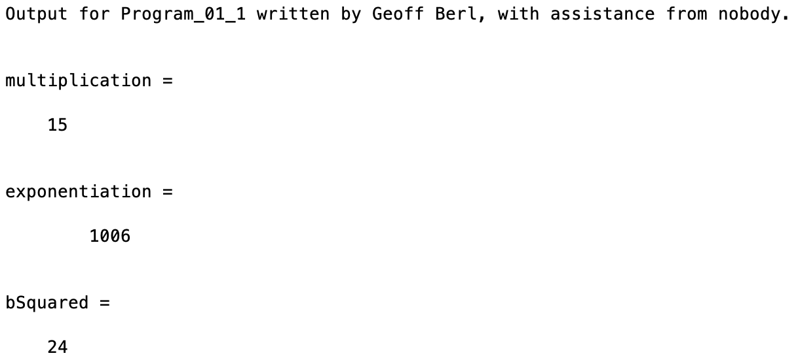

# Program\_01\_1
## Requirements
* Create a program to execute the operations in the included code.
* Name the program file **Program\_01\_1.m**
* Add the standard comments similar to those that appear at the top of each tutorial and clearly label your output following the example shown below. I have provided you with a "skeleton" of what your program should look like, in the future you will be given a blank code block to be filled out from scratch.

## Program
Use the code below to start your M file and follow the comments to complete the requirements stated above

```Matlab
% Program Description:
% The purpose of this program is to demonstrate common arithmetic
% operations in MATLAB using variables as well as hard-coded values

% Clear the command window and all variables
clc % clc clears the contents of the command window
clear % clear clears the command window and all variables

% Output of the title and author to the command window.
tutorialName = "Program_01_1";
name = "";
assistedBy = "";
fprintf("Output for %s written by %s, with assistance from %s.\n\n", tutorialName, name, assistedBy)

% Declare Variables a and b where a has the value 5 and b has the value 3


% Create the following arithmetic operations
% Multiply variables a and b
multiplication =

% Calculate 10 to the power of b plus 6
exponentiation =

% Calculate a times b plus b squared (there are two general solutions)
bSquared =

```
## Example Output
Your program output values and format should match the following.
