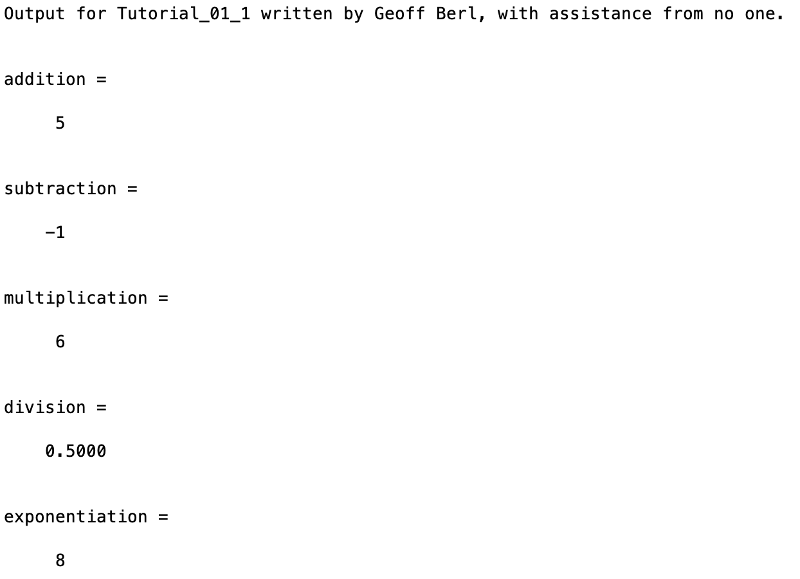

# Tutorial\_01\_1
Tutorials are programs in which most of the code is written for you. Your objective is to copy the code into an M file and add/change code as necessary to satisfy comments in the code or the tutorial file.
The intention is that you read and complete the code in the tutorial to learn the necessary skills for completing the "Program" assignments. "Program" assignments will require knowledge, learned in the tutorials, and will require more work so, they are therefore worth more in the overall homework grade for each week.
## Requirements
* Create a program to execute the operations in the included code.
* Name the program file **Tutorial\_01\_1.m**
* Add the standard comments similar to those that appear at the top of each tutorial and clearly label your output following the example shown below. I have provided you with a "skeleton" of what your program should look like, in the future you will be given a blank code block to be filled out from scratch.

## Program
Use the code below to start your M file and follow the comments to complete the requirements stated above

```Matlab
% Program Description:
% The purpose of this program is to demonstrate common arithmetic
% operations in MATLAB.

% Clear the command window and all variables
clc  % clc clears the contents of the command window
clear  % clear clears the command window and all variables

% Output of the title and author to the command window.
tutorialName = "Tutorial_01_1";
name = "";
assistedBy = "";
fprintf("Output for %s written by %s, with assistance from %s.\n\n", tutorialName, name, assistedBy)

% Finish the following commands
% Add 2 and 3
addition =
% Subtract 3 from 2
subtraction =
% Multiply 2 by 3
multiplication =
% Divide 1 by 2
division =
% Show 2 to the power of 3
exponentiation =

```
## Example Output
Your program output values and format should match the following.
