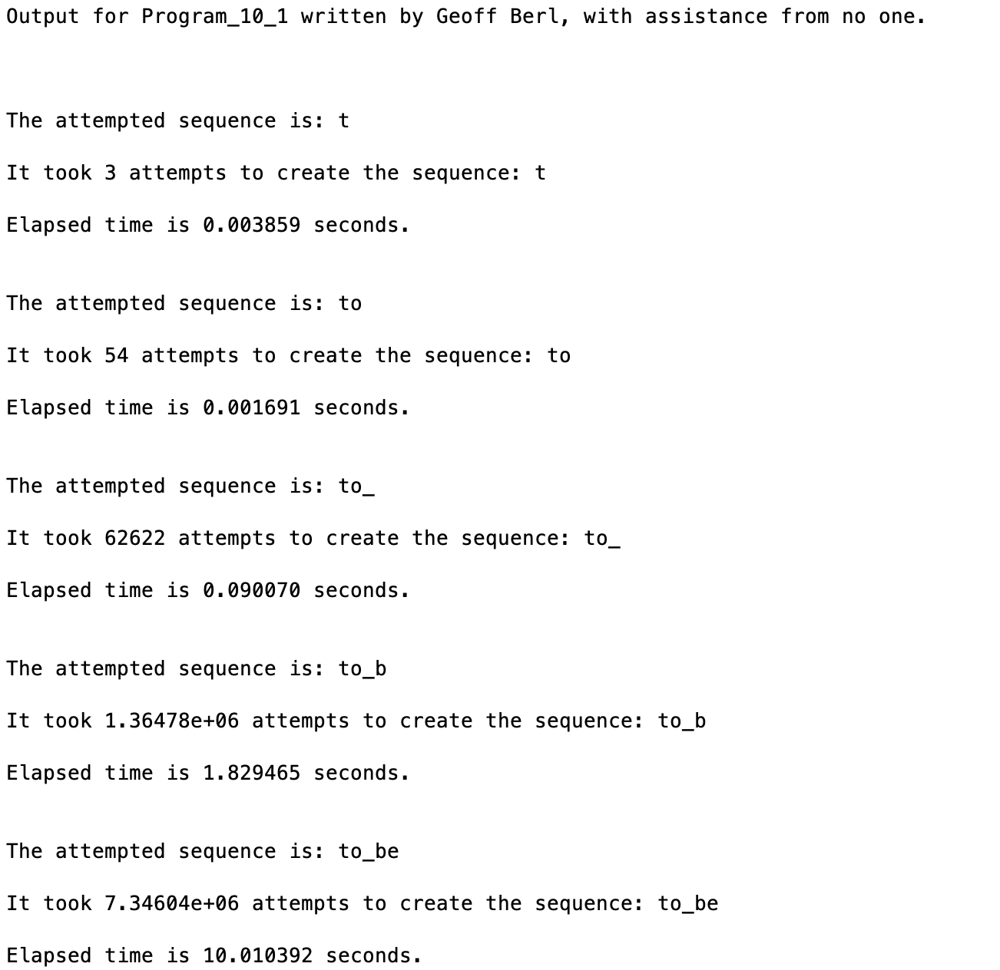

# Program\_10\_1
## Requirements
The infinite monkey theorem states that a monkey hitting keys at random on a typewriter or keyboard for an infinite amount of time will almost surely type the complete works of William Shakespeare. In this program you will put this theorem to the test by using the `rand()` function to create random sequences of letters and the underscore symbol until the desired sequence is created. While attempting to create the desired sequence you must count the number of random attempts needed to create the sequence and measure the time to create the sequence.

In your output, incrementally add a character from the phrase `to_be` and record the number of attempts needed to create `t`, `to`, `to_`, `to_b`, and finally, `to_be`

The ultimate goal is to create the phrase: **"to_be"** but we want to see how it compares to the smaller portions of the phrase.

Please note that it can take a few minutes on average to randomly generate this phrase depending on your computer's resources and, well, randomness in general. It may run in under a few seconds once, and take over a minute a second time.

## Program
Use the code below to start your M file and complete the requirements stated above

### Tips
* 

```Matlab
% Program Description:
% The purpose of this program is to ...

% Clear the command window and all variables
clc     % Clear the command window contents
clear   % Clear the workspace variables

% Output of the title and author to the command window.
programName = "Program_10_1";
name = "";
assistedBy = "";
fprintf("Output for %s written by %s, with assistance from %s.\n\n", programName, name, assistedBy)


```
## Example Output
Create a script of the same name, your output should match the following.
