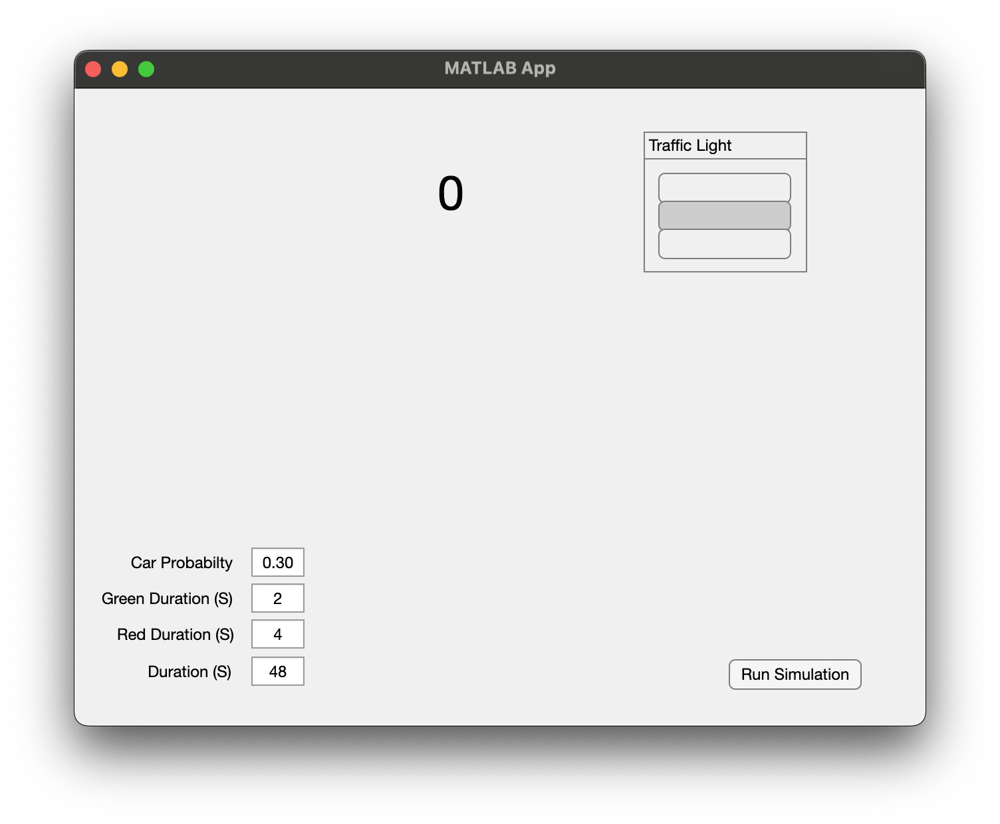
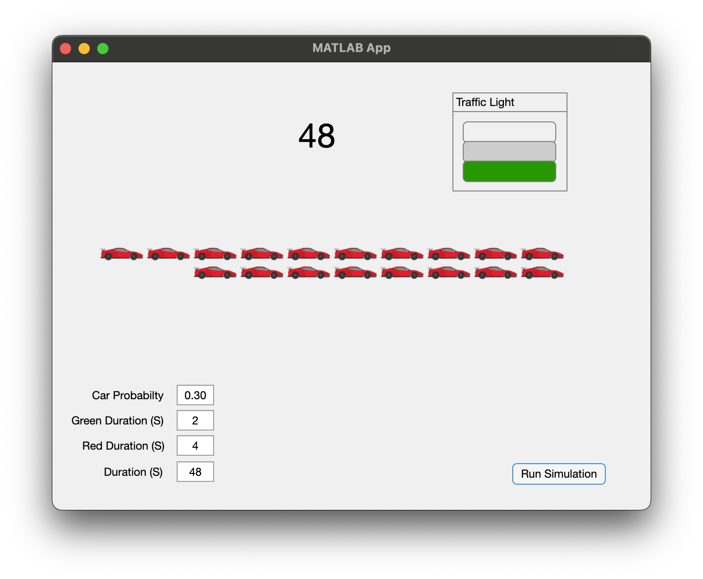
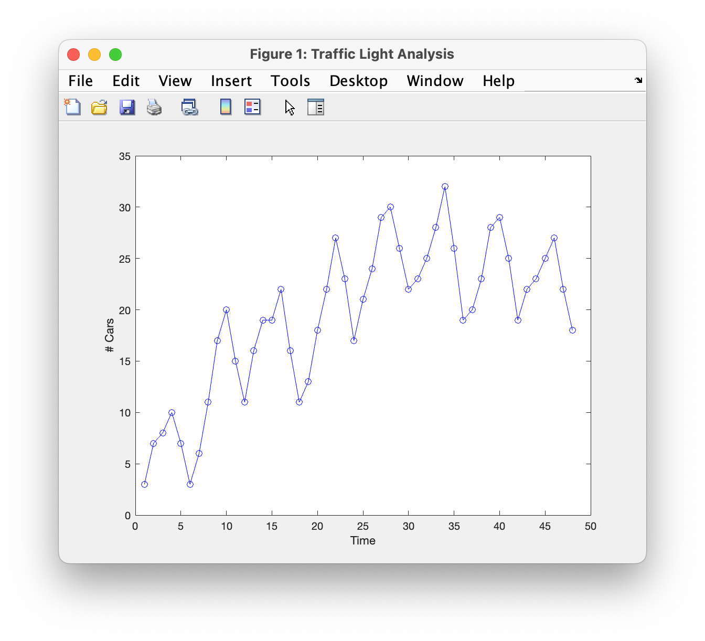

# Program\_10\_2
## Requirements
Create a Graphical User Interface that represents a visual simulation of the "Traffic Flow" example from the book pages **290-292 (7th Edition)**.

The GUI must meet the following requirements:
* Shall have an element to represent the traffic light state (red or green)
* Shall have an element to indicate the current iteration where one second will pass between each iteration.
* Shall have an element to allow for altering the following parameters (probability that a car arrives at the red light, Duration of a green light, duration of a red light, total duration) All durations are assumed to be measured in seconds therefore the total duration is also the total number of iterations as there is a one second pause between iterations.
* Shall have an element or elements representing the number of cars at the light. This Shall **not** simply be a numerical value, there are easy solutions if you think about it.
* Shall have an element to trigger starting the simulation
* Upon completion of the simulation, the program shall present a plot of the cars over time at the traffic light. This can be a separate window, a different tab, a plot integrated into the GUI, etc. However, it must appear or refresh automatically upon completing the simulation.
* The Plot shall be properly labeled with x, y, and title labels.

The following assumptions will be made regarding the program operation (taken from the book):
* Traffic travels straight, without turning
* When the lights are green, assume the cars move through at a steady rate of eight every ten seconds

Notes:
* Remember to rename any object you are interacting with using the prefixName convention, it will count as a portion of your homework grade for each assignment.
* Each iteration represents 10 seconds as stated in the book. However, due to our 1 second duration for each iteration, we will effectively be visualizing events at 10x speed.
* Save the file as TrafficSimulator.mlapp

## Example Output
Below is an example of a GUI that satisfies all requirements. You may play around with the design however, it should be intuitive to use and satisfy the requirements above.

### At Startup:

### After Completing an Analysis

