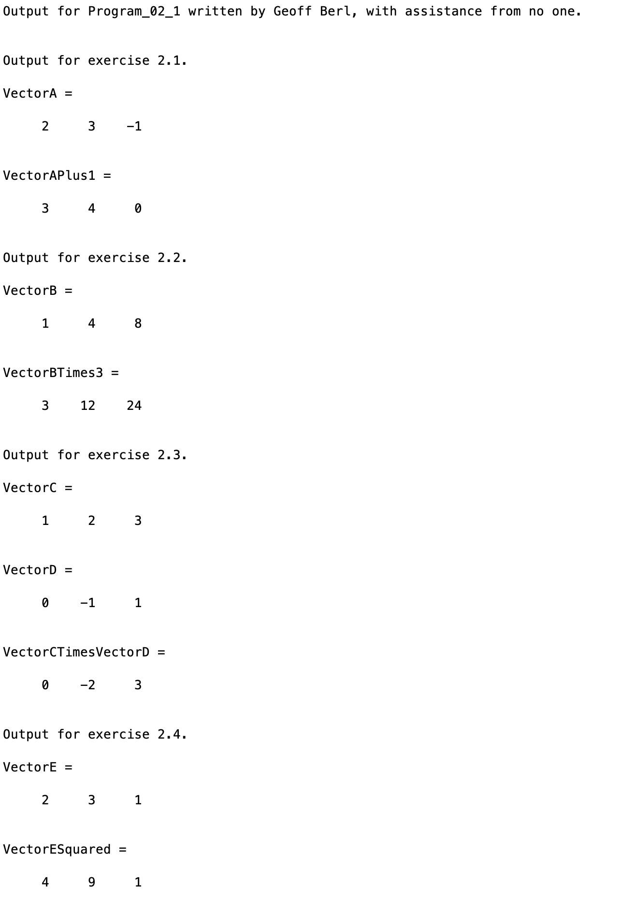

# Program\_02\_1
## Requirements
* Complete exercises **2.1, 2. 2, 2.3, and 2.4 on page 47 (7th edition)**.
* Name the program file **Program\_02\_1.m**
* Your output should match the output shown below.
* Add the standard comments similar to those that appear at the top of each tutorial and clearly label your output following the example shown below. I have provided you with a "skeleton" of what your program should look like, in the future you will be given a blank code block to be filled out from scratch.
* Add an `fprintf` statement before each exercise to display the message "Output for exercise..." before each solution, the first `fprintf` is given for you, copy/paste and edit for the remaining exercises. We learn about `fprintf` in detail in week 3.

## Program
Use the code below to start your M file and complete the requirements stated above

```Matlab
% Program Description:
% The purpose of this program is to ...

% Clear the command window and all variables
clc     % Clear the command window contents
clear   % Clear the workspace variables

% Output of the title and author to the command window.
programName = "Program_02_1";
name = "";
assistedBy = "";
fprintf("Output for %s written by %s, with assistance from %s.\n\n", programName, name, assistedBy)

fprintf('\nOutput for exercise 2.1.\n')
% Your code here...
```
## Example Output
Your program output values and format should match the following.
