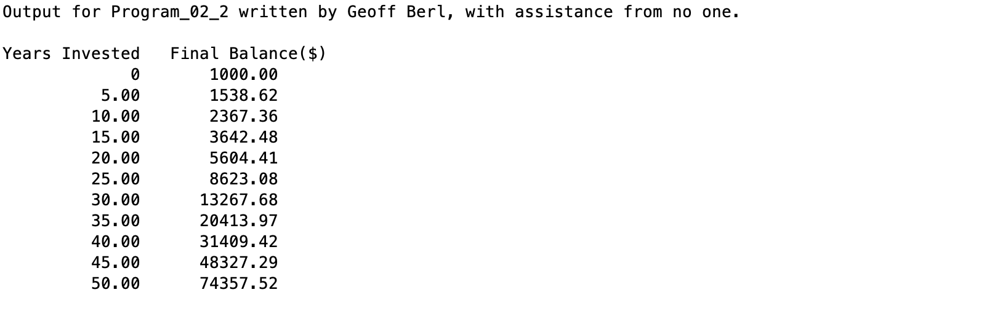

# Program\_02\_2
## Requirements
Rewrite the investment program on page 49 (7th edition) and make the following changes.

* Add comments as has been done in previous tutorials
* Change `A` to a scalar value of 1000 and rename the variable to something more descriptive.
* Change `n` to a vector of years invested to produce the table shown in the output below, use the variable name `yearsInvested` instead of `n`.
* Change variable name `r` to a descriptive name.
* Change variable name `B` to `finalBalance`
* Your output should match the output shown below.
* Name your file **Program_02_2.m**
* The "Create Output" section of code has been completed for you as we learn about input and output in week 3. For this program you are mainly declaring the variables and performing the main calculation in `finalBalance`.

## Notes:
The style of output in the "Create Output" section will be used repeatedly throughout the course. I should go over this in class but in case I do not, here is a description of what is going on in those three lines of code.
`table=[yearsInvested' finalBalance'];` is doing a few things.
1. Notice `yearsInvested'` and `finalBalance'` have the transpose operator. These variables currently hold row vector data. Meaning, it's one single row of data in many columns. Since we want to display that data vertically rather than horizontally, step 1 is to transpose the row vector into a column vector.
2. Next, the two variables `yearsInvested'`, and `finalBalance'` are wrapped with `[`brackets `]` which, as we should know, creates a vector or array. There are only two variables and they are separated by a space (the comma is implicit) so they will create a row vector.
3. Finally, the result of steps 1 and 2 are stored in `table` so, if you're following along, we have `table` which is a 2-element row vector **but** each element that was added was a column vector. Therefore, we effectively created a table of data that is 2 columns wide and has as many rows as `yearsInvested` and `finalBalance`. It's important to note, when creating an array using this notation `[yearsInvested' finalBalance']`, the number of elements in the two variables must be equal.

The `disp()` function is one method of outputting data, we will learn about inputs and outputs in week 3 so, I won't go into detail here.

## Program
Use the code below to start your M file and complete the requirements stated above

```Matlab
% Program Description:
% The purpose of this program is to ...

% Clear the command window and all variables
clc     % Clear the command window contents
clear   % Clear the workspace variables

% Output of the title and author to the command window.
programName = "Program_02_2";
name = "";
assistedBy = "";
fprintf("Output for %s written by %s, with assistance from %s.\n\n", programName, name, assistedBy)

format bank.   % Outputs numbers with 2 decimal places

% Your Code here...

% Create Output
table=[yearsInvested' finalBalance']; % table of values
disp('Years Invested Final Balance($)')
disp(table)

format default    % Always call `format default` at the end to reset the formatting
```
## Example Output
Your program output values and format should match the following.
