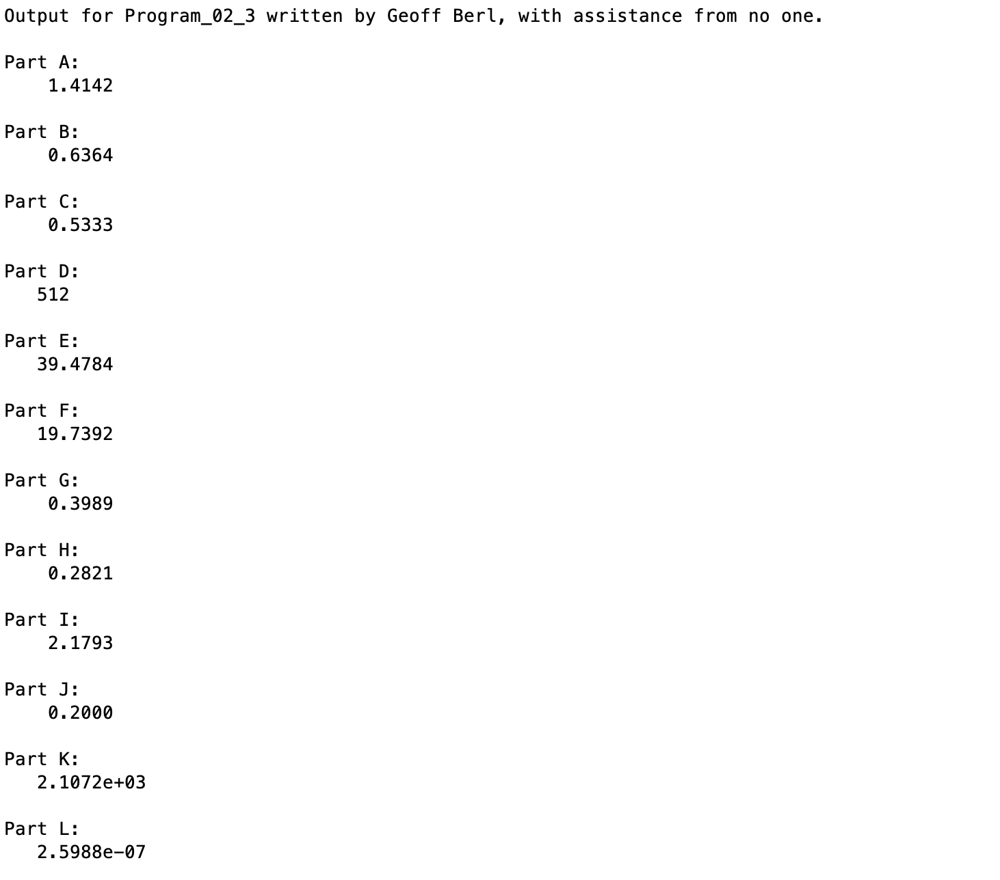

# Program\_02\_3
## Requirements
* Complete exercise **2.2 on page 50 (7th edition)**.
* Name your file **Program_02_3.m**
* Include comments and create output with the format shown below.
* **Create output for parts A-L**
* Wrap your output in the `disp` function for a cleaner output. We'll learn more about `disp` in Week 3. Here's an example; if you want to display `5+4`, wrap that with `disp` like this `disp(5+4)` so that the output won't show the `ans =` that you would normally see.
* Also, add an `fprintf` before each part to provide a clean output. The first example is given for you.

## Program
Use the code below to start your M file and complete the requirements stated above

```Matlab
% Program Description:
% The purpose of this program is to ...

% Clear the command window and all variables
clc     % Clear the command window contents
clear   % Clear the workspace variables

% Output of the title and author to the command window.
programName = "Program_02_3";
name = "";
assistedBy = "";
fprintf("Output for %s written by %s, with assistance from %s.\n\n", programName, name, assistedBy)

% Example format for each Part; note the fprintf, and perform the calculation in disp()
fprintf('Part A:\n')
disp()
```
## Example Output
Your program output values and format should match the following.
