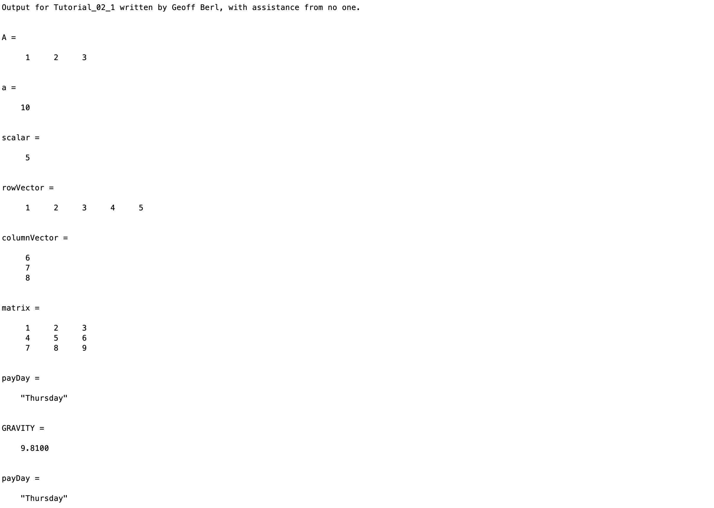
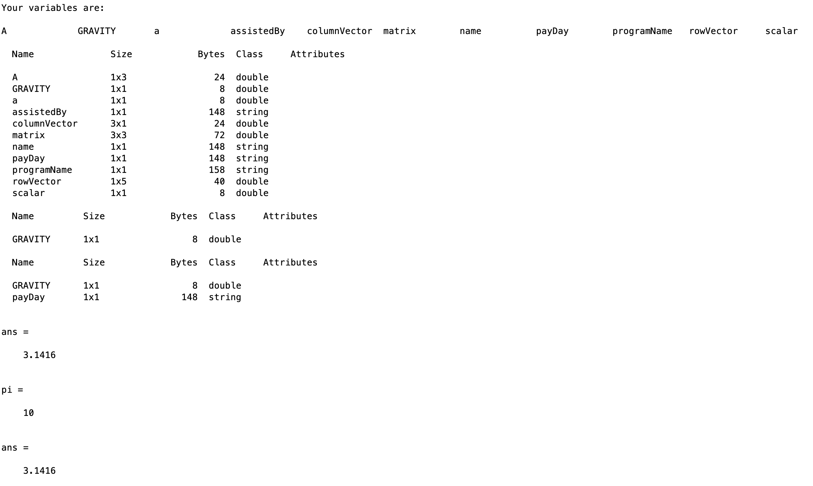

# Chapter 2 Tutorial 1
The purpose of this tutorial is to teach you about variables in MATLAB.
```Matlab
% Clear the command window and all variables
clc     % Clear the command window contents
clear   % Clear the workspace variables
```
Edit the code below and update the variable named name with your **name** for this tutorial in the code below.
```Matlab
% Output of the title and author to the command window.
programName = "Tutorial_02_1";
name = "";
assistedBy = "";
fprintf("Output for %s written by %s, with assistance from %s.\n\n", programName, name, assistedBy)
```
## Variables
### Naming conventions
MATLAB variables and filenames must begin with a letter, and contain only letters, numbers, and underscores. The format of the name is generally in one of the following formats.

* [Camel case](https://en.wikipedia.org/wiki/Camel_case) - Multi-word variable names with with the first word in all lowercase, each subsequent word with the first letter capitalized. For example, a variable holding the value for top speed might be topSpeed.
* [Snake case](https://en.wikipedia.org/wiki/Snake_case) - Multi-word variable names with all words lowercase, each word separated by an underscore. For example, top speed would appear as top_speed.
* Constants - Values that are only used for reference and don't change within your code are generally in the form of snake case but all capitalized instead of lowercase. This is the general rule in programming however, MATLAB does not follow this convention though you may see it in custom programs.

Variable names should be descriptive and give general clues as to the data they store. For example, a good name for radius might be radius rather than just simply r.

MATLAB variables are case sensitive. Generally it is bad practice to name two variables the same and only change the case. However, in MATLAB it is common practice to declare scalars as a single lowercase letter and matrices/arrays, or vectors as a single uppercase letter.
```Matlab
A=[1 2 3]   % A 1x3 row vector using an uppercase letter
a=10        % A scalar using a lowercase letter
```
## Defining/Declaring Variables
```Matlab
scalar=5                   % scalar variable
rowVector=[1 2 3 4 5]      % row vector variable
columnVector=[6;7;8]       % column vector variable
matrix=[1 2 3;4 5 6;7 8 9] % matrix variable
```
### Data Types
Variables can store numbers or characters. Unlike some other languages, MATLAB does not require you to declare the type of data being stored in a variable.

The following are common data types you may see

* Integer
* Floating point (decimal numbers)
* Character (a single letter)
* String (a vector or letters)
* Dates
```Matlab
payDay="Thursday"   % A vector of characters
GRAVITY=9.81        % A floating point value representing gravity in m/s^2
```
## Viewing Variable Data
### Contents
To view the contents of a variable, execute a command with just the variable name.
```Matlab
payDay
```
### Metadata
To view information about the variables in your workspace use the `who` or `whos` functions.
The `who` function displays all of the variables in your workspace.
```Matlab
who
```
The `whos` function displays all variables in the workspace as well as the size of the array, the size of the data (`Bytes`), the class or `type` of variable, and any attributes of the variables.
```Matlab
whos
```
You can also view only certain variables using the whos command.
```Matlab
whos GRAVITY         % Show the whos information on GRAVITY
whos GRAVITY payDay  % Show the whos information on GRAVITY, payDay, etc
```
## Reserved Words
There are a number of "reserved" words provided to users for simplicity, these are variables and functions that already exist in all workspaces and are provided by MATLAB libraries. Generally it is bad practice to create a variable with the name of a reserved word. The following are a few, more common, reserved words you'll encounter.

* `inf` - Infinity
* `eps` - The smallest number MATLAB can represent
* `clear`
* `clc`
* `pi`

Let's run through a simple example using `pi`. Display the current value of `pi`, we didn't set this value, it's included in MATLAB's default library since it's a well known constant used in mathematics.
```Matlab
pi
```
Now, "create" a variable `pi` with the value of 10.
```Matlab
pi=10;
```
Now, check the value of pi again. You'll notice, it's now the value of 10 because variables in the workspace take precedence over reserved words in MATLAB.
```Matlab
pi
```
Recall that `clear` clears or deletes the variables in your workspace, `clear pi` will _only_ delete the `pi` variable from the workspace. If we run `clear` and check the value of `pi` once more, we'll see it's back to the intended value.

:bulb: This is why it is always important to run the `clear` command at the beginning of your script, you never know what variables already exist in the workspace that might affect your script. Imagine if you were computing the circumference of a circle and you used `pi` but didn't call `clear` and there was an existing value of `pi` in the workspace from someone's previous script.
```Matlab
clear pi
pi
```
## Additional Notes:
* Variables should have comments explaining the values they hold
# Example Output
Create a script of the same name, your output should match the following.

