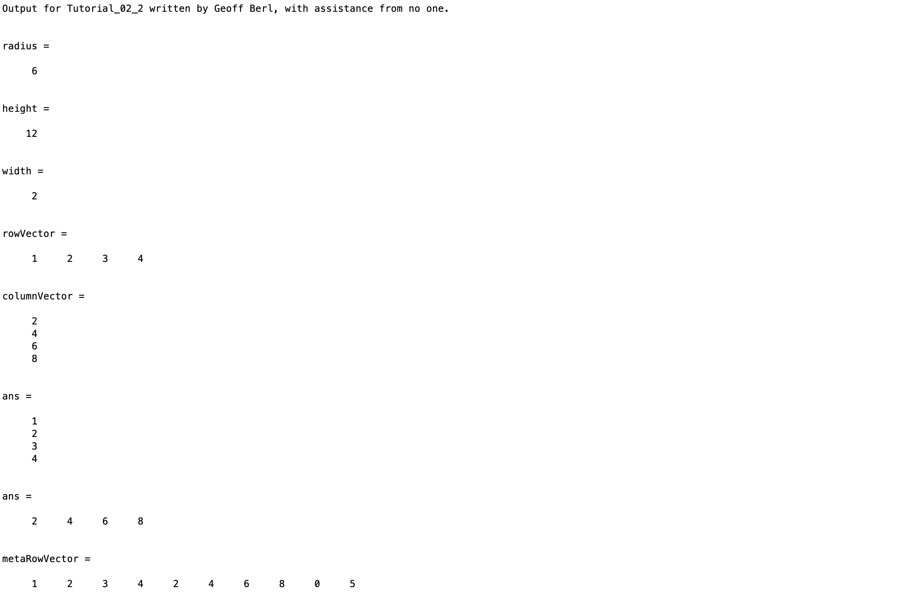
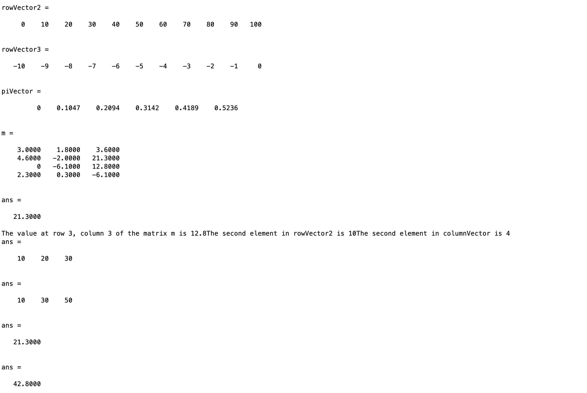

# Chapter 2 Tutorial 2
The purpose of this tutorial is to teach you about Scalars, and Arrays (Vectors and Matrices).
```Matlab
% Clear the command window and all variables
clc     % Clear the command window contents
clear   % Clear the workspace variables
```
Edit the code below and update the variable named name with your **name** for this tutorial in the code below.
```Matlab
% Output of the title and author to the command window.
programName = "Tutorial_02_2";
name = "";
assistedBy = "";
fprintf("Output for %s written by %s, with assistance from %s.\n\n", programName, name, assistedBy)
```
## Scalars
Scalars are simply single values, whether it be a number or a character.
```Matlab
radius=6
height=12
width=2
```
## Vectors
Vectors, or lists, are one-dimensional arrays and can be in the format of a row or a column vector. 

### Types
A row vector is made using commas or spaces between values enclosed by square brackets. The comma is optional, just simply a space will suffice however, commas appear more clear than just a space, comma and space makes it even more clear.

A column vector is made using semicolons between values enclosed by square brackets.
```Matlab
rowVector=[1, 2, 3, 4]  % A 1x4 row vector
columnVector=[2;4;6;8]  % A 4x1 column vector
```
### Transposing
A row vector can be converted to a column vector and vise-versa. This is easily done using the transpose operator (apostrophe).
```Matlab
rowVector'      % Convert the 1x4 rowVector to a 4x1 column vector
columnVector'   % Convert 4x1 columnVector to a 1x4 row vector
```
### Initializing/Declaring
You've already seen a few examples of declaring vectors. Here are a few more ways vectors can be generated.
```Matlab
% Create a row vector using existing vectors and hard coded scalars, notice
% the columnVector is converted to a row vector using the transpose operator.
metaRowVector=[rowVector, columnVector', 0, 5]
```
Vectors can also be created using the colon operator as we've used before.
```Matlab
rowVector2=0:10:100 % Create a row vector using the colon operator
rowVector3=-10:0    % We can also use negatives and/or decending order
```
Recall that if you know the starting number, ending number and the increment value, you use colon notation `1:5:100` to declare a vector. The `linspace()` function can be used when the starting number, end number, and total number of values is known. In the case of `linspace()`, you don't know to know the ending number. That is, `linspace()` generates "linearly spaced" data.
```Matlab
% Create 6 values, starting at 0 and ending at pi/6
piVector=linspace(0,pi/6,6)
```
## Matrices
A matrix is a collection of values represented as a two-dimensional array. It can be easier to visualize the array during declaration by starting a new line after each semi-colon.
```Matlab
% A 3x4 matrix of floating point values
m = [ 3.0, 1.8, 3.6;
      4.6, -2.0, 21.3; 
      0.0, -6.1, 12.8; 
      2.3, 0.3, -6.1 ]
```
### Accessing Matrix and Vector Elements
The function notation `variableName(row,col)` can be used to access subscripts, or, in this case a single element value in a matrix at a specific row and column position.
```Matlab
% Get the value from matrix at row 2, column 3
m(2,3)
fprintf("The value at row 3, column 3 of the matrix m is %4.1f", m(3,3))
```
Since vectors are simply 1-dimensional matrices, the same notation can be used to get the nth element in a vector.
```Matlab
fprintf("The second element in rowVector2 is %i", rowVector2(2))
fprintf("The second element in columnVector is %i", columnVector(2))
```
The previous notation showed examples of accessing a single value from a matrix or vector. We can also access multiple value subscripts of matrices.
```Matlab
rowVector2(2:4)  % access the second, through fourth, elements in rowVector2
rowVector2(2:2:6) % Fancy, access elements at positions 2, 4, and 6
```
### Editing Matrix and Vector Values
If a value in a matrix or vector needs to be changed, we simply use the parenthesis notation as before when accessing the value, and use the equals sign to set it like any other variable.
```Matlab
m(2, 3) % Display the current value of m(2, 3)
% Update the value at row 2, column 3 of the matrix m
m(2, 3)=42.8;
m(2, 3) % Display the updated value of m(2, 3)
```
## Additional Notes:

* Only integer values can be used to obtain a subscript of a matrix or vector
* Subscripts may be scalar (single value) or vectors (a collection of values)
* Many programming languages start with the first element at position 0, MATLAB subscripts always start at 1
# Example Output
Create a script of the same name, your output should match the following.

