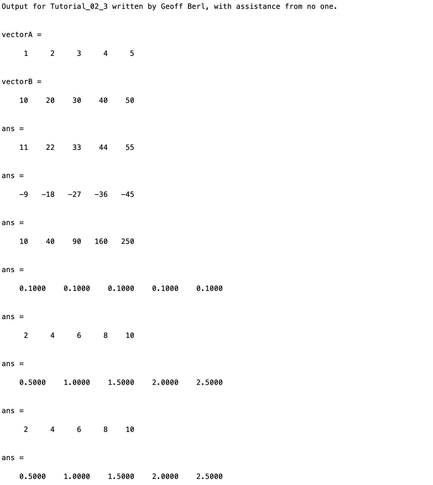
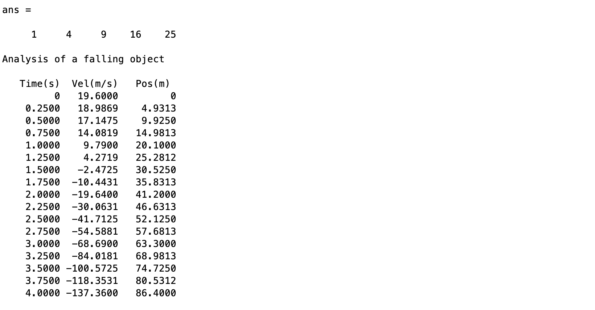

# Chapter 2 Tutorial 3
The purpose of this tutorial is to teach you about arithmetic operations involving vectors and matrices
```Matlab
% Clear the command window and all variables
clc     % Clear the command window contents
clear   % Clear the workspace variables
```
Edit the code below and update the variable named name with your **name** for this tutorial in the code below.
```Matlab
% Output of the title and author to the command window.
programName = "Tutorial_02_3";
name = "";
assistedBy = "";
fprintf("Output for %s written by %s, with assistance from %s.\n\n", programName, name, assistedBy)
```
## Addition and Subtraction
Let's create two simple vectors
```Matlab
vectorA=1:5         % A row vector 1 through 5
vectorB=10:10:50    % A row vector 10 through 50 incrementing by 10s
```
Addition and subtraction of vectors does not require any special notation. Notice that element (1,1) of `vectorA` is added to element(1,1) of `vectorB` and so on for each corresponding element.
```Matlab
vectorA+vectorB
vectorA-vectorB
```
## Multiplication and Division
Multiplication of vectors requires a dot . operator to signify that we want each element to be multiplied to the corresponding element from each vector. This is referred to as **element-wise arithmetic**. If we do not use the dot operator, MATLAB will perform a matrix multiplication which is a very different thing altogether, we will discuss matrix math later in the course.
```Matlab
vectorA.*vectorB
vectorA./vectorB
```
There is an exception where matrix and element-wise math overlap. That is when we have a scalar and a matrix. When of the operands is a scalar, both element-wise and matrix multiplication and division will result in the same outcome.
```Matlab
% The outcome here will be the same for matrix and non-matrix math
vectorA*2
vectorA/2
```
is the same as…
```Matlab
vectorA.*2  % Explicitly declare element-wise multiplication
vectorA./2  % Explicitly declare element-wise division
```
**Tip:** It is always better to be safe than sorry, since adding the dot operator does not inhibit functionality, it not only ensures the right outcome but allows someone reading your code to determine your intentions. Additionally, using the dot operator when a scalar is _expected_ will still function properly if a matrix was used instead for some reason.
## Exponents
Exponentiation requires the dot operator for element-wise exponentiation.
```Matlab
vectorA.^2  % Square each element in vectorA
```
## Example:
Let's create a time table giving the velocity and position of a falling object over time.
```Matlab
% Declare the initial data
initialVel=19.6;
initialPos=0;
GRAVITY=9.81;

% Let's plot the velocity and position every 1/4 second for 4 seconds
% starting at t=0
timeInc=0:0.25:4;

% Compute the velocity over the time increments.
velocityY=initialVel - GRAVITY*timeInc.^2;

% Compute the position over the time increments. Remember, we don't NEED
% the dot operator on the multiplication since initialVel and (1/2) are
% scalar values but hopefully you can see how it makes it clearer by using it.
position=initialPos + initialVel.*timeInc + (1/2).*timeInc.^2;

% Create a table for displaying the output (refer to this for future programs 
% that ask for a table style output).
dispTable=[timeInc', velocityY', position'];

% Display a nice output
disp('Analysis of a falling object')    % Title for the table
disp(' ')                               % Prints a blank line
disp('   Time(s)  Vel(m/s)   Pos(m)')   % Column headings
disp(dispTable)                         % Disp the table
```
# Example Output
Create a script of the same name, your output should match the following.

