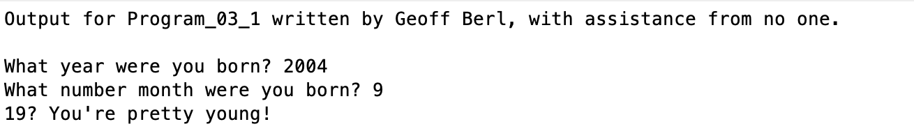
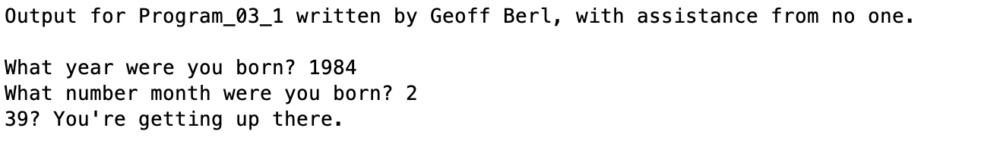
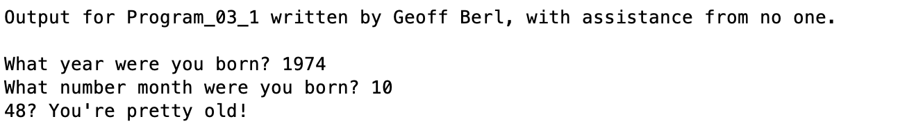

# Program\_03\_1
## Requirements
* Create a program that
    * Asks the user for their birth year
    * Asks the user for their birth month (the ordinal value)
    * Calculates the user's age based on the inputs
        * If their birth month is the current month, assume their birthday has passed.
        * If the user is under 20, reply with "\<age\>? Wow, you're pretty young!"
        * If the user is between 20 and 40, reply with "\<age\>? You're getting up there."
        * If the user is over 40, reply with "\<age\>? You're pretty old!"
        * For all others, reply "There was an error"
* Name the program file **Program\_03\_1.m**
* Your output should match the output shown below.
* Add the standard comments similar to those that appear at the top of each tutorial and clearly label your output following the example shown below.

## Program
Use the code below to start your M file and complete the requirements stated above

### Tips
* We haven't learned how to get and manipulate date data so you will have to hard-code the current month and year in your calculation.

```Matlab
% Program Description:
% The purpose of this program is to ...

% Clear the command window and all variables
clc     % Clear the command window contents
clear   % Clear the workspace variables

% Output of the title and author to the command window.
programName = "Program_03_1";
name = "";
assistedBy = "";
fprintf("Output for %s written by %s, with assistance from %s.\n\n", programName, name, assistedBy)


```
## Example Output
Your program output values and format should match the following.
Under 20 example

20-40 example

Over 40 example
