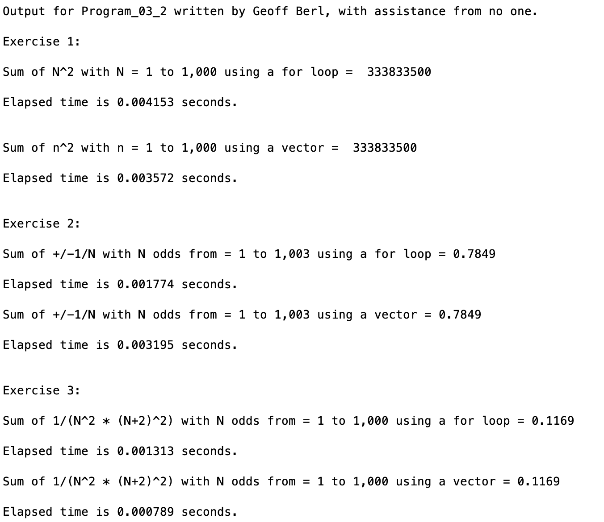

# Program\_03\_2
## Requirements
* Complete exercises **1-3 on page 63 (7th edition)**.
* Use `tic` and `toc` to time each operation
* Name the program file **Program\_03\_2.m**
* Your output should match the output shown below.
* Add the standard comments similar to those that appear at the top of each tutorial and clearly label your output following the example shown below.

## Program
Use the code below to start your M file and complete the requirements stated above

### Tips
* `tic` is used to start a timer
* `toc` is used to stop a timer, it will return a value with the time elapsed since `tic` was called. However, if you simply call `toc` it will output the message as shown in the example output "Elapsed time is … seconds."

```Matlab
% Program Description:
% The purpose of this program is to ...

% Clear the command window and all variables
clc     % Clear the command window contents
clear   % Clear the workspace variables

% Output of the title and author to the command window.
programName = "Program_03_2";
name = "";
assistedBy = "";
fprintf("Output for %s written by %s, with assistance from %s.\n\n", programName, name, assistedBy)


```
## Example Output
Your program output values and format should match the following.
