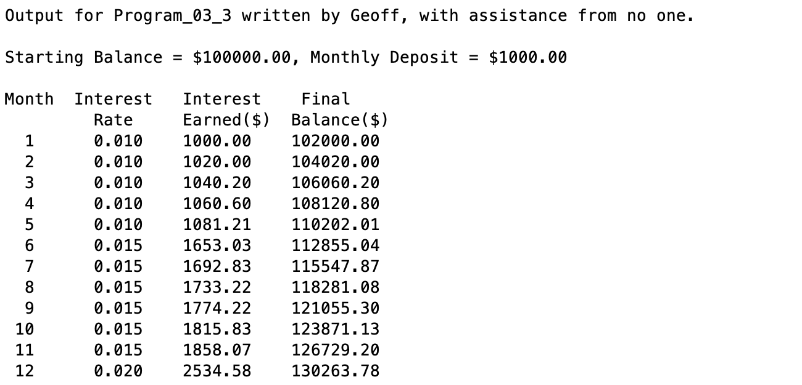

# Program\_03\_3
## Requirements
* Complete exercise **2.25 on page 79 (7th edition)**.
* Name the program file **Program\_03\_3.m**
* Your output should match the output shown below.
* Add the standard comments similar to those that appear at the top of each tutorial and clearly label your output following the example shown below.

## Program
Use the code below to start your M file and complete the requirements stated above

### Tips
* Break it up into pieces, try getting the correct values for the first month before worrying about using a loop or if statements.

```Matlab
% Program Description:
% The purpose of this program is to ...

% Clear the command window and all variables
clc     % Clear the command window contents
clear   % Clear the workspace variables

% Output of the title and author to the command window.
programName = "Program_03_3";
name = "";
assistedBy = "";
fprintf("Output for %s written by %s, with assistance from %s.\n\n", programName, name, assistedBy)


```
## Example Output
Your program output values and format should match the following.
