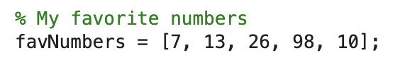
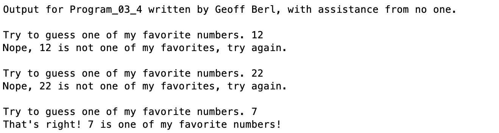

# Program\_03\_4
## Requirements
* Create a program that
    * Has a vector containing 5 of your favorite numbers (or just any numbers)
    * Asks a user to guess your favorite number
    * Uses a for loop to parse through your favorite numbers vector to compare
    * If the guess is one of your favorite numbers
        * Reply with "Good guess! \<number\> is one of my favorite numbers."
    * If the guess is not one of your favorite numbers
        * Reply with "Good guess, but \<number\> not one of my favorite numbers."
    * Only exits once a favorite number is guessed, otherwise, continues to ask.
* Name the program file **Program\_03\_4.m**
* Your output should match the output shown below.
* Add the standard comments similar to those that appear at the top of each tutorial and clearly label your output following the example shown below.

## Program
Use the code below to start your M file and complete the requirements stated above
### Tips
* Break it into parts
    * Maybe start with asking for a number and parsing to see if it's correct
    * Then wrap it in a while loop so it asks repeatedly
    * Or, the other way around…
* You may use whatever numbers you want, they don't need to match mine

```Matlab
% Program Description:
% The purpose of this program is to ...

% Clear the command window and all variables
clc     % Clear the command window contents
clear   % Clear the workspace variables

% Output of the title and author to the command window.
programName = "Program_03_4";
name = "";
assistedBy = "";
fprintf("Output for %s written by %s, with assistance from %s.\n\n", programName, name, assistedBy)


```
## Example Output
Your program output values and format should match the following.
Given my favorite numbers vector

Here is my output
