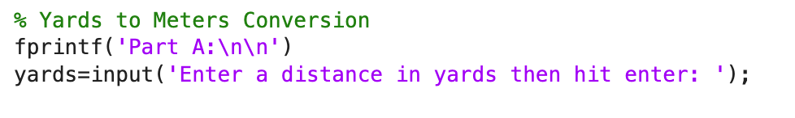
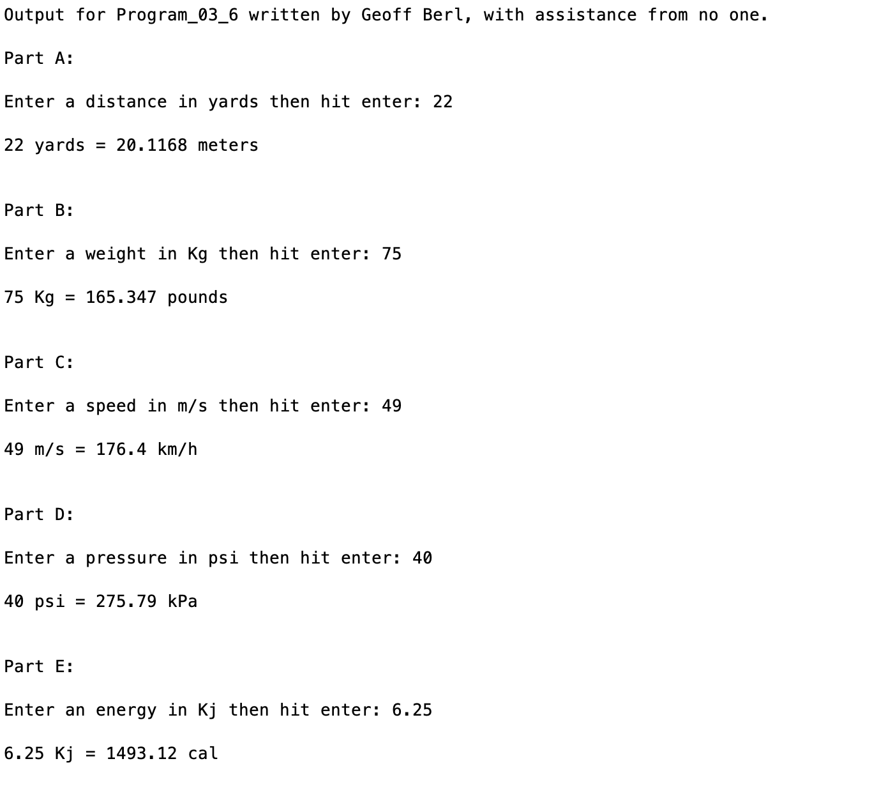

# Program\_03\_6
## Requirements
* Complete exercise **2.8 on page 52 (7th edition)** with the modifications listed below. 
* Name your file **Program_03_6.m**
* Include comments and create well-formatted output as shown below.
* At the top of your program, assign the values of conversion factors to descriptive variable names as shown. (Replace ... with the remaining conversion factors needed for the program)
     

* Use input statements to allow for any numerical values to be input by a user. Be sure to add a prompt statement before the input.
     
* Use the variables defined in your list of "Definition of Conversion Factors" to convert your inputted values.
* Format your output as shown below.

**Note:** I will be using various values to confirm the calculations work properly so it would be wise to do the same with your own program.

## Program
Use the code below to start your M file and complete the requirements stated above
### Tips:
* Your results may differ slightly depending on where you got your conversion factor, there shouldn't be much of a difference but please confirm with your instructor that your difference is acceptable.

```Matlab
% Program Description:
% The purpose of this program is to ...

% Clear the command window and all variables
clc     % Clear the command window contents
clear   % Clear the workspace variables

% Output of the title and author to the command window.
programName = "Program_03_6";
name = "";
assistedBy = "";
fprintf("Output for %s written by %s, with assistance from %s.\n\n", programName, name, assistedBy)
```
## Example Output
Your program output values and format should match the following.
