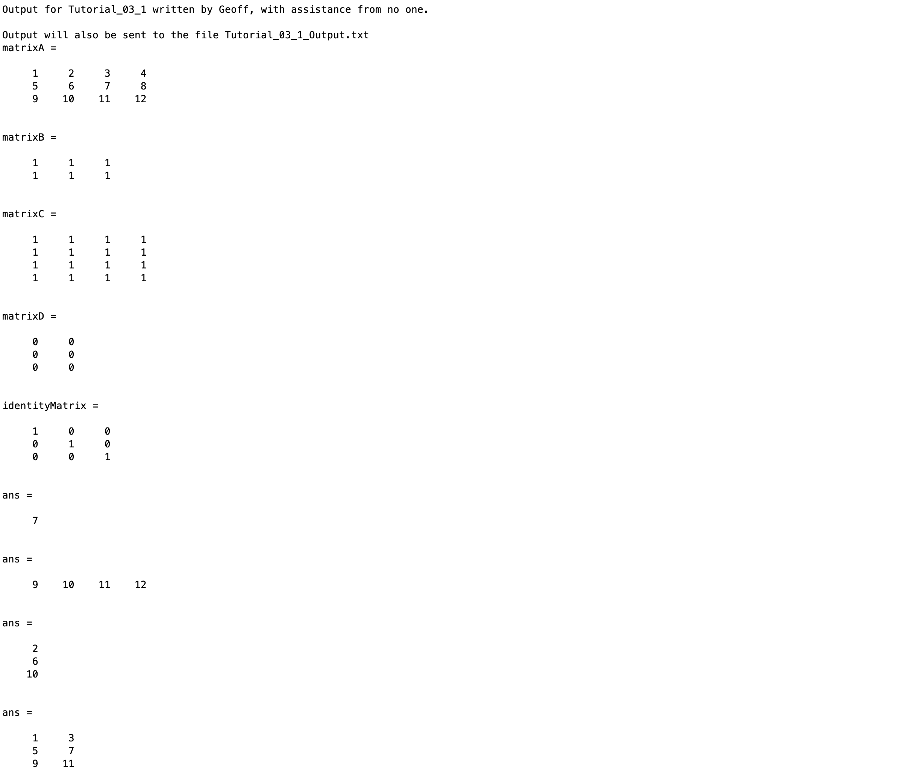
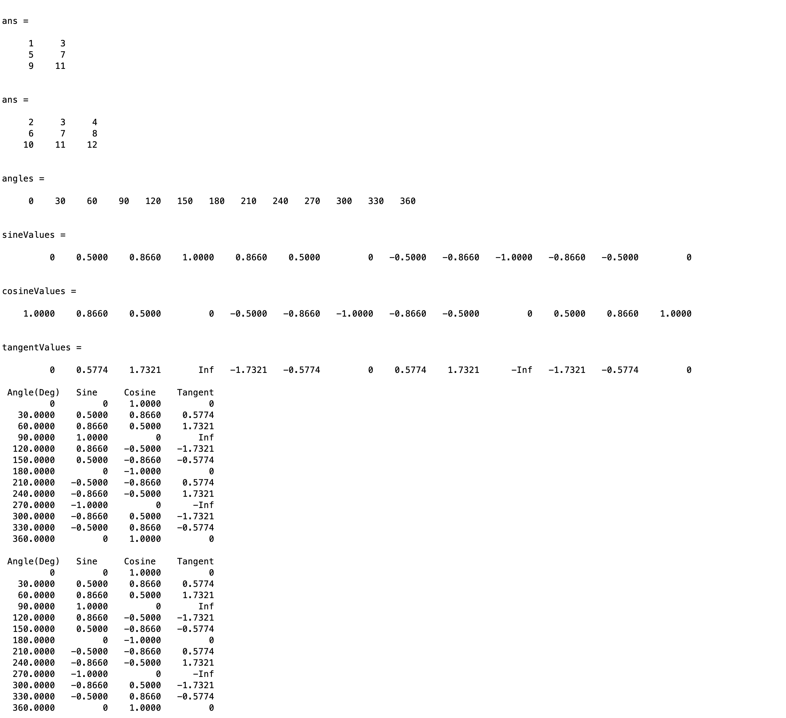

# Chapter 3 Tutorial 1
The purpose of this tutorial is to teach you about capturing output with the diary function. At the same time we'll cover some built in MATLAB functions.
```Matlab
% Clear the command window and all variables
clc     % Clear the command window contents
clear   % Clear the workspace variables
```
Edit the code below and update the variable named name with your **name** for this tutorial in the code below.
```Matlab
% Output of the title and author to the command window.
programName = "Tutorial_03_1";
name = "";
assistedBy = "";
fprintf("Output for %s written by %s, with assistance from %s.\n\n", programName, name, assistedBy)
```
## Diary
The diary command echoes all output sent to the command window into a file of your choosing. If the file does not exist, it will be created. If the file does exist, the diary will be continued from the end of the current file contents. When using the diary command, the filename that is provided may be enclosed with single quotes or no quotes. Double quotes in the filename will be interpreted literally and your filename with include them.
```Matlab
fprintf("Output will also be sent to the file Tutorial_03_1_Output.txt")
diary Tutorial_03_1_Output.txt
```
## More Ways to Create Matrices
Create a matrix manually
```Matlab
matrixA=[1 2 3 4; 5 6 7 8; 9 10 11 12]  % Again, we can use spaces or commas for row values
```
Create a matrix filled with ones
```Matlab
matrixB=ones(2,3)   % Create a 2 row, 3 column matrix of ones
matrixC=ones(4)     % Create a 4x4 matrix of ones
```
Create a matrix filled with zeros
```Matlab
matrixD=zeros(3,2)  % Create a 3 row, 2 column matrix of zeros
```
Create the identity matrix; _more on this later in matrix arithmetic_
```Matlab
identityMatrix=eye(3)   % Create a 3 row, 3 column identity matrix
```
## More Ways to Access Matrix Elements
Access a single value subscript
```Matlab
matrixA(2,3)    % Get the value of matrixA element at row 2, column 3
```
Access an entire row or rows subscript, think of the : operator as representing _all_. We want _all_ column values in row 3.
```Matlab
matrixA(3,:)    % Get the third row of matrixA
```
Access an entire column or columns subscript. We want all row values in column 2
```Matlab
matrixA(:,2)    % Get the second column of matrixA
```
Access the first and third columns in matrixA
```Matlab
matrixA(:,[1,3])    % By manually creating a vector with the column numbers we want
matrixA(:,1:2:3)    % Not a great example but dynamically creating the vector works too
```
Access columns 2 through 4 of matrixA
```Matlab
matrixA(:,2:4)
```
## Example
Let's say we want to create a trig table showing the Sine, Cosine, and Tangent values for a set of angles. Here's how we might go about doing that.
```Matlab
% What angles do we want to see the values for?
angles=[0:30:360]   % Angles 0 to 360 in increments of 30

% Get the sine values
sineValues=sind(angles)     % sind for the sine using degrees

% Get the cosine values
cosineValues=cosd(angles)   % cosd for the cosine using degrees

% Get the tangent values
tangentValues=tand(angles)  % tand for the tangent using degrees

% Put all of the vectors into a table.
% Notice we're transposing rows to columns using the transpose ' operator.
trigTable=[angles', sineValues', cosineValues', tangentValues'];

% Display the trig table (disp is a nicer way of displaying a matrix)
disp(' Angle(Deg)   Sine     Cosine    Tangent')
disp(trigTable)
```
**TIP:** Once you better understand software programming, you can start to "nest" things, here is an example of a much more concise way of solving that same example problem above. Notice that, since we don't need to save the results of the trig functions, we don't have to put them in a variable first, we can compute and transpose them right in place.
```Matlab
% What angles do we want to see the values for?
angles=[0:30:360];   % Angles 0 to 360 in increments of 30

% Display the trig table (disp is a nicer way of displaying a matrix)
disp(' Angle(Deg)   Sine     Cosine    Tangent')
disp([angles', sind(angles)', cosd(angles)', tand(angles)'])
```
## Diary
When you've finished with your diary output, it's important to turn it back off.
```Matlab
diary off
```
## Additional Notes:
* Don't forget to turn the diary off at the end of your program.
# Example Output
Create a script of the same name, your output should match the following. Note that row vectors that exceed the command window width, will wrap and a header "column 1", "column 2", etc. will be added. It is acceptable if your output differs because of wrapped vectors that can't display in one line.

