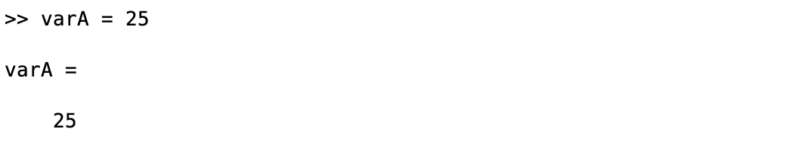
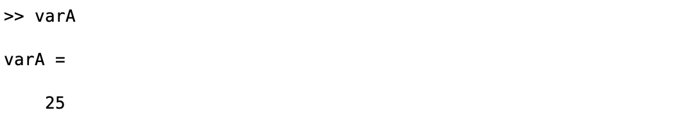
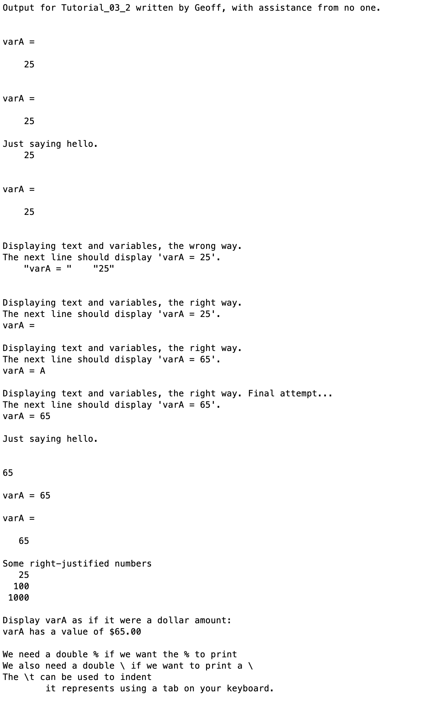

# Chapter 3 Tutorial 2
The purpose of this tutorial is to teach you about `disp`, `fprintf` and `sprintf` functions, which are used to output data in some way.
```Matlab
% Clear the command window and all variables
clc     % Clear the command window contents
clear   % Clear the workspace variables
```
Edit the code below and update the variable named name with your **name** for this tutorial in the code below.
```Matlab
% Output of the title and author to the command window.
programName = "Tutorial_03_2";
name = "";
assistedBy = "";
fprintf("Output for %s written by %s, with assistance from %s.\n\n", programName, name, assistedBy)
```
## The Old Way
The "old" way of displaying a variable and/or its value is to initialize, or callout the variable. This output, while helpful, presents a few issues; the output displayed takes up 5+ lines of output, and the format is always the same with one line showing `variableName =` and another showing the value. The `disp` function will allow us to provide better, more informative outputs.
### Display By Initializing
When declaring a variable, if the command is not terminated with a semicolon, the output will be displayed to the command window.
```Matlab
varA = 25
```

### Display Using a Callout
Just as with declaration, we can show the same output by simply calling the variable name in a line of code and again, not terminating that line with a semicolon.
```Matlab
varA
```

## disp()
The `disp()` function allows for outputting information to the command window. Up to this point we've mostly used the method of typing the variable name or initializing a variable in order to output to the command window.
### Displaying Text
The `disp()` function can be used to output string data. We can use `disp` to give information to the user in plain text.
```Matlab
disp("Just saying hello.")
```
### Display a Variable's Value
To display a variable's value, all that is required is placing the variable's name inside the `disp()` function.
```Matlab
disp(varA)
```
But this isn't really helpful by itself since it just displays a number.
### Text and Values
We could actually use `disp` to display the same format as the callout. Using the `disp()` function with an empty string will display a blank line. Sometimes, however, MATLAB doesn't honor this method and will not display some `disp` output if it's an empty string. So, a safer way is to include a space in the empty string. This way, it's still a blank line and it forces MATLAB to print it.
```Matlab
disp(" ")
disp("varA =")
disp(" ")
disp(varA)
disp(" ")
```
### Text and Values Together
Another thing we can do with `disp` is display variable values along with text by placing the data into a vector. The function will only display multiple types of data if they are converted to the same type. For example, if we try to display some text along with `varA`, we don't get the output we'd expect.
```Matlab
disp("Displaying text and variables, the wrong way.")
disp("The next line should display 'varA = 25'.")
disp(["varA = ", varA])
disp(" ")
```
Notice how the output displays two strings? MATLAB converted the number `25` and then added it to the vector but printed each element enclosed in quotes. Also note, I used a `disp(" ")` at the end, I like to add a blank line after posting a message, so it separates future output, it's easier to read.

The first step to fixing this is simply understanding that using single quotes works best for the disp function. More specifically, when displaying multiple data types, it's best to use single quotes.
```Matlab
disp("Displaying text and variables, the right way.")
disp("The next line should display 'varA = 25'.")
disp(['varA = ', varA])
disp(" ")
```
But, as you can see, this still doesn't output what we want, for some reason the value of `varA` is displaying as blank. This is because `disp` is automatically converting `varA` to a character by referring to an [ASCII table](https://upload.wikimedia.org/wikipedia/commons/thumb/1/1b/ASCII-Table-wide.svg/1280px-ASCII-Table-wide.svg.png). If we look at the table, we see that decimal value 25 relates to `[END OF MEDIUM]` and that's not an actual character. If we try to find something that's an actual character, let's use `A` as an example. `A`'s decimal value says it's 65 so let's change `varA` to 65 and see what happens
```Matlab
% Change the value of varA to 65 supressing the output

% Copy the code from above and paste it here, editing as necessary

```
So, it's actually printing something other than blank, it's printing `A` which is, as we saw, the character value for the decimal value 65. What's happening here is, again, MATLAB is converting that value of 65 to a character using the ASCII table.

If we want to actually display the text value of the variable we need to convert it to a string so it can be printed as the actual value. The function we use for that is `num2str` or, as we'll see shortly, we could also use other methods.
```Matlab
disp("Displaying text and variables, the right way. Final attempt...")
disp("The next line should display 'varA = 65'.")
disp(['varA = ', num2str(varA)])
disp(" ")
```
That looks much better. And if you're interested in why the single quote quirk exists, it goes back to string vs char array. If you were to run `num2str(varA)` in your command window and then take a look at the type of variable that is produced (by checking your Workspace or using `whos`) you'll see that it's a char type. If we use double quotes, that creates a string type. So, what `disp` is doing is it's converting that second element into a string. Strings in a `disp` are always displayed as a vector of elements. If we use char arrays, those can be concatenated and displayed as a single, unquoted value. This may seem like a confusing quirk but, as you run into this problem in the future, you can now refer back to this and recall why, which will hopefully allow you to fix it.
## fprintf()
The `fprintf` function is like the `disp` function but much more powerful. The formatted output in `disp` will always be the format that is set using the `format` command. With `fprintf` we can specify a different format, and not only that, we can specify different formats for different values in the output.
### Displaying Text
Just as with `disp()` we can give information to the user in plain text.
```Matlab
fprintf("Just saying hello.")
```
Uh oh, you may have noticed that the `>>` normally on the left of the command window, is now showing after the text we wrote. That's because, since `fprintf` is so powerful in formatting outputs, it requires that you give it nearly every detail needed. When using `fprintf` we need to remember to add a newline character when we want the cursor to move to the next line. When we used `disp(" ")` to output a blank line, what's actually going on behind the scenes is, `disp` prints your text provided and then adds a `\n` character to move the cursor down to a new line. In order to fix this, let's add some blank lines. With `disp`, to create a blank line we used `disp(" ")`. With `fprintf` the same can be done with `fprintf("\n")` and we can put as many `\n` characters as we want. Let's move the cursor down a few lines to clean up our code.
```Matlab
fprintf("\n\n\n")
```
### Display a Variable's Value
#### Format Specifiers
To display a variable's value, we need to learn about **format specifiers**. Format specifiers allow you to… well, specify the format of a particular value. A few of the most common specifiers that we'll use are
* `%i` or `%d` - These are both used for displaying integers
* `%f` - This is used for a floating point or decimal value
* `%e` - This is used for displaying in scientific notation
* `%g` - This will use whichever is more compact; `%f` or `%e` 
* `%s` - This is used for strings or character vectors

So, we have a variable `varA` already, which we know is an integer so let's display it as such. Let's not forget the `\n`, actually, let's add two `\n`s so we get that extra blank line to keep our output cleaner. I like to use `%i` for integers since it's easy to remember. One last thing to note, for every format specifier that we provide, we need a variable to follow the format specification string.
```Matlab
fprintf("%i\n\n", varA)
```
So now, what MATLAB does is takes our string `"%i\n\n"` and replaces `%i` with the value in `varA`, it gets correctly converted to the actual value since we gave it the integer specification. While the `\n`s don't technically get "replaced" they get represented by actual newlines and the `\n` is hidden.
### Text and Values
Printfing text and values is pretty straight forward, we just add text to the format specification like so.
```Matlab
fprintf("varA = %i\n\n", varA)
```
Or if we wanted to output like our `disp` example above, we can do it all in one line with the power of the `\n` character.
```Matlab
fprintf("varA =\n\n   %i\n\n", varA)
```
#### Field Width and Precision
What makes format specifiers even more powerful is the ability to specify the **field width** and **precision** (precision only applies to floating point values). Field width is a number that is declared immediately following the `%` and specifies how many character spaces a value will take up. This is most useful with printing a list where you want all of the values to be right-justified so they line up nicely. Here's an example where I'll supply hardcoded values.
```
fprintf("Some right-justified numbers\n")
fprintf("%5i\n", 25)
fprintf("%5i\n", 100)
fprintf("%5i\n\n", 1000)
```
The field width works on all data types, for example, if you wanted to print months of the year in a neat, right-justified list, you could pad the string specifier with something like `%8s`. This way, all months appear to be aligned nicely.

The precision option appears as a decimal value on the field width option. For example, if we want to display `varA` in decimal form, maybe it's a dollar amount, we can do that like this.
```Matlab
fprintf("Display varA as if it were a dollar amount:\n")
fprintf("varA has a value of $%5.2f\n\n", varA)
```
Note that the `.2` added to the value of `%5` translates like this.
1. We want the value to take up five spaces in width
2. We want a decimal value to appear
3. We want the number of values in the decimal portion to be 2.
It's important to note, the decimal actually counts as one of those 5 spaces. The amount of values in the decimal place is a max, meaning there will only ever be two decimal places, no more or less. The decimal also takes up one of those 5 spaces. Therefore, the leaves 2 spaces to the left of the decimal. However, this is a minimum for the left side, it means it will always take up at least 2 spaces. If you have a value that uses more than two spaces, it will expand to fit but if you have a single digit value, it will still take up two spaces, one will be blank.
#### Operators
Operators will appear after a `%` but before the field width value. Here are some useful operators.
* `-` - This is used to left justify, maybe less commonly used as there are other ways to do it but worth noting.
* `+` - This is used to always print a sign on a number value `+\-`
#### Special Characters
Because `fprintf` interprets `%` as the start of a format specifier and a `\` as the start of a newling `\n` or tab `\t`. Characters like this need to be "escaped" by putting two of them in a row.
```Matlab
fprintf("We need a double %% if we want the %% to print\n")
fprintf("We also need a double \\ if we want to print a \\\n")
fprintf("The \\t can be used to indent\n\tit represents using a tab on your keyboard.\n\n")
```
## sprintf()
This is already a fairly long tutorial, but the good news is that `sprintf` is exactly the same as `fprintf` except it prints to a variable rather than to the command window. This is useful if you need to dynamically generate a string for use in say, a filename. Since the concept is the same, we'll see examples of sprintf in the other tutorials, no sense in making this tutorial any longer.
## Additional Notes:
* `disp` will honor the format that is set by using the `format` command. If you need to display a value in a format _other_ than what is set by `format`, rather than change the format for that one disp, you can use `fprintf` or `sprintf` which allow you to specify the format.
# Example Output
Create a script of the same name, your output should match the following.
