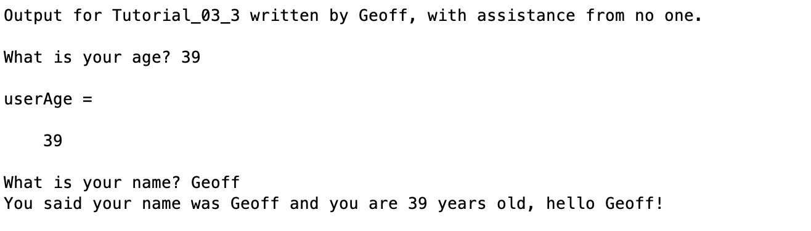

# Chapter 3 Tutorial 3
The purpose of this tutorial is to teach you about `input` function, which is used to get input from a user through the command window.
```Matlab
% Clear the command window and all variables
clc     % Clear the command window contents
clear   % Clear the workspace variables
```
Edit the code below and update the variable named name with your **name** for this tutorial in the code below.
```Matlab
% Output of the title and author to the command window.
programName = "Tutorial_03_3";
name = "";
assistedBy = "";
fprintf("Output for %s written by %s, with assistance from %s.\n\n", programName, name, assistedBy)
```
## input()
The `input` function has two parameters and one output. To capture the output of a function, we assign a variable to the function, the result of the function will be stored in the variable.
### Default/Minimal Use
The default or minimal usage of `input` is that you call the function with a single parameter (the message) and store that input in a variable, like this:
```Matlab
userAge = input("What is your age? ")
```
The cursor get's placed at the end of your message so it's useful to add a space at the end of your message. Also, notice that your input gets printed to the command window, this is because by running this command, you initialized a variable `userAge` so it's printing that out. Be sure to supress this, it's likely we'll never want to have this default output displayed so it's almost always going to be the case that we want to supress the output.
### String Inputs
By default, the `input` function expects that the user is inputting numerical data. If you intend to ask for string data like a name, month, etc. you'll need to use the optional second parameter of the function and pass in `"s"` to indicate to MATLAB that we're expecting text.
```Matlab
userName = input("What is your name? ", "s");
```
## Example
Let's use the data provided previously, and output some information to the user. Notice we have three format specifiers, this means that after the format specification, we'll need to provide three variables in the order in which they appear in the specification. Also note, they don't have to be different, here we're using the same variable twice.
```Matlab
fprintf("You said your name was %s and you are %i years old, hello %s!\n\n", userName, userAge, userName)
```
## Additional Notes:
* If the user does not enter anything and instead presses <enter> then the resulting variable will be an empty matrix.
# Example Output
Create a script of the same name, your output should match the following.
