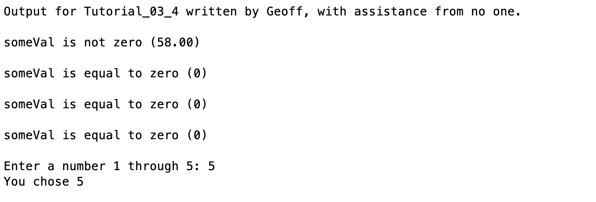

# Chapter 3 Tutorial 4
The purpose of this tutorial is to teach you about control structures `if` and `switch` as well as covering relational and logical operators.
```Matlab
% Clear the command window and all variables
clc     % Clear the command window contents
clear   % Clear the workspace variables
```
Edit the code below and update the variable named name with your **name** for this tutorial in the code below.
```Matlab
% Output of the title and author to the command window.
programName = "Tutorial_03_4";
name = "";
assistedBy = "";
fprintf("Output for %s written by %s, with assistance from %s.\n\n", programName, name, assistedBy)
```
# If
## The Simplest If
In it's most basic form, an if statement is just that, simply an if with a single conditional.
```Matlab
% Create a variable named someVal and populate it with a value that is not zero

if (someVal)
    fprintf("someVal is not zero (%4.2f)\n\n", someVal)
end
```
Notice that the code in the if-statement was executed but we didn't actually ask it anything, we didn't ask if this equals that or if this is greater than that. This is referred to as a boolean, in it's most basic state an if-statement simply says `if (condition)` where condition must be true or false. The value zero is the same as false, so, if you had set someVal to zero, you wouldn't see the output. On the other end, **anything not zero is a true**. So, since we had set `someVal` to a value that was not zero, it will execute because that is considered true.
## If Elseif
There is an option to add an `elseif` case, we can add as many as we want but we'll start simple and just create one.
```Matlab
% Change the value of someVal to zero

if (someVal)
    fprintf("someVal is not zero (%4.2f)\n\n", someVal)
elseif (~someVal)
    fprintf("someVal is equal to zero (%i)\n\n", someVal)
end
```
Notice again, we simply used the variable name but we put not before it `~someVal` which simply asks "if someVal is not true" or in simpler terms, "if someVal is zero/false".
## If Elseif Else
Finally, the last option in an if statement is the `else` which covers any condition not covered by the previous `if`s or `elseifs`.
```Matlab
if (someVal)
    fprintf("someVal is not zero (%4.2f)\n\n", someVal)
elseif (~someVal)
    fprintf("someVal is equal to zero (%i)\n\n", someVal)
else
    fprintf("something is wrong if we hit this condition")
end
```
Now, if you analyze the code you should realize that the `else` will never get triggered since the first if checks if `someVal` is true and the `elseif` checks if it's false, there is only true/false, so the else will never get reached.
# Relational Operators
Relational operators allow us to check for a set of relations, we have the following options.
* == - Checks if two things are equal
* ~= - Checks if two things are not equal
* < - Checks if the object on the left is less than the right
* <= - Checks if the object on the left is less than or equal to the right
* > - Checks if the object on the left is greater than the right
* >= - Checks if the object on the left is greater than or equal to the right
Since we know that a zero means false we can take the example code from above and instead of saying `~someVal` it might be easier to read if we actually use a relational operator, for example:
```Matlab
if (someVal)
    fprintf("someVal is not zero (%4.2f)\n\n", someVal)
elseif (someVal == 0)
    fprintf("someVal is equal to zero (%i)\n\n", someVal)
else
    fprintf("something is wrong if we hit this condition")
end
```
You'll see the code gets executed just as before because asking if `someVal` is `false` is the same as asking if `someVal == 0`
## Logical Operators
Now, let's change the if statement to say the same as asking if `someVal` is `true` but more specifically, asking if it is not zero. We have to ask two questions because in order to be not zero it has to either be greater than zero or less than zero. To ask two questions, we use a logical operator `|` and we'll also use `<` and `>` relational operators. Here is how we can "reword" this question in the if. But first, change `someVal` to something not zero so it executes the first if.
```Matlab
% Change the value of someVal to something not zero

if (someVal > 0 | someVal < 0)
    fprintf("someVal is not zero (%4.2f)\n\n", someVal)
elseif (someVal == 0)
    fprintf("someVal is equal to zero (%i)\n\n", someVal)
else
    fprintf("something is wrong if we hit this condition")
end
```
So here, we're asking "is someVal greater than zero or is someVal less than zero". We could have also simply used `if (someVal ~= 0)` which is cleaner but this was a good way to show you that
1. There is almost always multiple valid solutions in software
2. How to use the logical OR operator
We'll get into some more detailed `if` statements as we go along so no sense in giving you a bunch of tutorial-style examples with fake data.
# Switch
The `switch` statement is very similar to the `if` statement. It is used for checking a set of conditions and has a situation to handle all other conditions. If uses an `else` and switch uses `otherwise` for all other conditions. The main difference is that sometimes a `switch` statement can be cleaner and more readable than an if. It's up to you whether to use `switch` or `if`, whichever is easier for you to read/understand. 

Let's run through a simple example, let's ask the user for a number 1 through 5 and use a `switch` statement to analyze the input
```Matlab
% Ask the user for a number
userChoice = input("Enter a number 1 through 5: ");

switch userChoice
    case 1
    case 2
        fprintf("You chose 1 or 2\\n\\n")
    case 3
        fprintf("You chose 3\\n\\n")
    case 4
        fprintf("You chose 4\\n\\n")
    case 5
        fprintf("You chose 5\\n\\n")
    otherwise
        fprintf("It appears you chose something other than 1-5...\\n\\n")
end
```
Notice we don't need the `==` and we can check multiple cases (like an or) without the `|` operator by putting two cases in a row before the conditional code. We'll see, later on, there are even more ways to compact this down further resulting in cleaner code.
## Additional Notes:
* 
# Example Output
Create a script of the same name, your output should match the following.
