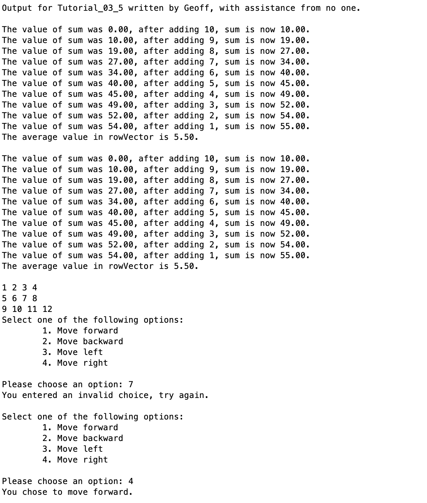

# Chapter 3 Tutorial 5
The purpose of this tutorial is to teach you about control structures `for` and `while` loops as well as covering relational and logical operators.
```Matlab
% Clear the command window and all variables
clc     % Clear the command window contents
clear   % Clear the workspace variables
```
Edit the code below and update the variable named name with your **name** for this tutorial in the code below.
```Matlab
% Output of the title and author to the command window.
programName = "Tutorial_03_5";
name = "";
assistedBy = "";
fprintf("Output for %s written by %s, with assistance from %s.\n\n", programName, name, assistedBy)
```
# for
The for loop is used whenever you want to loop for some specified number of iterations. Whether it's _n_ times or to loop through each element in a list, etc.

Here is an example where we'll create a row vector and find the average of the values in that vector by looping through them with a `for` loop.
```Matlab
% Create a row vector with some values in it
rowVector = fliplr(1:10);

sum = 0;
for element = rowVector
    sum = sum + element;
    fprintf("The value of sum was %4.2f, after adding %i, sum is now %4.2f.\n", sum-element, element, sum)
end
average = sum / 10;
fprintf("The average value in rowVector is %4.2f.\n\n", average)
```
A few things are worth noting here so please take some time to analyze the code
1. During each iteration `element` contains the next value in `rowVector`. This is because we used `element = rowVector`, MATLAB is going to take each element in `rowVector` and populate `element` with it prior to each iteration.
2. We initialize a variable `sum = 0` because if we created this in the for loop, it would keep setting it to zero during each iteration. So, we have to do this before the loop.
3. We can add something to itself by saying `variable = variable + ...` and it doesn't stop at adding, we could perform any manipulation on a variable while also referencing its own value.
4. We're using multiple format specifiers but more interestingly, notice one of the variables provided is actually a calculation rather than a variable `sum-element`. This is another example of nesting, we could have created a variable like `prevValue = sum - element` and then used `prevValue` as the value for the first specifier but we can save time and code by doing it on the fly, we don't need to store `prevValue` for anything else so there's no need to save it.

As always, there are multiple ways to solve problems with code. If you don't think you would have been able to come up with that method of calculating the previous value, we can split the `fprintf` and not use a `\n` which allows us to create a single line of text even though it's two lines of code. Remember that the cursor doesn't move to the next line until you provide a `\n`.
```Matlab
sum = 0;
for element = rowVector
    fprintf("The value of sum was %4.2f", sum)
    sum = sum + element;
    fprintf(", after adding %i, sum is now %4.2f.\n", element, sum)
end
average = sum / 10;
fprintf("The average value in rowVector is %4.2f.\n\n", average)
```
This is just one more way we can utilize our understanding of the language to our advantage. Don't focus on there being one solution, figure out how to solve the problem the best way you know how and as you progress you will slowly start finding multiple ways to solve the same problem and pick the one that you think best fits for you.
### Nested for
There will come times when you need to use a nested `for` loop. Usually it's the case that you have a matrix and you want to visit each element in that matrix. In this case you will need two for loops because, like above, you need to loop through the columns, but then you also need to loop through the rows.

#### Example
This is just to expose you to it so when we visit these later, it might be a little easier to understand since it had time to sit in your brain a bit. Let's create a 3x4 matrix that contains the values 1-12 in order from top right to bottom left. Then, create a nested `for` loop to parse through these values one at a time.

To solve this problem it'd be easier to break this task into two steps, we know we need to parse the columns and the rows so, which comes first? We want to go in order from 1 to 12 so we should start with the first row and parse through the matrix. Let's first create the matrix…
```Matlab
% Create a matrix, we'll use 1-12 so it's easy to follow the numbers as they sit in the matrix
matrixA=[1 2 3 4;
         5 6 7 8;
         9 10 11 12];
```
Now, let's create a single `for` loop to run through the rows but we'll only print the first element in that row so we don't need to worry about a second `for` loop just yet.
```Matlab
% Don't copy this section into your code, wait until the completed nested for loop
for row = 1:3
    fprintf("%i\n", matrixA(row, 1))
end
```
Perfect, it prints the first element of each row, let's analyze what's going on
1. For the values 1 to 3 (we know there are three rows)
    2. Print `"%i\n"`
    3. The value provided for `%i` is not `row` because, again, we're using an index, we want that number row's value so we instead provide `matrixA(row, 1)` which is the element in `matrixA` at row `row` and column 1.

Now let's create a single `for` loop _inside_ this loop, to run through the columns of each row. 
```Matlab
for row = 1:3
    for col = 1:4
        fprintf("%i ", matrixA(row,col))
    end
    fprintf("\n")
end
```

 so let's just create a row vector of 1:4 so our loop's `col` value goes 1, 2, 3, 4. Then we'll just print out the values for the first row.

Let's analyze
1. For the values 1 to 4 (we know there are four columns)
    2. Print `"%i "` (This is the same print as before but now, notice there is no newline. The newline was moved until after all the columns are displayed so the next row will be printed on a new row.
    3. We modified `matrixA(row, 1)` to `matrix(row, col)` since we now have the column index as well.
3. Print a newline (this just moves the cursor to the next line which we'll need once we start getting to the next line)

Again, this is just to get this into your brain to have time to stew, don't worry if you don't fully understand what's going on.
## while
The `while` loop is (mostly) used when we have an indefinite number of loop iterations. I generally tell people to think of the loops like this. If you say to yourself, I need to loop through **each** or for **n times**, these two words indicate a for loop. If you say I need to loop **until** or **while** then you're going to want a `while` loop.

The `while` loop can also be thought of as an `if` statement that keeps executing as long as the `if` condition is met, hence the `while`.

### Example
One very common use for a while loop is when you are asking for user input. Let's create a program that prints a menu of options and asks the user for input. We can use a `while` loop to keep asking until the user enters a valid input. Again, we can do this in parts. It's easier to build this outside of a loop and then just wrap the loop at the end. So, let's pretend there is no loop and get this solved for one iteration.
```Matlab
% Print a menu of options
fprintf("Select one of the following options:\n")
fprintf("\t1. Move forward\n")
fprintf("\t2. Move backward\n")
fprintf("\t3. Move left\n")
fprintf("\t4. Move right\n")

% Get the user input
userChoice = input("\nPlease choose an option: ");

% Now, check what the user chose
switch userChoice
    case 1
        fprintf("You chose to move forward.\n\n")
    case 2
        fprintf("You chose to move forward.\n\n")
    case 3
        fprintf("You chose to move forward.\n\n")
    case 4
        fprintf("You chose to move forward.\n\n")
    otherwise
        fprintf("You entered an invalid choice, try again.\n\n")
end
```
So, if we try this as is, no matter what we enter the script will exit. We want to loop until the user entered a valid selection (1-4). So, we can simply take all that code we just wrote and wrap it in a `while` loop. But, we need a conditional to determine if the loop should keep going. So, let's create a variable, initially set to `true`, we can call it `shouldContinue`. It needs to be initially set to `true` so it enters the loop. Then we can change the value to `false` if a valid selection is made.
```Matlab
shouldContinue = true;
while(shouldContinue)  % We could also use while(shouldContinue == true) if that's easier for you to read
    % Print a menu of options
    fprintf("Select one of the following options:\n")
    fprintf("\t1. Move forward\n")
    fprintf("\t2. Move backward\n")
    fprintf("\t3. Move left\n")
    fprintf("\t4. Move right\n")

    % Get the user input
    userChoice = input("\nPlease choose an option: ");

    % Now, check what the user chose
    switch userChoice
        case 1
            fprintf("You chose to move forward.\n\n")
            shouldContinue = false;
        case 2
            fprintf("You chose to move forward.\n\n")
            shouldContinue = false;
        case 3
            fprintf("You chose to move forward.\n\n")
            shouldContinue = false;
        case 4
            fprintf("You chose to move forward.\n\n")
            shouldContinue = false;
        otherwise
            fprintf("You entered an invalid choice, try again.\n\n")
    end
end
```
We added a `shouldContinue = false;` after each valid selection so the loop will exit during the next iteration.
## Additional Notes:
* 
# Example Output
Create a script of the same name, your output should match the following.
