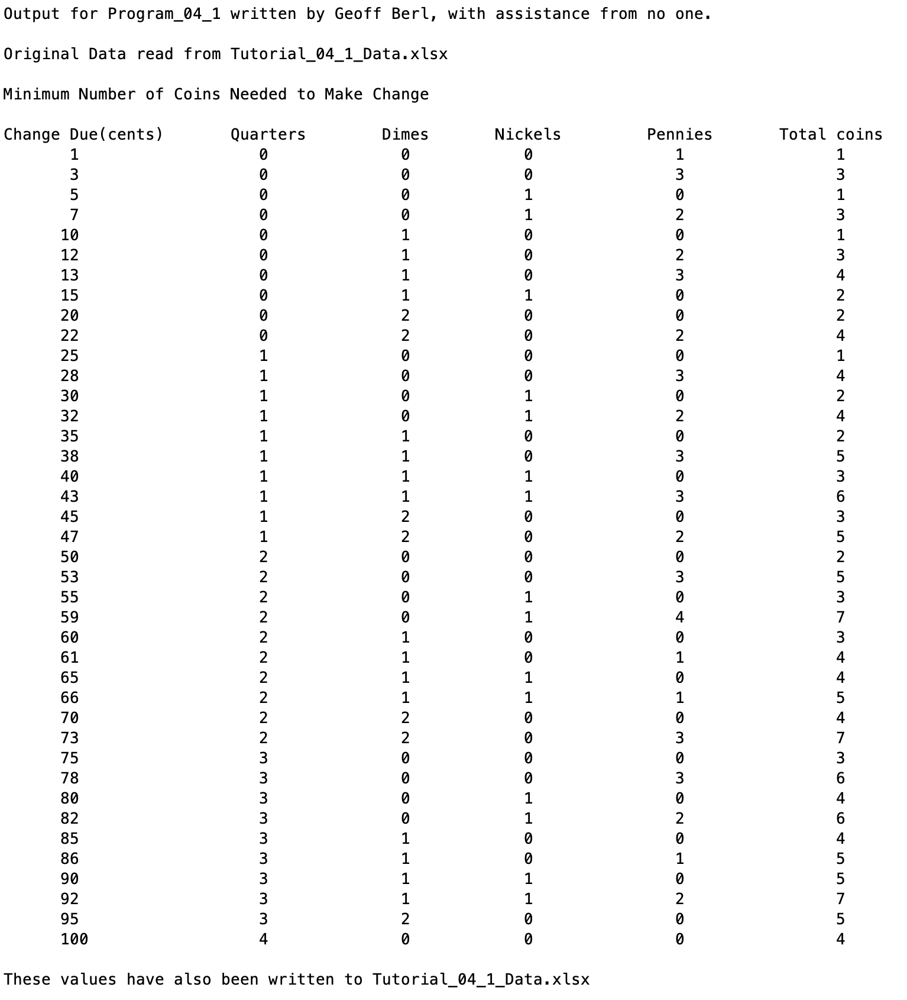

# Program\_04\_1
## Requirements
Write a script that will load change due data from Tutorial_04_1_Data.xlsx and calculates the minimum number of coins to provide the change due.

* Create a program that
    * Loads Change Due from Tutorial_04_1_Data.xlsx sheet Coins
    * Computes the minimum coins needed to provide the change due
    * Outputs to the command window
    * Outputs to the file `Tutorial_04_1_Data.xlsx` sheet Coins in the appropriate cell array to fill the fields for quarters, dimes, nickels, pennies, and total number of coins.
* Name the program file **Program\_04\_1.m**
* Your output should match the output shown below.
* Add the standard comments similar to those that appear at the top of each tutorial and clearly label your output following the example shown below.

## Program
Use the code below to start your M file and complete the requirements stated above

### Tips
* 

```Matlab
% Program Description:
% The purpose of this program is to ...

% Clear the command window and all variables
clc     % Clear the command window contents
clear   % Clear the workspace variables

% Output of the title and author to the command window.
programName = "Program_04_2";
name = "";
assistedBy = "";
fprintf("Output for %s written by %s, with assistance from %s.\n\n", programName, name, assistedBy)


```
## Example Output
Your program output values and format should match the following.

**IMPORTANT: You should also ensure that the file named `Tutorial_04_1.xlsx` is updated by your program.**
