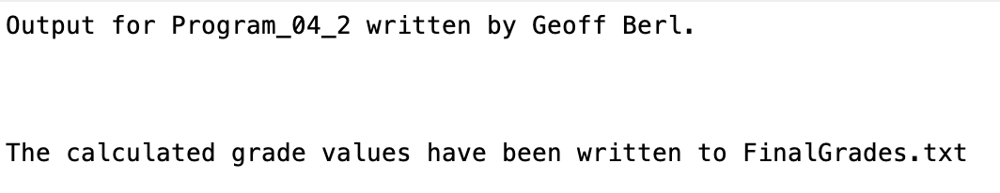
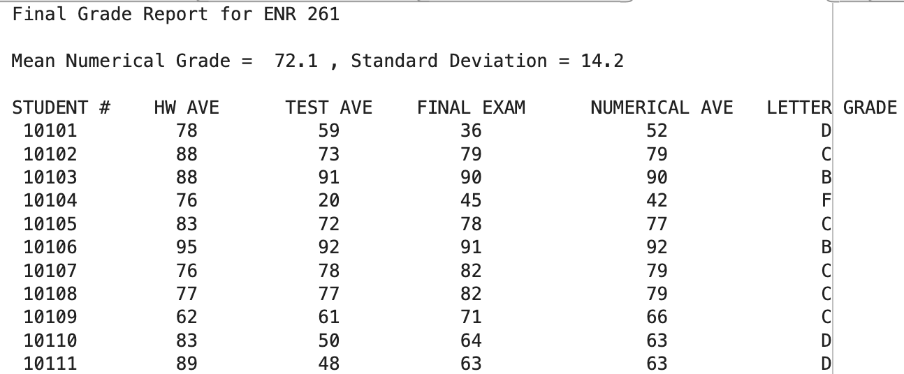

# Program\_04\_2
## Requirements
Write a script that will load raw grade data from **RawGrades.txt** and calculate the letter grade received, based on a curve algorithm.
* Create a program that
    * Loads grade data from **RawGrades.txt**
    * Compute the total numerical grade based on the following formula
                    HW 20%, Tests 35%, Final Exam 45% rounded to the nearest whole number
    * Compute a letter grade based on the following curve
                    A >= Mean Numerical Average + 1.5\* Standard Dev of Numerical Averages
                    B >= mean + 0.5*Stdev and less than mean + 1.5\*Stdev
                    C >= mean - 0.5*Stdev  and less than mean + 0.5\*Stdev
                    D >= mean - 1.5*Stdev  and less than mean - 0.5\*Stdev
                    F <   mean - 1.5\*Stdev
Output should print to the command window
Output should print to the file Tutorial_04_1_Data.xlsx sheet Coins in the appropriate cell array to fill the fields for quarters, dimes, nickels, pennies, and total number of coins.
* Name the program file **Program\_04\_2.m**
* Your output should match the output shown below.
* Add the standard comments similar to those that appear at the top of each tutorial and clearly label your output following the example shown below.

## Program
Use the code below to start your M file and complete the requirements stated above

### Tips
* 
```Matlab
% Program Description:
% The purpose of this program is to ...

% Clear the command window and all variables
clc     % Clear the command window contents
clear   % Clear the workspace variables

% Output of the title and author to the command window.
programName = "Program_04_1";
name = "";
assistedBy = "";
fprintf("Output for %s written by %s, with assistance from %s.\n\n", programName, name, assistedBy)


```
## Example Output
Your program output values and format should match the following.

**IMPORTANT: You should also see the sorted grades in the `FinalGrades.txt` file**

Here is an example of the first few lines of the text file
