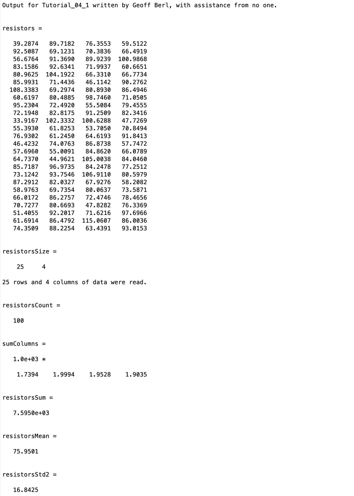
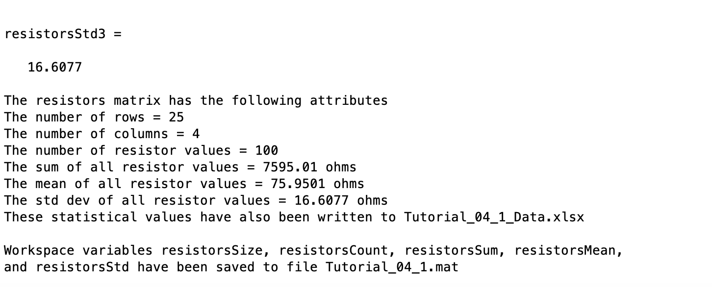

# Chapter 4 Tutorial 1
The purpose of this tutorial is to teach you importing and exporting Excel data.
```Matlab
% Clear the command window and all variables
clc     % Clear the command window contents
clear   % Clear the workspace variables
```
Edit the code below and update the variable named name with your **name** for this tutorial in the code below.
```Matlab
% Output of the title and author to the command window.
programName = "Tutorial_04_1";
name = "";
assistedBy = "";
fprintf("Output for %s written by %s, with assistance from %s.\n\n", programName, name, assistedBy)
```
## Input
**Get data from Excel with readmatrix (formerly xlsread)**
### `readmatrix`
The `readmatrix` command is used to import data from excel. It is used in the format `dataVariable = readmatrix('filename.xlsx', options...)` where options can either be an object with optional settings or just a set of inputs to tell MATLAB how to format the data. By default, MATLAB will try to interpret the data the best it can but the `option` settings can be specifically set to represent what how the data is formated. 
#### Options
Sometimes we'll have data with varying formats, different sheets, etc. We want to be able to instruct MATLAB how to interpret the data, the following is an example. We can either create an options object and set settings accordingly, or, if the data isn't too complex, we can just provide the options as "sets" of arguments.

For example, to specify the sheet to get the data from, we supply this pair of arguments `'Sheet', 'name_of_sheet'` where the first defines what option, and the second provides the value. Then, to specify a range, we include this pair of arguments `'Range', 'the_range'` where again, the first defines what option, and the second provides the value.

Let's run through an example.
```Matlab
% Read range A4:D28 from the sheet named 'OldResistors'
resistors = readmatrix('Tutorial_04_1_Data.xlsx','Sheet','OldResistors','Range','A4:D28')
% The following would be acceptable as well, notice the pair of options still stays together but the order of the pairs does not matter.
%resistors = readmatrix('Tutorial_04_1_Data.xlsx','Range','A4:D28','Sheet','OldResistors')
```
## Data Manipulation
### Checking out the size of the data
Now, let's take a look at what was imported, use the `size()` function to determine the size of the variable. Remember you can use the search bar or `help size` in the command window for more information
```Matlab
resistorsSize=
fprintf('%i rows and %i columns of data were read.\n\n', resistorsSize)
```
You may not have seen this notation for `fprintf` before, because `resistorsSize` is a vector, `fprintf` will start pulling out each element one by one from left to right to fill the values for the format specifiers.

If you look at the output of assigning `resistorsSize` you should notice it's a 1x2 array. The first column, as you might expect, is the number of rows.

There are a few rows and columns, they're all resistor values. In the following code, get the row and column count values from `resistorsSize` and multiply them to compute the total number of resistors.
```Matlab
resistorsCount=
```
#### Let's do some math with sum()
Create a vector with the sum for each column in the resistors array.
```Matlab
sumColumns=
```
Create a scalar that will have the total value of all resistors combined. Again, using the sum() function.
```Matlab
resistorsSum=
```
#### Getting the mean
Now, compute the total mean of the resistors' values.
```Matlab
resistorsMean=
```
#### Getting the Standard Deviation
Normally, with a vector this would be simple, but we have a 2D array and can't simply run the std() function on our data. There are a few ways of computing the std dev for a 2D array.

The long way
```Matlab
% We can compute our own standard deviation using a vectorized formula

% step 1: Compute (x-xmean)^2 for each value in matrix resistors.
deviations=(resistors-resistorsMean).^2;  % Creates a matrix of deviations

% step 2: sum all the deviations
sumDevColumns=sum(deviations); % vector containing sum of each column
sumDeviations=sum(sumDevColumns); % sum of the column vectors = sum(x-xmean)^2

% step 3: compute sqrt(sum(x-xmean)^2)/(N-1))
resistorsStd=sqrt(sumDeviations/(resistorsCount-1));
```
The slightly shorter way, let's just make our data into a vector and call std()
```Matlab
% If there were more than 4 rows, we may want to use a for loop
resistorsStd2=std([resistors(1,:),resistors(2,:),resistors(3,:),resistors(4,:)])
```
The shortest way, instead of supplying a row or column, just use a colon operator to get all values in a single column vector.
```Matlab
resistorsStd3=std(resistors(:))
```
## Output
### To the command window
Let's output our data to the command window
```Matlab
fprintf('The resistors matrix has the following attributes\n')
fprintf('The number of rows = %i\n', resistorsSize(1))
fprintf('The number of columns = %i\n', resistorsSize(2))
fprintf('The number of resistor values = %i\n', resistorsCount)
fprintf('The sum of all resistor values = %g ohms\n', resistorsSum)
fprintf('The mean of all resistor values = %g ohms\n', resistorsMean)
fprintf('The std dev of all resistor values = %g ohms\n', resistorsStd)
```
### To the Excel spreadsheet
Now store the data in the original Excel spreadsheet using writematrix (formerly xlswrite)

Let's put the values in as follows.
* resistorsCount in cell H4 of sheet 'OldResistors'
* resistorsSum in cell H5 of sheet 'OldResistors'
* resistorsMean in cell H6 of sheet 'OldResistors'
* resistorsStd in cell H7 of sheet 'OldResistors'

I'll do the first one, it's in the format `writematrix(value, filename, ... sheet and range params)`. We should use variables so we don't have to repeat things like the filename, and sheet name
```Matlab
filename='Tutorial_04_1_Data.xlsx';
sheetName='OldResistors';
writematrix(resistorsCount,filename,'Sheet',sheetName,'Range','H4:H4')


% Notify the user that data is written to the Excel file
fprintf('These statistical values have also been written to Tutorial_04_1_Data.xlsx \n\n')
```
### To a .mat binary file
Finally, let's try saving some variables to a .mat binary file. Check the slides, book, or help doc if you don't remember how to save workspace variables. Save the following workspace variables to a file named **Tutorial_04_1.mat**
* resistorsSize
* resistorsCount
* resistorsSum
* resistorsMean
* resistorsStd
```Matlab
% Save some variables to Tutorial_04_1.mat


% Notify the user that the variable have been saved
fprintf('Workspace variables resistorsSize, resistorsCount, resistorsSum, resistorsMean,\n')
fprintf('and resistorsStd have been saved to file Tutorial_04_1.mat\n\n')
```
## Additional Notes:
* 
# Example Output
Create a script of the same name, your output should match the following.

