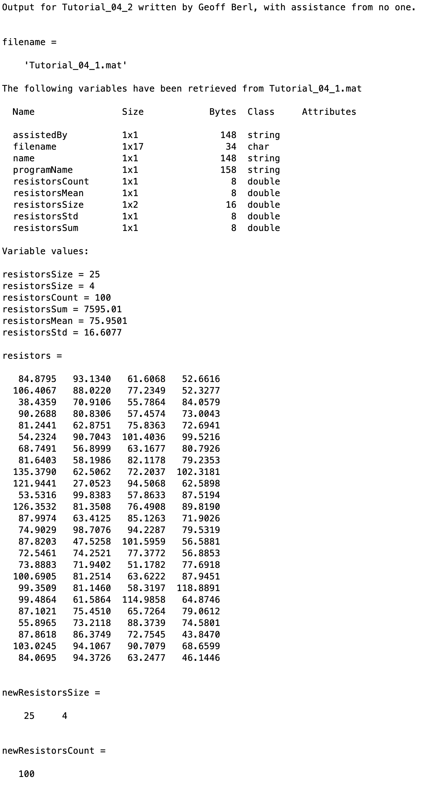
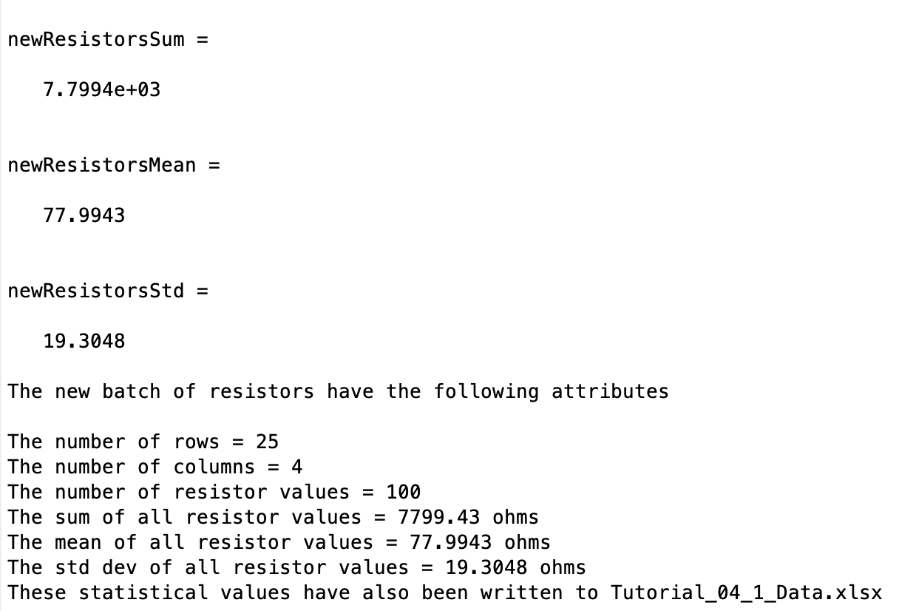

# Chapter 4 Tutorial 2
The purpose of this tutorial is to teach you importing and exporting Excel data.
```Matlab
% Clear the command window and all variables
clc     % Clear the command window contents
clear   % Clear the workspace variables
```
Edit the code below and update the variable named name with your **name** for this tutorial in the code below.
```Matlab
% Output of the title and author to the command window.
programName = "Tutorial_04_2";
name = "";
assistedBy = "";
fprintf("Output for %s written by %s, with assistance from %s.\n\n", programName, name, assistedBy)
```
## Input
Importing From .mat
Refer to the lecture slides, book, or the help doc if you don't remember. Load the workspace variables that were stored when running Tutorial_04_1.
```Matlab
filename='Tutorial_04_1.mat'

% Load stored workspace variables


% Display some info to the user
fprintf('The following variables have been retrieved from %s\n\n', filename)
whos

fprintf('Variable values:\n\n')
fprintf('resistorsSize = %g\n', resistorsSize)
fprintf('resistorsCount = %i\n', resistorsCount)
fprintf('resistorsSum = %g\n', resistorsSum)
fprintf('resistorsMean = %g\n', resistorsMean)
fprintf('resistorsStd = %g\n', resistorsStd)
```
## Manipulation
### Create a random matrix
Let's say we want to create a matrix of equal size as the matrix previously loaded from the Excel file. But in this new matrix, we're going to fill it with random values and store that data on a separate sheet in the Excel file.

Furthermore, let's say we want those values to be with roughly the same mean and std dev as the previous set of resistor values. We discussed the `rand()` function briefly, there is also the `randn()` function which creates a matrix of random values with a normal distribution, a mean of 0 and a std dev of 1. Because this is a normal distribution (bell curve), the random values will have a higher chance of being closer to the mean than farther.

The formula for adjusting the distribution of `randn()` using a specified mean and std dev is _mean + stdev\*randn(m,n)_.

With that knowledge, create a new `resistors` variable containing random values with roughly the same mean and std dev as Tutorial_04_1's resistor values.
```Matlab
resistors=resistorsMean + resistorsStd*randn(resistorsSize)
```
### Get Meta Data
Just as was done in Tutorial_04_1, compute the following statistical values on this newly generated matrix of random values.
```Matlab
newResistorsSize=
newResistorsCount=
newResistorsSum=
newResistorsMean=
newResistorsStd=
```
## Output
### To the command window
Let's output our data to the command window
```Matlab
fprintf('The new batch of resistors have the following attributes\n\n')
fprintf('The number of rows = %i\n', newResistorsSize(1))
fprintf('The number of columns = %i\n', newResistorsSize(2))
fprintf('The number of resistor values = %i\n', newResistorsCount)
fprintf('The sum of all resistor values = %g ohms\n', newResistorsSum)
fprintf('The mean of all resistor values = %g ohms\n', newResistorsMean)
fprintf('The std dev of all resistor values = %g ohms\n', newResistorsStd)
```
### To the Excel spreadsheet
Now store the data in the original Excel spreadsheet using writematrix
Let's put the values in as follows.
* Store the array of resistors in cells A4:D28 of sheet 'NewResistors'
* resistorsCount in cell H4 of sheet 'NewResistors'
* resistorsSum in cell H5 of sheet 'NewResistors'
* resistorsMean in cell H6 of sheet 'NewResistors'
* resistorsStd in cell H7 of sheet 'NewResistors'
I'll do the first one, it's in the format `writematrix(value, filename, ... sheet and range params)`. We should use variables so we don't have to repeat things like the filename, and sheet name
```Matlab
filename='Tutorial_04_1_Data.xlsx';
sheetName='newResistors';
writematrix(resistors,filename,'Sheet',sheetName,'Range','A4:D28')


% Notify the user that data is written to the Excel file
fprintf('These statistical values have also been written to Tutorial_04_1_Data.xlsx \n\n')
```
**Pro Tip:** You can see the benefit of storing the filename and sheetname in a variable, you can copy and paste your `writematrix` commands from Tutorial_04_2 and just change the names of the variables, the filename and sheetname are stored in variables so you don't need to replace those values 8 different times. So, use variables 

## Compare the Results
After you've run both scripts, compare Excel sheets 'OldResistors' and 'NewResistors' and see how closely they compare even though the 'NewResistors' were randomly generated values.
## Additional Notes:
* 
# Example Output
Create a script of the same name, your output should match the following.

