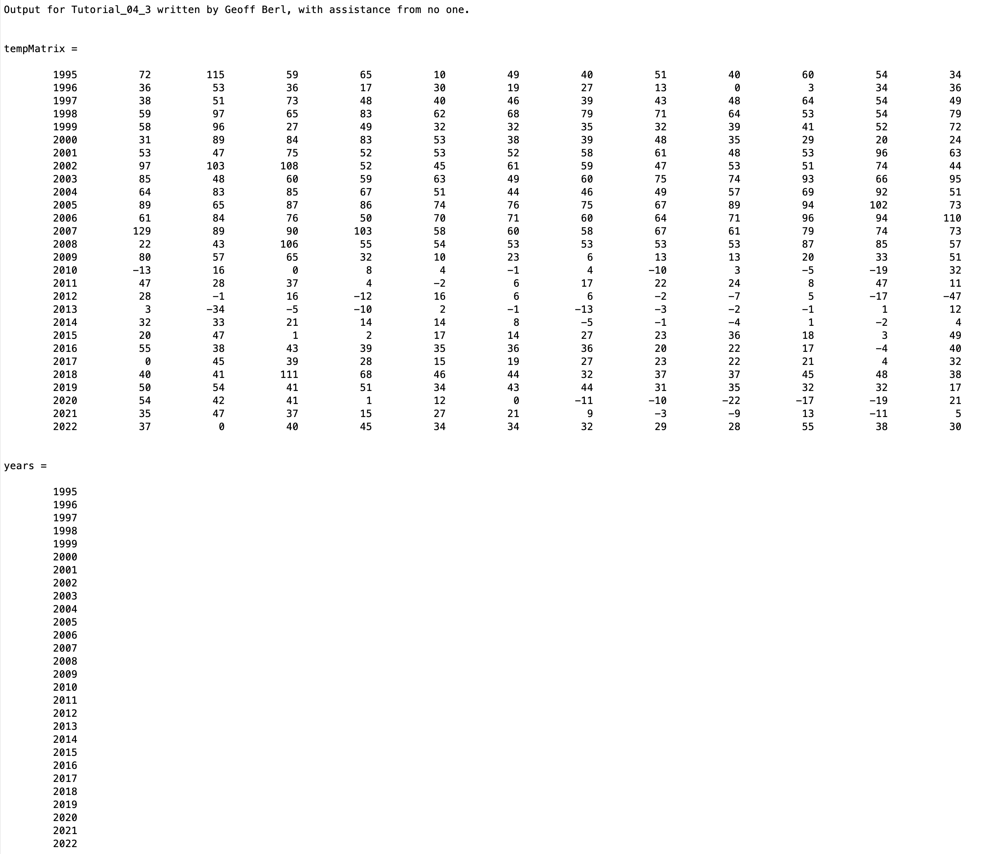
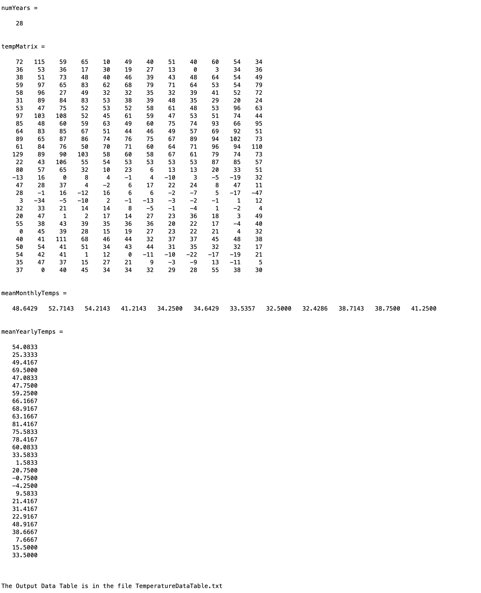

# Chapter 4 Tutorial 3
The purpose of this tutorial is to teach you importing and exporting Excel data.
```Matlab
% Clear the command window and all variables
clc     % Clear the command window contents
clear   % Clear the workspace variables
```
Edit the code below and update the variable named name with your **name** for this tutorial in the code below.
```Matlab
% Output of the title and author to the command window.
programName = "Tutorial_04_3";
name = "";
assistedBy = "";
fprintf("Output for %s written by %s, with assistance from %s.\n\n", programName, name, assistedBy)
```
## Input
### Importing From a .txt File
Refer to the lecture slides, book, or the help doc if you don't remember. Load the data from the file **NorthernHemTempIndex.txt** into **tempMatrix**.
```Matlab

```
## Data Manipulation
### Get the Years
Extract the values from the first column
```Matlab
years=
```
Get the number of year values in **years**, search the docs for "length of ...".
```Matlab
numYears=
```
Now that we've extracted the data, delete the first column. Remember that `variable(1,2)=[]` deletes a single value, if you want to delete an entire column you'll have to apply it to "all rows" in that column. Essentially the same as extracting the values above, but here you're assigning the values.
```Matlab
% Delete the first column (years)

```
If you look at your Workspace, you should see that your **tempMatrix** variable says it's a 28x12 where it was 28x13 array since we just deleted a column.

We're just removing the years so we can perform calculations on the remaining data as a whole, as the rest of the data is temperature values.

### Compute the Mean
Compute the mean of each column and row in **tempMatrix**. You'll have to check the doc to determine how to get the mean by column vs getting the mean by rows. That is, `mean()` of a matrix will return a vector containing the means for each column and row depending on which arguments you supply.
```Matlab
% Compute the mean by column (monthly temps)
meanMontlyTemps=

% Compute the mean by rows (yearly temps)
meanYearlyTemps=
```
## Output
### Open a .txt File
Output to a text file is slightly different than what we've seen with Excel or .mat files. In this case, a reference to the file is stored in a variable. Then we can `fprintf()` to that fileId. Remember, there is an optional first parameter to write to a file, by default it writes to the Command Window. Opening the file with **w**rite permissions will cause each `fprintf()` to append or, add to, the file so long as it is open. If the file is opened again later, it will overwrite the file entirely (starting from an empty file). There are other permissions options depending on how you want to open the file.

Don't forget the '\n' character.
```Matlab
% Open a file with 'w'rite permissions
fileId=fopen('TemperatureDataTable.txt','w');

% Print a title
fprintf(fileId,'Table of Northern Hemisphere Temperature Changes in Degrees Fahrenheit\n\n');

% Print some table headings (the '\t' is a tab character which is generally 4 or 8 spaces)
fprintf(fileId,'Year      Jan\t Feb\t  Mar\t  Apr\t  May\t  Jun\t  Jul\t  Aug\t  Sep\t  Oct\t  Nov\t  Dec\tMean');
```
You may have noticed, I didn't use a '\n' character, but that is for good reason. We're going to be using for loops to print the data to the file. If we add a new line at the end of each print statement in the for loop, we will end with one extra new line from the last for-loop iteration. One common way to avoid this is to set yourself up so you can put the '\n' at the start of your print statement. In this case it will move the cursor down one line, then print the statement in the for loop.
### Print the Temperature Data
Write a (nested) for-loop to print the year, followed by each month's temperature data. The data should look like the following.
2004    64    83    85    67    51    44    46    49    57    69    92    51    63.17
You have to think about the data you have and how you want it represented. So, we have the **years**, the **tempMatrix** data, and the **means**. Those are in three different variable arrays. The year and mean only show up once in each row so we will need a for loop to parse through each year. We should print the year (with a '\n' in the beginning), then we will need a for loop to parse each month's temp data. We will print those one by one but with these, we will begin with a '\t' because we want a tab of space between each value but again, we don't want it on the end or we'll have an extra one. Then, after the months are parse, we want to print our mean value.

To summarize:
* Create a for loop to parse the NUMBER of years (we just want the values 1:n) you may find it easy to use r=1:n
* Print the year for the current iteration (with a '\n' to begin and use %4i for the format)
* Create a for loop to parse the columns in the month data, you may find it easy to use c=1:n where n is the number of columns in the tempMatrix. This way, when you are printing the temperature value, you can use tempMatrix(r,c) for the current row and column based on the for loops. Print the temp value (with a '\t' to begin and use %3i for the format)
* Outside of the nested for-loop, print the mean value for that year (again, beginning with a '\t' and use %5.2f for the format)

Do not forget to fprintf to the fileId!
```Matlab
% For loop to parse the number of years in our dataset


    % Print the current year
    
    
    % For loop to parse the months in the current year (r from the outer for loop)
    
        % Print the current month (r,c)


    % Print the yearly mean at the end of each year's row
    

```
Now, while that file is still open, let's add a final row of information showing the mean from each column (months). Here we don't need to go for `r=1:n`, we can actually parse through the values so we can use `for mean=meanMontlyTemps` and then just print the value of mean rather than needing to use and index like `meanMonthlyTemps(r)`.
```Matlab
% Label the column "Mean" in place of where the Year would normally be


% For loop to step through each month in meanMonthlyTemps and print
% beginning with a \t and %5.2f format


% Finally, we need to always remember to close the file when we're done
fclose(fileId);

% Notify the user that the process is complete
fprintf('\n\nThe Output Data Table is in the file TemperatureDataTable.txt\n\n') 
```
## Additional Notes:
* 
# Example Output
Create a script of the same name, your output should match the following.

