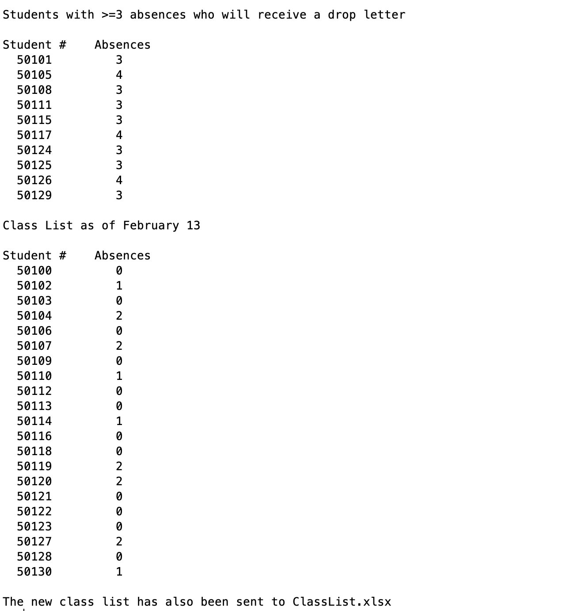

# Program\_05\_1
## Requirements
Write a script that will read in the original data from the Feb_6_2009 sheet contained in the Excel file named `ClassList.xlsx` . This file contains the student number and number of absences recorded for each student as of Feb 6.

Your program shall:
* Load the appropriate data from ClassList.xlsx
* Output the Feb 6 attendance data to the command window with a neat format.
* Output a list of students with 1 or 2 absences in the command window who will be sent warning letters.
* Output a list of students with >=3 absences in the command window who will be dropped from the course.
* Remove the students with >=3 absences from the class list and output this updated class list to the command window and the Feb_13 sheet in the ClassList.xlsx file.

* Name the program file **Program\_04\_1.m**
* Your output should match the output shown below.
* Add the standard comments similar to those that appear at the top of each tutorial and clearly label your output following the example shown below.

## Program
Use the code below to start your M file and complete the requirements stated above

### Tips
* 

```Matlab
% Program Description:
% The purpose of this program is to ...

% Clear the command window and all variables
clc     % Clear the command window contents
clear   % Clear the workspace variables

% Output of the title and author to the command window.
programName = "Program_05_1";
name = "";
assistedBy = "";
fprintf("Output for %s written by %s, with assistance from %s.\n\n", programName, name, assistedBy)


```
## Example Output
Your program output values and format should match the following, be sure to check that your values are correctly stored in the Excel file.

