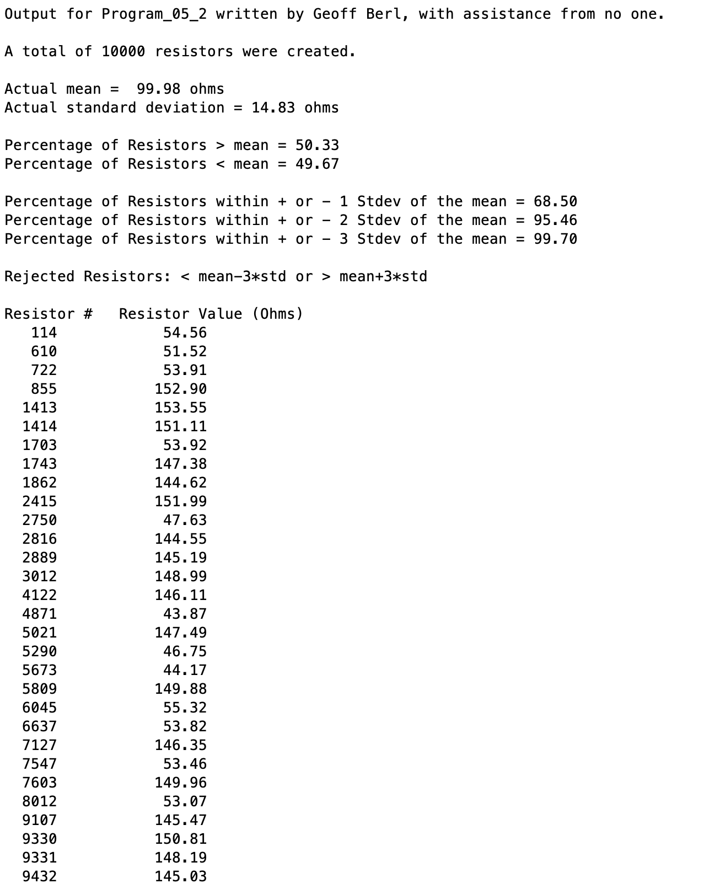

# Program\_05\_2
## Requirements
Write a script that will create 10,000 random resistors with a normal distribution, a mean of 100 ohms, and standard deviation of 15 ohms.

Perform the following operations with the resistor data using logical vectors where appropriate.
* Output the total number of resistors created along with their actual mean and standard deviation as they will differ slightly from the values given.
* Output the percentage of resistor with values > mean and < mean.
* Output the percentage of resistors within +/- 1 Standard Deviation of the mean.
* Repeat step 3 for +/- 2 Standard Deviations and +/- 3 Standard Deviations.
* Output the resistor position numbers and the corresponding resistor values for all resistors outside of +/- 3 standard deviations of the mean.

* Name the program file **Program\_05\_2.m**
* Your output should match the output shown below.
* Add the standard comments similar to those that appear at the top of each tutorial and clearly label your output following the example shown below.

## Program
Use the code below to start your M file and complete the requirements stated above

### Tips
* Keep in mind that the results will vary for each run of your code. Use the "Empirical" or "Three-sigma" rule of statistics.
* The Empirical Rule states that 99.7% of data observed following a normal distribution lies within 3 standard deviations of the mean. Under this rule, 68% of the data falls within one standard deviation, 95% percent within two standard deviations, and 99.7% within three standard deviations from the mean.

```Matlab
% Program Description:
% The purpose of this program is to ...

% Clear the command window and all variables
clc     % Clear the command window contents
clear   % Clear the workspace variables

% Output of the title and author to the command window.
programName = "Program_05_2";
name = "";
assistedBy = "";
fprintf("Output for %s written by %s, with assistance from %s.\n\n", programName, name, assistedBy)


```
## Example Output
Your program output values and format should match the following.
