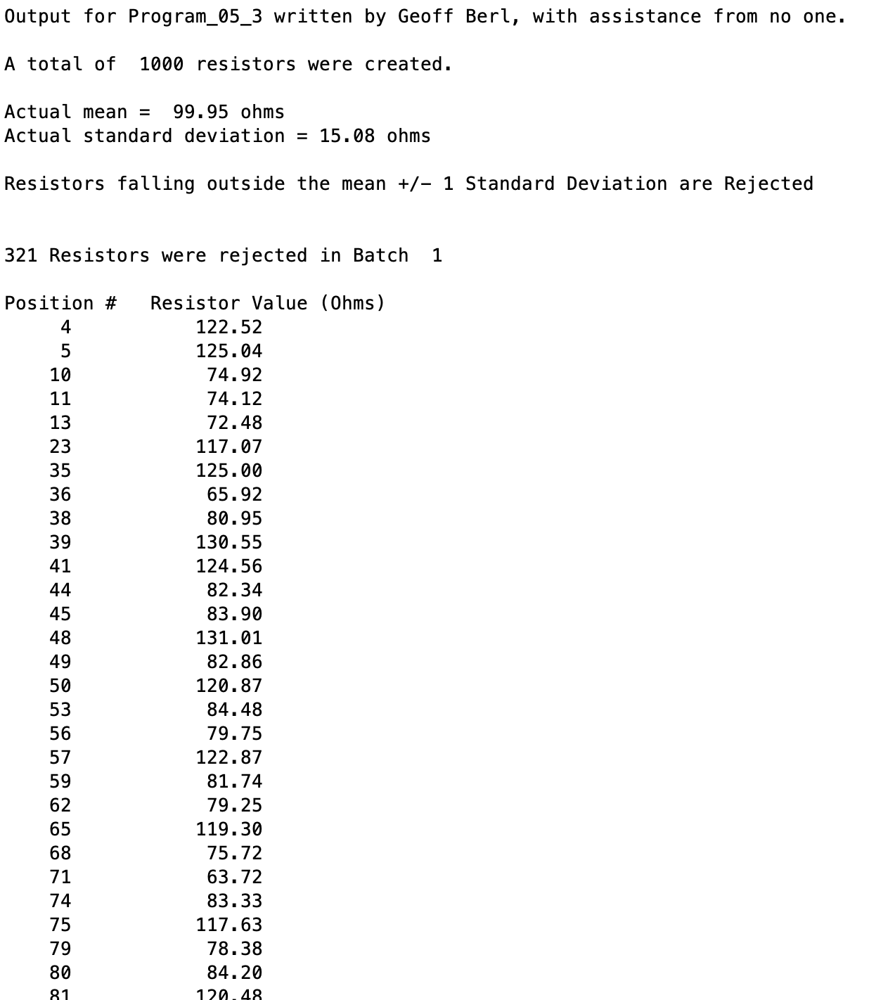
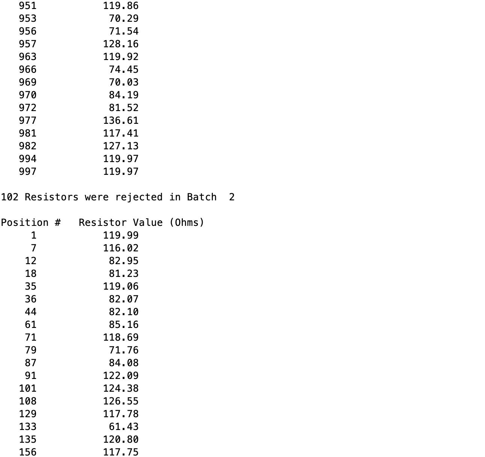
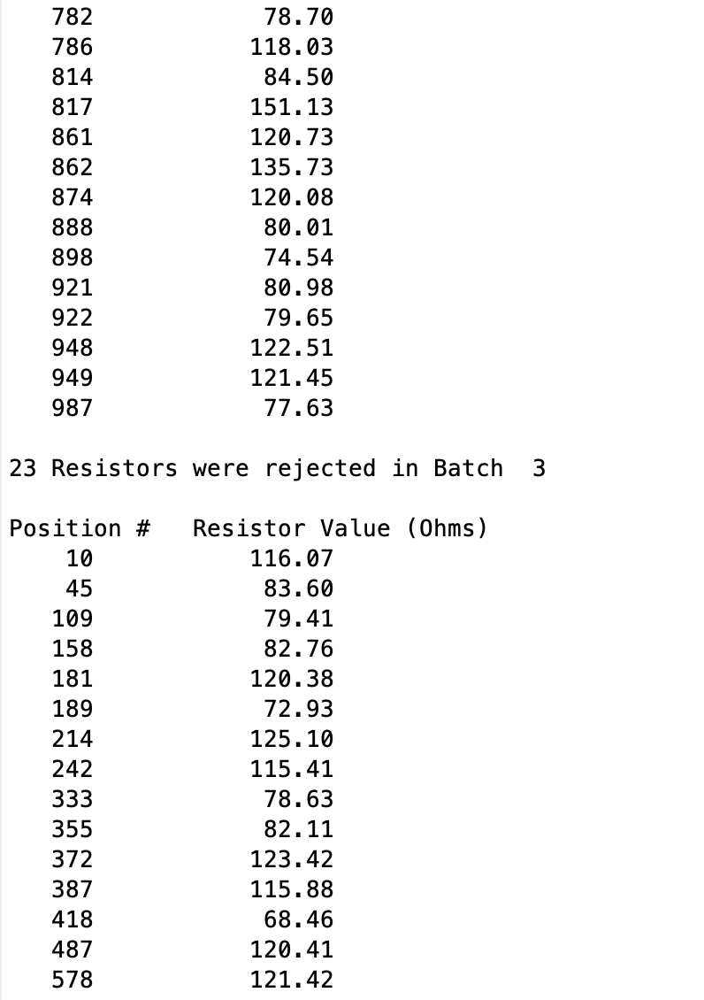
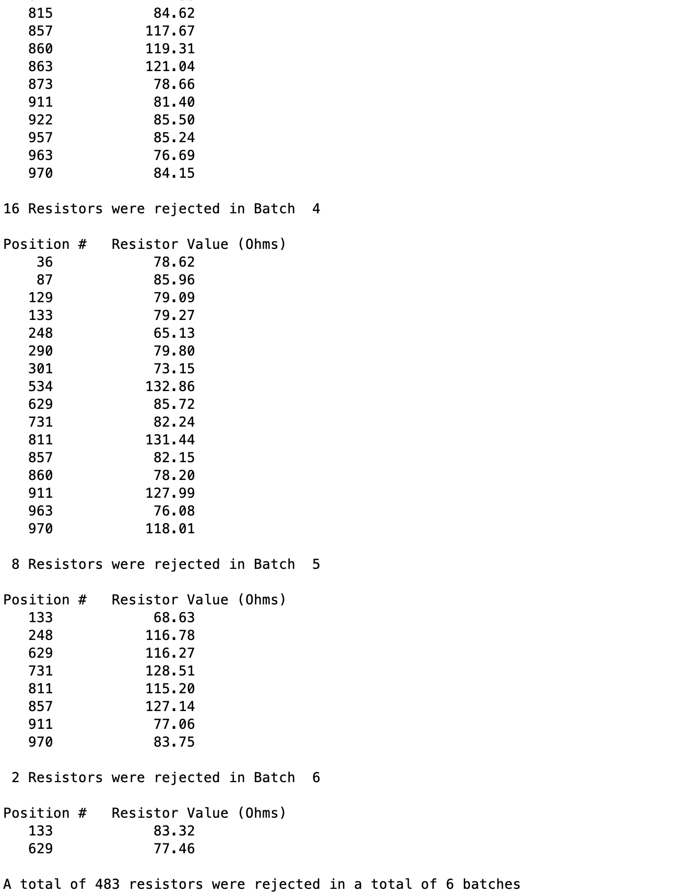

# Program\_05\_3
## Requirements
Write a script that will create 1,000 random resistors in batch 1 with a normal distribution, mean of 100 ohms, and standard deviation of 15 ohms.

Perform the following operations with the resistor data using logical vectors where appropriate
* Output the total number of resistors created in batch 1 along with their actual mean and standard deviation as they will differ slightly from the values given.
* Find the positional number and corresponding resistance value for all resistors in the batch that fall above the upper bound of mean + 1 std or below the lower bound of mean - 1 std.
* Output the number of resistors rejected and the batch number.
* Output the position number and corresponding resistance value for all resistors rejected in the batch.
* If a batch has more than 1 rejected resistor all rejected resistors must be recreated using the randn function and used to replace the rejected resistorin the original vector of resistors.
* Repeat steps 2-5 until there are no resistors outside the lower and upper bounds.

* Name the program file **Program\_05\_3.m**
* Your output should match the output shown below.
* Add the standard comments similar to those that appear at the top of each tutorial and clearly label your output following the example shown below.

## Program
Use the code below to start your M file and complete the requirements stated above

### Tips
* "Repeat until some condition" should indicate to you that a while loop should be used.
* Recall that there is a function to find positional values.
* Utilize vectorized methods and logical vectors as much as possible to avoid overcomplicating your script.
* Keep in mind that the results will vary for each run of your code due to randomness. You can use the fact that about 1/3 of the values of each batch will be rejected as a way to determine if your output is reasonable.

```Matlab
% Program Description:
% The purpose of this program is to ...

% Clear the command window and all variables
clc     % Clear the command window contents
clear   % Clear the workspace variables

% Output of the title and author to the command window.
programName = "Program_05_3";
name = "";
assistedBy = "";
fprintf("Output for %s written by %s, with assistance from %s.\n\n", programName, name, assistedBy)


```
## Example Output
Your program output values and format should match the following. Notice that the output has `...` between images. Rather than post the entire output, the example output shows the start and end of the first few iterations. The portions of output that are cut out are indicated by the `...`.

…

…

…
