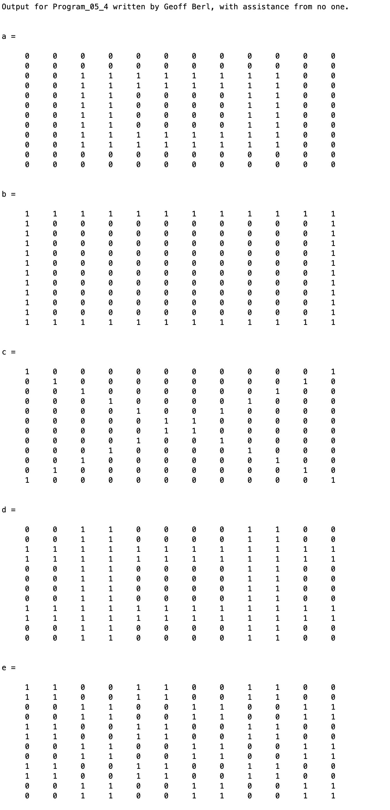

# Program\_05\_4
## Requirements
Create matrices `a`, `b`, `c`, `d`, and e as efficiently as you possibly can such that they appear as shown in the [Example Output](#example-output) section below.
**DO NOT** use brute force, creating matrices manually with bracket or colon notation.
You may **ONLY** use subscript notation and functions.
Colon notation is allowed in subscripts. ex: `a(1:5,3:5)= 0;`

* Name the program file **Program\_05\_4.m**
* Your output should match the output shown below.
* Add the standard comments similar to those that appear at the top of each tutorial and clearly label your output following the example shown below.

## Program
Use the code below to start your M file and complete the requirements stated above

### Tips
Some functions you may find useful are as follows, though you're welcome to find
* ones()
* zeros()
* eye()
* flipud()
* fliplr()
* repmat()
* rot90()

```Matlab
% Program Description:
% The purpose of this program is to ...

% Clear the command window and all variables
clc     % Clear the command window contents
clear   % Clear the workspace variables

% Output of the title and author to the command window.
programName = "Program_05_4";
name = "";
assistedBy = "";
fprintf("Output for %s written by %s, with assistance from %s.\n\n", programName, name, assistedBy)


```
## Example Output
Your program output values and format should match the following.
