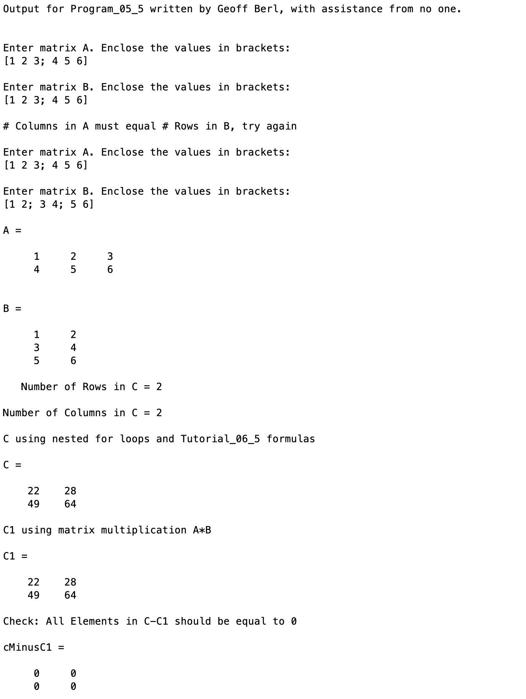

# Program\_05\_5
## Requirements
The purpose of this program is to input matrices A and B and then determine if the matrix multiplication `C=A*B` can be performed.  
* If `C=A*B` cannot be performed, the user shall be instructed to input a new pair of matrices. 
* If `C=A*B` can be performed the number of row and columns of C must be printed. 
* In computing the value of `C` you may not use the matrix multiplication operator `A*B`.
* You must instead create nested for loops to evaluate each element of `C` manually using the formulas given in **Tutorial_05_6**.  Matrix C1 will be computed using `C1 = A*B` to check our answer.  
* The matrix `CminusC1 = C - C1` will be computed.  If all elements of `CminusC1` are zero then our method iscorrect.

* Name the program file **Program\_05\_5.m**
* Your output should match the output shown below.
* Add the standard comments similar to those that appear at the top of each tutorial and clearly label your output following the example shown below.

## Program
Use the code below to start your M file and complete the requirements stated above

### Tips
* 

```Matlab
% Program Description:
% The purpose of this program is to ...

% Clear the command window and all variables
clc     % Clear the command window contents
clear   % Clear the workspace variables

% Output of the title and author to the command window.
programName = "Program_05_5";
name = "";
assistedBy = "";
fprintf("Output for %s written by %s, with assistance from %s.\n\n", programName, name, assistedBy)


```
## Example Output
Your program output values and format should match the following. Be sure to try with different matrix dimensions and ensure it works. When I test, I will be testing multiple failure points, not simply entering the values shown in the output below.
