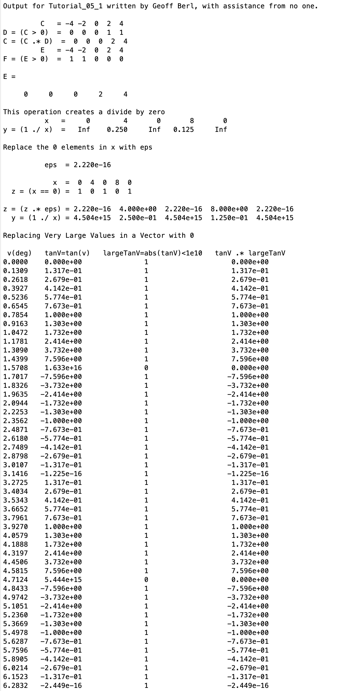
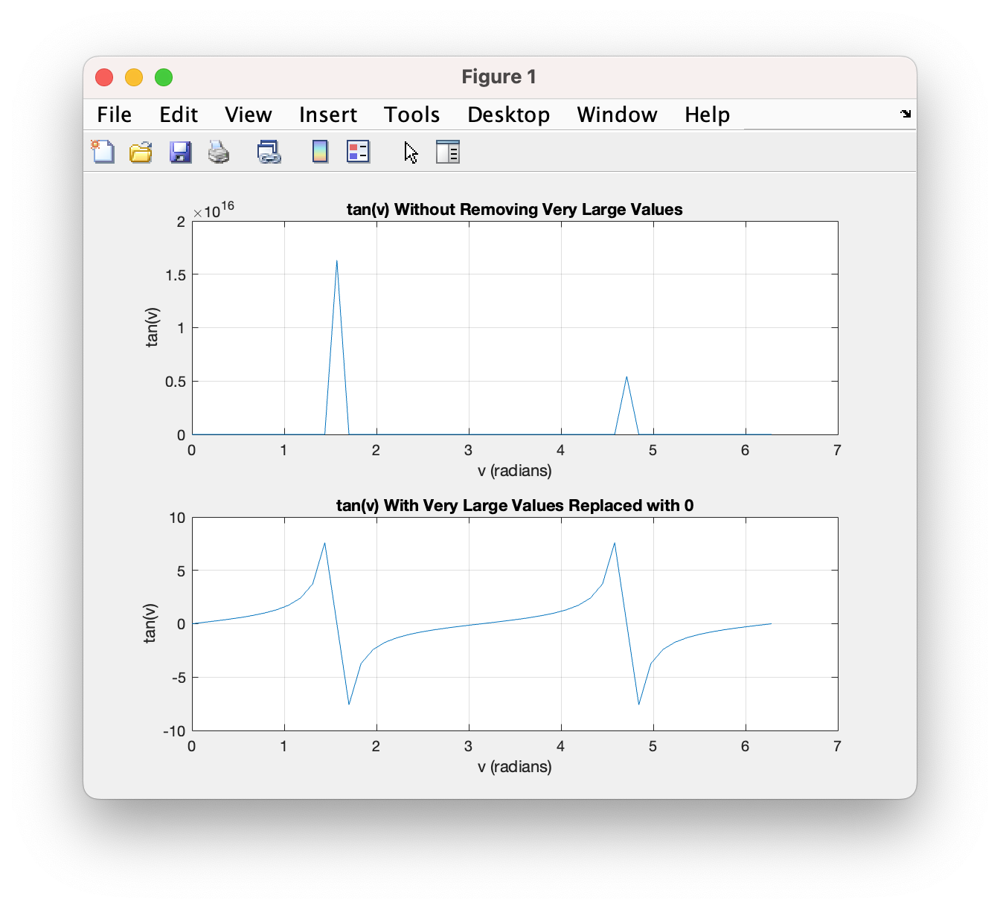

# Chapter 5 Tutorial 1
The purpose of this tutorial is to teach you show you some uses for logical vectors.
```Matlab
% Clear the command window and all variables
clc     % Clear the command window contents
clear   % Clear the workspace variables
```
Edit the code below and update the variable named name with your **name** for this tutorial in the code below.
```Matlab
% Output of the title and author to the command window.
programName = "Tutorial_05_1";
name = "";
assistedBy = "";
fprintf("Output for %s written by %s, with assistance from %s.\n\n", programName, name, assistedBy)
```
## Replacing Values
### Replace negative values using elementwise multiplication
Let's say we have a vector C which has some negative values, we want to set them to zero. Here's how we might do that.
```Matlab
% Create a vector with some negative values
C=-4:2:4;
% Get a logical vector of values that are greater than 0
D=C>0;

fprintf('         C   = %2i %2i %2i %2i %2i\n',C)
fprintf('D = (C > 0)  = %2i %2i %2i %2i %2i\n',D)
```
Looking at the results, we can see that D is a vector with a 1 in the position of every value in C that is greater than 0.

We can multiply the two vectors element-wise so that each value in C is multiplied by the corresponding value in D. Therefore, everything would be multiplied by 0, except those values in C that are greater than 0, those will be multipled by 1.
```Matlab
C = C .* D;
fprintf('C = (C .* D)  = %2i %2i %2i %2i %2i\n',C .* D)
```
Another way we might do this is to set any value less than zero, to zero. We could do that like so.
```Matlab
E=-4:2:4;
% Get a logical vector of values less than zero
F=E<0;

fprintf('         E   = %2i %2i %2i %2i %2i\n',E)
fprintf('F = (E > 0)  = %2i %2i %2i %2i %2i\n',F)

% Assign those values to zero
E(F) = 0
```
Notice, the assignment operation only affects those values in E, where F has a matching value of 1.

## Avoid Division by Zero
A common problem in programming is the "division by zero" error. Typically, programming languages will throw an error if you try to divide by zero. But this is only caught at "runtime", there's no easy way for MATLAB to know ahead of time so you only see the error when you run the script. MATLAB doesn't throw an error, instead it puts an inf or NaN in the place of any divide by zero. As you may already know, anything divided by zero is essentially an infinite value since 1/x approaches infinity as x approaches zero.
```Matlab
% Create an array with some zeros
x = [0, 4, 0, 8, 0];
% Attempt to divide by zero
y = 1 ./ x;     % creates divide by zero for 1st, 3rd and 5th elements

fprintf('This operation creates a divide by zero\n')
fprintf('          x   = %5i \t %5i \t %5i \t %5i \t %5i\n',x)
fprintf('y = (1 ./ x)  = %5.3f \t %5.3f \t %5.3f \t %5.3f \t %5.3f\n\n',y)
```
Let's get a better representation in MATLAB by utilizing eps which represents the smallest possible distance between two numbers in MATLAB.
```Matlab
% replace 0 elements with eps.  eps is the smallest increment in Matlab
fprintf('Replace the 0 elements in x with eps\n\n')
fprintf('          eps  = %9.3e\n\n',eps)

% Get a logical vector of values that equal zero
z = x == 0;

fprintf('            x  = %2i %2i %2i %2i %2i\n',x)
fprintf('  z = (x == 0) = %2i %2i %2i %2i %2i\n\n',z)

% Replace the values in x with eps, use any method you prefer
x(z)=eps;

% Let's see what the values of x are now
fprintf('z = (z .* eps) = %9.3e  %9.3e  %9.3e  %9.3e  %9.3e\n',x)

% And now, let's try dividing once more with eps in place of zeros
y = 1 ./ x;
fprintf('  y = (1 ./ x) = %9.3e  %9.3e  %9.3e  %9.3e  %9.3e\n',y)
```
In the second attempt at 1 ./ x we can see that the values which were zeros, now show up as a very large number (4.504e15) but not inf as before. This will make performing future arithmetic much easier.

## Avoiding Infinity or Very Large Numbers
Sometimes, when making plots, lines can appear discontinuous due to extremely large numbers. We have not worked with plots yet but, it's important to know how to find and replace values that exceed some value.
```Matlab
% Avoiding Infinity or really large terms
fprintf('\nReplacing Very Large Values in a Vector with 0\n\n')
v = 0:pi/24:2*pi;

% tanV will be very large when x = pi/2 and 3*pi/2
tanV = tan(v);

% largeTanV is equal to one when abs(tanV) < 1e10 and 0 for elements >= 1e10
largeTanV = abs(tanV) < 1e10;
% tanV2 .* largeTanV will remove large values because tanV .* largeTanV will = 0 for large tanV values
tanV2 = tanV .* largeTanV;

% for loop to print each line of the vectors with formatted output
disp(' v(deg)   tanV=tan(v)   largeTanV=abs(tanV)<1e10   tanV .* largeTanV')
for n=1:length(v)
    fprintf('%6.4f  %11.3e               %i                  %11.3e\n',v(n),tanV(n),largeTanV(n),tanV2(n))
end
```
Again, we haven't used plots yet however, here are a couple to show you why there is a need to do this sometimes.
```
% plot graphs of the tan(x) with large values and with the very large
% values removed in the same figure window

% creates a figure window with 2 graphs (2 rows, 1 col), row 1
% col 1 graph active
subplot(2,1,1)  
                
plot(v,tanV) % plot of the original y vector

% add labels and grid lines
title('tan(v) Without Removing Very Large Values')
xlabel('v (radians)')
ylabel('tan(v)')
grid on

subplot(2,1,2)  %  row 1 col 1 graph active
plot(v,tanV2) % plot with the very large values of tanV replaced with zero

% addition of labels and grid lines
title('tan(v) With Very Large Values Replaced with 0')
xlabel('v (radians)')
ylabel('tan(v)')
grid on
```
# Additional Notes:
* 
# Example Output
Create a script of the same name, your output should match the following.

