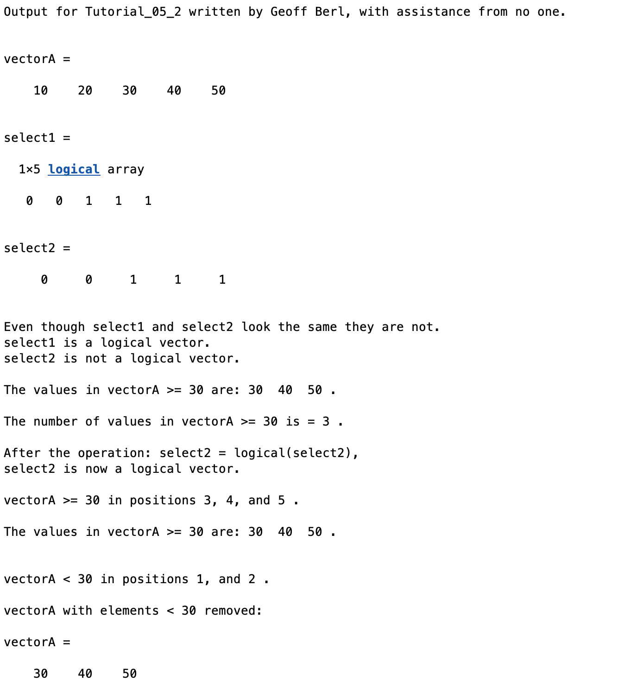

# Chapter 5 Tutorial 2
The purpose of this tutorial is to demonstrate the difference between logical vectors and a vector containing integers.
```Matlab
% Clear the command window and all variables
clc     % Clear the command window contents
clear   % Clear the workspace variables
```
Edit the code below and update the variable named name with your **name** for this tutorial in the code below.
```Matlab
% Output of the title and author to the command window.
programName = "Tutorial_05_2";
name = "";
assistedBy = "";
fprintf("Output for %s written by %s, with assistance from %s.\n\n", programName, name, assistedBy)
```
## Logical Vectors
A logical vector is a vector of "boolean" values, that is, they are true or false, 1 or 0. Though they may look the same, they are not.
```Matlab
vectorA = [10, 20, 30, 40, 50]
% Select all of the values in vectorA that are >= 30
select1 = vectorA >= 30
% Let's make an array called select2 that looks like select1 but 
% is a set of integers, not a logical vector.
select2 = [0, 0, 1, 1, 1]

% The islogical() function returns a 1 if a vector is a logical vector and
% a 0 if it is not. If the expression in an if statement is any non-zero
% value it is considered true.
fprintf ('\nEven though select1 and select2 look the same they are not.\n')
if (islogical(select1))
    disp('select1 is a logical vector.')
else
    disp('select1 is not a logical vector.')
end

if (islogical(select2))
    disp('select2 is a logical vector.')
else
    disp('select2 is not a logical vector.')
end
```
As we've seen, logical vectors are used to obtain select elements from a vector but non-logical arrays cannot be used for this purpose.
```Matlab
% A logical vector can be used to select element in an array
fprintf ('\nThe values in vectorA >= 30 are: %i  %i  %i .\n\n',vectorA(select1))

% A logical vector can be used to select element in an array
% Comment this line out to remove the error.
%fprintf ('\nThe values in vectorA >= 30 are: %i  %i  %i .\n\n',vectorA(select2))
```
Logical vectors can not only be used to select specific values from a vector, they can also be used to count the number of occurrences since they are vectors of zeros and ones.
```Matlab
% The number of occurrences in a vector can be counted using a logical
% vector and the sum() function.
numValuesGtEq30 = sum(select1);
fprintf ('The number of values in vectorA >= 30 is = %i .\n\n',numValuesGtEq30)
```
However, if necessary, we could convert a non-logical vector in to a logical one.
```Matlab
% A vector can be made into a logical vector by using the logical() function.
select2 = logical(select2);
fprintf('After the operation: select2 = logical(select2),\n')
if (islogical(select2)) % islogical(select2)=1 now
    disp('select2 is now a logical vector.')
else
    disp('select2 is not a logical vector.')
end
```
The `find()` function can also be used to get values in a vector that satisfy some condition. However, find returns the positional value of matching values in the vector. It should be noted that using logical vectors is faster than using positional values so, whenever the two can be interchanged, you should favor logical vectors.
```Matlab
% The find() fuction returns the element positions where a conditional is true
positionsGtEq30 = find(vectorA >= 30);

% The positionsGtEq30 vector can be used to print the position where vectorA
% was >= 30.
fprintf('\nvectorA >= 30 in positions %i, %i, and %i .\n',positionsGtEq30)

% As with vectorA(select1), vectorA(positionsGtEq30) can be used to access
% element values >= 30.
fprintf ('\nThe values in vectorA >= 30 are: %i  %i  %i .\n\n', ...
          vectorA(positionsGtEq30))

% Element positions in a vector < 30 
positionsLt30 = find(vectorA < 30);
fprintf('\nvectorA < 30 in positions %i, and %i .\n',positionsLt30)

% Remove elements in vectorA < 30
vectorA(find(vectorA<30)) = [ ];
fprintf('\nvectorA with elements < 30 removed:\n')
vectorA 
```
# Additional Notes:
* 
# Example Output
Create a script of the same name, your output should match the following.
