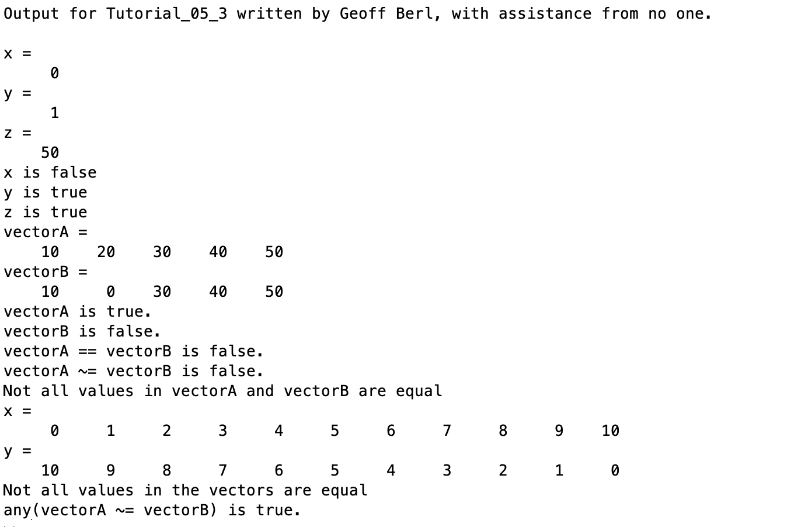

# Chapter 5 Tutorial 3
The purpose of this tutorial is to demonstrate the usage of logical vectors and control structures.
```Matlab
% Clear the command window and all variables
clc     % Clear the command window contents
clear   % Clear the workspace variables
```
Edit the code below and update the variable named name with your **name** for this tutorial in the code below.
```Matlab
% Output of the title and author to the command window.
programName = "Tutorial_05_3";
name = "";
assistedBy = "";
fprintf("Output for %s written by %s, with assistance from %s.\n\n", programName, name, assistedBy)
```
## Review `if` With Scalars
Here's a little review on if statements with scalar values
```Matlab
format compact  % Unformatted ouput will not have blank lines added

x=0
y=1
z=50

% An if statement with a scalar expression is true if the scalar has any 
% non-zero value               
if (x)  % false since x = 0
    disp('x is true')
else
    disp('x is false')
end

if (y)  % true since y ~= 0
    disp('y is true')
else
    disp('y is false')
end

if (z)  % true since z ~= 0
    disp('z is true')
else
    disp('z is false')
end
```
## `if` With Vectors
Luckily, if statements work exactly the same with vectors as they do with scalars. With vectors however, if **any** value in the vector is zero, the result will be false, if there are no zero values in the vector, the result is true.
```Matlab
vectorA = [10, 20, 30, 40, 50]
vectorB = [10, 0, 30, 40, 50]

if (vectorA)  % true since vectorA has no elements = 0
    disp('vectorA is true.')
else
    disp('vectorA is false.')
end

if (vectorB)  % false since at least one element of vectorA is 0
    disp('vectorB is true.')
else
    disp('vectorB is false.')
end

if (vectorA == vectorB)  % false since not all elements are equal
    disp('vectorA == vectorB is true.')
else
    disp('vectorA == vectorB is false.')
end

if (vectorA ~= vectorB)  % false since not all elements are unequal
    disp('vectorA ~= vectorB is true.')
else
    disp('vectorA ~= vectorB is false.')
end
```
Using the `all()` function is equivalent to comparing two vectors. To determine if all values in vectorA match vectorB.
```Matlab
if all(vectorA == vectorB) % false since all values are not equal
    disp('All values in vectorA and vectorB are equal')
else
    disp('Not all values in vectorA and vectorB are equal')
end
```
It should be noted that, when using `all()` it is not only checking the set of all numbers in the two vectors, it is also checking the order.
```Matlab
x=0:1:10
y=10:-1:0
if all(x == y) % false since not all elements are unequal
    disp('All values in the vectors are equal')
else
    disp('Not all values in the vectors are equal')
end
```
If we want to see if **any** values (in their respective positions) match between two vectors, we can use the `any()` function.
```Matlab
% true, since the position of 5 is the same for both vectors
if (any(vectorA ~= vectorB))
    disp('any(vectorA ~= vectorB) is true.')
else
    disp('any(vectorA ~= vectorB) is false.')
end
```
# Additional Notes:
* 
# Example Output
Create a script of the same name, your output should match the following.
