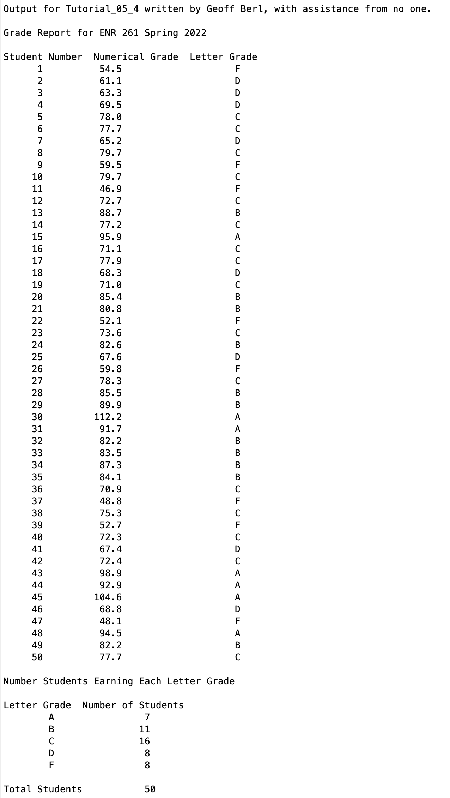

# Chapter 5 Tutorial 4
The purpose of this tutorial is to walk you through a use-case for logical vectors and show you how they can improve your code. The goal of this tutorial is to create some random grades, and assign letter grades to them but using vectorized functions rather than for loops. The only for loop in this tutorial should be for the output which will be done for you.
```Matlab
% Clear the command window and all variables
clc     % Clear the command window contents
clear   % Clear the workspace variables
```
Edit the code below and update the variable named name with your **name** for this tutorial in the code below.
```Matlab
% Output of the title and author to the command window.
programName = "Tutorial_05_4";
name = "";
assistedBy = "";
fprintf("Output for %s written by %s, with assistance from %s.\n\n", programName, name, assistedBy)
```
## Input
Create a row vector of 50 random grade values with a normal distribution, a mean of 75, and a std dev of 15. Recall from previous tutorials that the formula for this is `mean + stddev*randn(nRows,nCols)`

Also, create an empty vector to hold the letter grades, normally you might use the `ones()` or `zeros()` functions but this won't work for characters. For characters you should use the `blanks(n)` function where n is the number of elements in the vector. blanks() does not have an option to make a multi-dimesional array like the other functions.

Finally, create a row vector of zeros which will hold the count of students receiving each letter grade (5 different grades).
```Matlab
numGrades =
letterGrades =
countByGrade =
```
## Manipulation
Assign a logical vector finding all grades with a value greater than or equal to 90. Then, using that logical array, assign the appropriate letter grade of 'A' to the `letterGrades` vector. Finally, capture a count of the students who received this letter grade.
```Matlab
% Logical vector of all grades >=90
gradeA =
% Assign the letter grade of A

% Assign the count of students getting As to the appropriate position in
% countByGrade
```
Repeat for B (>= 80 & < 90). Don't forget, you need the **full** condition statement for each condition you want to meet.
```Matlab
% Logical vector of all grades >=80 and <90
gradeB =
% Assign the letter grade of B

% Assign the count of students getting Bs to the appropriate position in
% countByGrade
```
Repeat for C (>= 70 & < 80)
```Matlab
% Logical vector of all grades >=70 and <80
gradeC =
% Assign the letter grade of C

% Assign the count of students getting Cs to the appropriate position in
% countByGrade
```
Repeat for D (>= 60 & < 70)
```Matlab
% Logical vector of all grades >=60 and <70
gradeD =
% Assign the letter grade of D

% Assign the count of students getting Ds to the appropriate position in
% countByGrade
```
Repeat for F (< 60)
```Matlab
% Logical vector of all grades <60
gradeF =
% Assign the letter grade of F

% Assign the count of students getting Fs to the appropriate position in
% countByGrade
```
## Output
```Matlab
% Print out the heading for the table of results
fprintf('Grade Report for ENR 261 Spring 2022\n\n')
fprintf('Student Number  Numerical Grade  Letter Grade\n')

% for loop to print each element in the NumGrades and LetterGrades vectors
for n = 1:1: length(numGrades)
    fprintf('     %2i\t\t%5.1f \t\t\t %s\n',n, numGrades(n), letterGrades(n))
end

% Summary statistics
% LetterChoices vector is used to efficiently use the for loop
GRADE_LETTERS = ['A' 'B' 'C' 'D' 'F'];

% Heading for summary statistics
fprintf('\nNumber Students Earning Each Letter Grade\n\n')
fprintf('Letter Grade  Number of Students\n')
% Prints the letter grade and the number of students earning that grade
for n = 1:5
    fprintf('\t%s\t\t%2i\n',GRADE_LETTERS(n), countByGrade(n))
end
% Total students is a good check to be sure that the sum of the letter
% grades earned is equal to 50
fprintf('\n%s \t\t %2i\n','Total Students', sum(countByGrade))
```
# Additional Notes:
* 
# Example Output
Create a script of the same name, your output should match the following. 
> [!IMPORTANT]
> 
> Keep in mind, these are random numbers so your values will be different.
