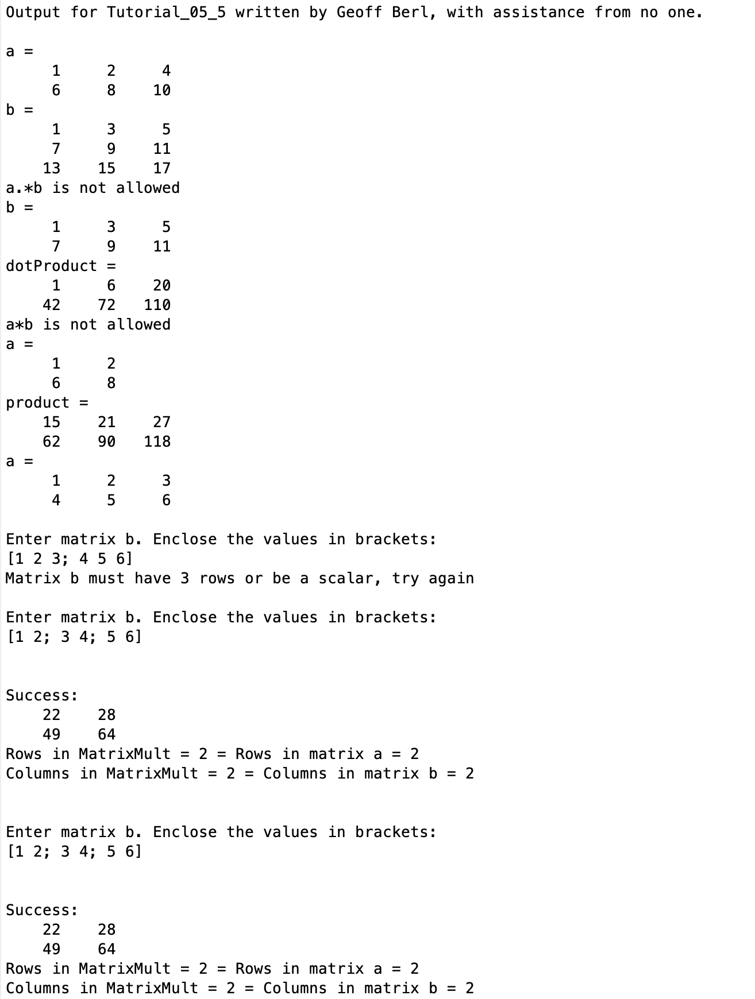

# Chapter 5 Tutorial 5
The purpose of this tutorial is to show the difference between the dot product (element-wise multiplication) and matrix multiplication.
```Matlab
% Clear the command window and all variables
clc     % Clear the command window contents
clear   % Clear the workspace variables
```
Edit the code below and update the variable named name with your **name** for this tutorial in the code below.
```Matlab
% Output of the title and author to the command window.
programName = "Tutorial_05_5";
name = "";
assistedBy = "";
fprintf("Output for %s written by %s, with assistance from %s.\n\n", programName, name, assistedBy)
```
## Input
For element-wise multiplication, two arrays/matrices must be of the same size or one be a scalar value.
```Matlab
% Create two matrices of different sizes
a = [1 2 4;6 8 10]
b = [1 3 5;7 9 11;13 15 17]
```
## Manipulation
Though we will learn about ways to handle errors, for now we can develop a method for making sure two variables satisfy the requirements for element-wise multiplication.

Fill in the appropriate `if` condition to check that the matrices/arrays are of the same size or that one is a scalar, or both are scalar. Don't forget to see if there is a function to check for any of these conditions.
```Matlab
if 
    dotProduct = a.*b
else
    disp("a.*b is not allowed")
end
```
We should have already known this was going to fail since b has three rows while a only has two. Modify the matrix b by deleting a row.
```Matlab
% Delete a row in matrix b

dotProduct = a.*b
```
In contrast, matrix multiplication is much different. In order to perform matrix multiplication, the number of columns of the first matrix must match the number of rows in the second matrix or, one or the other must be a scalar.

Just as above, but this time for matrix multiplication, fill in the appropriate condition to check that a has a number of rows that match the number of columns in `b`, or that one or the other is scalar. 
```Matlab
if size(a,2) == size(b,1) || isscalar(a) || isscalar(b)
    product = a*b;
else
    disp("a*b is not allowed")
end
```
As with before, we should be aware this wasn't going to work since both matrices have two rows and three columns so, it will never satisfy the condition `numCols in a == numRows in b`.

Modify the matrix a by deleting a column so that matrix multiplication may be applied.
```Matlab
% Delete a column in matrix a

product = a*b
```
The resulting matrix will be a matrix with the same number of rows as a and same number of columns as b which, in this case would be a matrix of size 2x3.
## Output
Here's a simple while loop that will keep reading inputs until `a*b` can be performed. Copy your if condition above for matrix multiplication and paste it in the if statement below. Be sure to run this and test it when `b` is a matrix as well as when `b` is a scalar, both conditions should result in successful multiplication. Also, note that a is a 2x3 matrix, so you'll need to know that in order to create a matrix `b` that's capable of matrix multiplication with `a`.
```Matlab
% Matrix Multiplication Loop Example

% Given
a = [1 2 3;
     4 5 6]
success = 0;
                  
% Continue reading in matrix b until two successful entries are provided
while (success < 2)
    b = input("\nEnter matrix b. Enclose the values in brackets:\n");
    if 
        % if satisfied, perform the multiplication and mark as correct
        matrixMult = a*b;
        success = success + 1;

        % Print success message
        fprintf("\n\nSuccess:\n")
        disp(matrixMult)
        fprintf("Rows in MatrixMult = %i = Rows in matrix a = %i\n", size(matrixMult,1), size(a,1));
        fprintf("Columns in MatrixMult = %i = Columns in matrix b = %i\n\n", size(matrixMult,2), size(b,2));
    else
        % If not satisfied, notify the user
        fprintf("Matrix b must have %i rows or be a scalar, try again\n",size(a,2));
    end
end
```
# Additional Notes:
* 
# Example Output
Create a script of the same name, your output should match the following. Your entries for the while loop exercise may be different. Also, depending on which row and column you chose to delete from matrices a and b will give different values but the print statements and formats should be the same.
