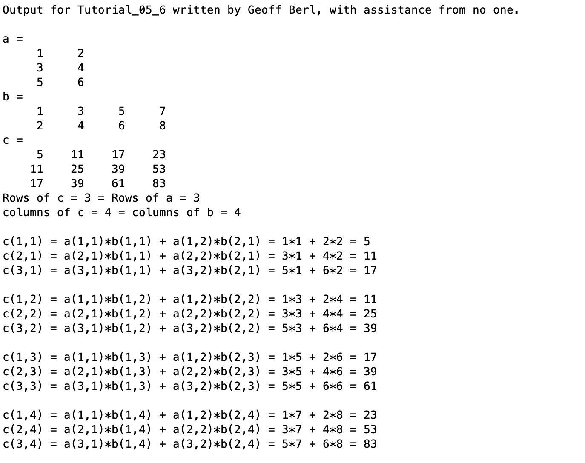

# Chapter 5 Tutorial 6
The purpose of this tutorial is to show the mathematical process of matrix multiplication.
```Matlab
% Clear the command window and all variables
clc     % Clear the command window contents
clear   % Clear the workspace variables
```
Edit the code below and update the variable named name with your **name** for this tutorial in the code below.
```Matlab
% Output of the title and author to the command window.
programName = "Tutorial_05_6";
name = "";
assistedBy = "";
fprintf("Output for %s written by %s, with assistance from %s.\n\n", programName, name, assistedBy)
```
## Input
For element-wise multiplication, two arrays/matrices must be of the same size or one be a scalar value.
```Matlab
% Given matrices
a = [1 2; 3 4; 5 6]
b = [1 3 5 7; 2 4 6 8]
```
## Manipulation
Simply perform the built-in matrix multiplication process
```Matlab
% Perform the matrix multiplication using asterisk
c= a*b
```
## Output
Show the manual process to matrix multiplication
```Matlab
% Shows how the overall size of c is related to rows of a and columns of b.
fprintf("Rows of c = %i = Rows of a = %i\n", size(c,1), size(a,1))
fprintf("columns of c = %i = columns of b = %i\n\n", size(c,2), size(b,2))

% This block shows the operations performed to fill matrix c.
% Note that a(1,:)*b(:,1) is matrix multiplication between the first row
% of a and the first column of b. The product has only one row and one column.

% 1st row of a * 1st column of b
fprintf("c(1,1) = a(1,1)*b(1,1) + a(1,2)*b(2,1) = %i*%i + %i*%i = %i\n",...
                  a(1,1), b(1,1), a(1,2), b(2,1), a(1,:)*b(:,1))
% 2nd row of a * 1st column of b              
fprintf("c(2,1) = a(2,1)*b(1,1) + a(2,2)*b(2,1) = %i*%i + %i*%i = %i\n",...
                  a(2,1), b(1,1), a(2,2), b(2,1), a(2,:)*b(:,1))
% 3rd row of a * 1st column of b 
fprintf("c(3,1) = a(3,1)*b(1,1) + a(3,2)*b(2,1) = %i*%i + %i*%i = %i\n\n",...
                  a(3,1), b(1,1), a(3,2), b(2,1), a(3,:)*b(:,1))
% 1st row of a * 2nd column of b               
fprintf("c(1,2) = a(1,1)*b(1,2) + a(1,2)*b(2,2) = %i*%i + %i*%i = %i\n",...
                  a(1,1), b(1,2), a(1,2), b(2,2), a(1,:)*b(:,2))
% 2nd row of a * 2nd column of b 
fprintf("c(2,2) = a(2,1)*b(1,2) + a(2,2)*b(2,2) = %i*%i + %i*%i = %i\n",...
                  a(2,1), b(1,2), a(2,2), b(2,2), a(2,:)*b(:,2))
% 3rd row of a * 2nd column of b 
fprintf("c(3,2) = a(3,1)*b(1,2) + a(3,2)*b(2,2) = %i*%i + %i*%i = %i\n\n",...
                  a(3,1), b(1,2), a(3,2), b(2,2), a(3,:)*b(:,2))
% 1st row of a * 3rd column of b               
fprintf("c(1,3) = a(1,1)*b(1,3) + a(1,2)*b(2,3) = %i*%i + %i*%i = %i\n",...
                  a(1,1), b(1,3), a(1,2), b(2,3), a(1,:)*b(:,3))
% 2nd row of a * 3rd column of b
fprintf("c(2,3) = a(2,1)*b(1,3) + a(2,2)*b(2,3) = %i*%i + %i*%i = %i\n",...
                  a(2,1), b(1,3), a(2,2), b(2,3), a(2,:)*b(:,3))
% 3rd row of a * 3rd column of b
fprintf("c(3,3) = a(3,1)*b(1,3) + a(3,2)*b(2,3) = %i*%i + %i*%i = %i\n\n",...
                  a(3,1), b(1,3), a(3,2), b(2,3), a(3,:)*b(:,3)) 
% 1st row of a * 4th column of b              
fprintf("c(1,4) = a(1,1)*b(1,4) + a(1,2)*b(2,4) = %i*%i + %i*%i = %i\n",...
                  a(1,1), b(1,4), a(1,2), b(2,4), a(1,:)*b(:,4))
% 2nd row of a * 4th column of b
fprintf("c(2,4) = a(2,1)*b(1,4) + a(2,2)*b(2,4) = %i*%i + %i*%i = %i\n",...
                  a(2,1), b(1,4), a(2,2), b(2,4), a(2,:)*b(:,4))
% 2nd row of a * 4th column of b
fprintf("c(3,4) = a(3,1)*b(1,4) + a(3,2)*b(2,4) = %i*%i + %i*%i = %i\n\n",...
                  a(3,1), b(1,4), a(3,2), b(2,4), a(3,:)*b(:,4))
```
# Additional Notes:
* 
# Example Output
Create a script of the same name, your output should match the following.
