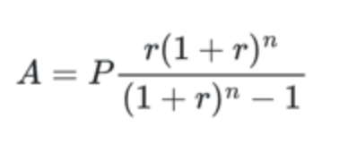
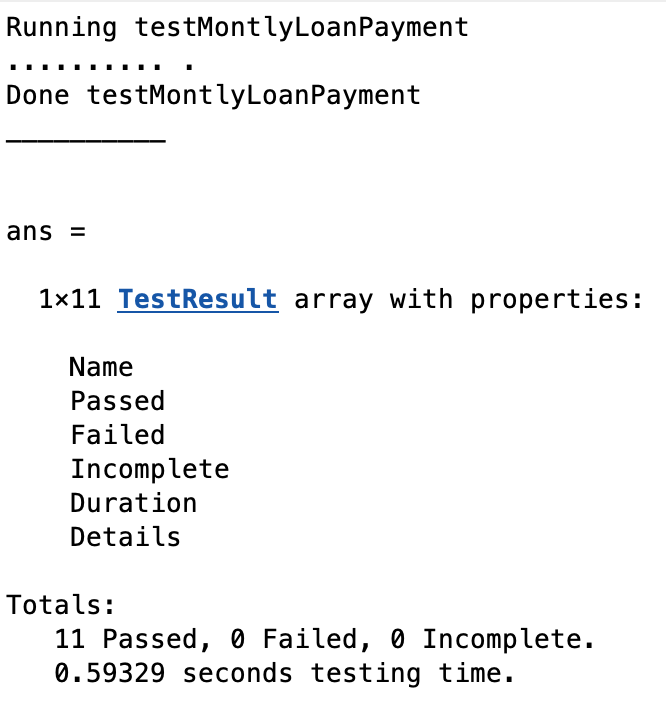

# Program\_06\_1
## Requirements
Given the following equation, create a function named **getMonthlyLoanPayment**.



**The function shall:**
* Compute a monthly loan payment given the principal, yearly interest rate, and number of payments in months
* Support vectors, that is, when provided with vectors of data for each parameter, return a vector of monthly payment amounts.
* Return an empty value if an error occured, such as a negative value, a string value in any of the arguments passed in, empty values in any of the arguments passed in, etc.
* Satisfy all of the test requirements as defined in testMonthlyLoanPayment. That is, you shall run the `testMonthlyLoanPayment` test and ensure all tests pass.

## Program
Use the code below to start your M file and complete the requirements stated above. **NOTE:** if you are using Octave, you will have to use the modified test `octaveTestMonthlyLoanPayment` as there are some aspects of MATLAB that Octave does not support so the MATLAB test will not work properly.

### Tips
* You will simply be creating a function and then running `testMonthlyLoanPayment.m` which will use your function to run some tests, you will not be creating an executable M file as has been the norm, this one is slightly different.
* In the equation above, the rate r is a per-payment rate, therefore the yearly rate must be divided by 12.
* Start by running the tests on your function before you even start writing code. Obviously this will result in multiple failures (11 to be precise). Review the failure summary and pick one test at a time, start satisfying the requirements for that test. If necessary, open up the test code and analyze the verify statement to see what it's looking for.

```Matlab
function payment = getMonthlyLoanPayment(principal, yearlyRate, numPayments)
%GETMONTHLYLOANPAYMENT Calculate the monthly payment for a loan
%   Using the standard loan payment calculation A=P(r(1+r)^n/((1+r)^n-1))
%   determine the monthly payment amount for a loan. This function assumes
%   payments are made monthly, and that numPayments is the number of months
%   in the duration of the loan. If an invalid state or error occurs, the
%   payment value will be empty.
```
## Example Output
Your program output values and format should match the following.

