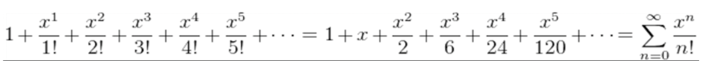
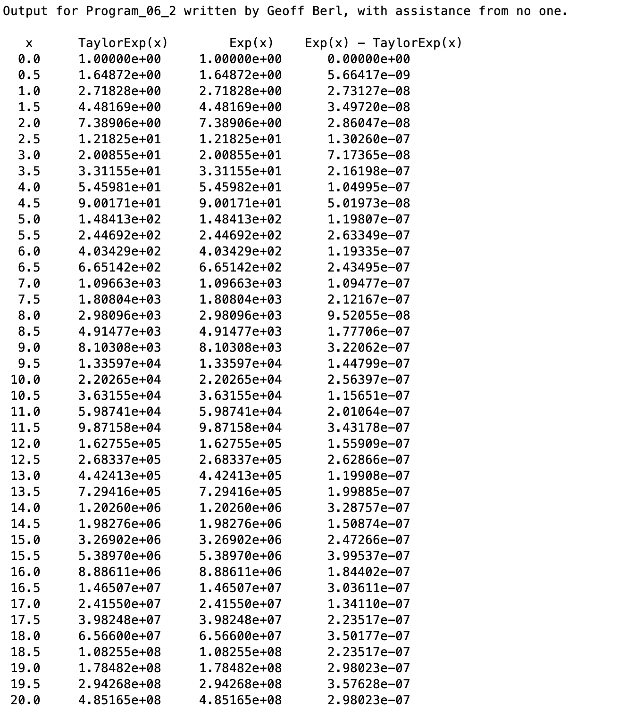

# Program\_06\_2
## Requirements
Given the following equation, create **taylorExp** function.

**The function shall:**
* Compute e^x given the value(s) passed in using a Taylor Series
* Be capable of accepting a vector of x values, compute e^x for each value in the vector
* Assume a tolerance of 1e-6. That is, compute the Taylor terms until the value of the current term is less than the tolerance.
* After creating your function, create a script named **Program_06_2**. In the script, create a vector of x values. Then, using your `taylorExp()` function and the MATLAB `exp()` function, generate the example output as efficiently as possible.

## Program
Use the code below to start your M file and complete the requirements stated above
### Tips
* Start by creating a function that only works with a scalar value, then modify it to work with a vector
* Think of key words that indicate what sort of conditional statements you'll need
* The program should likely be 15 or less lines of actual code, if you're exceeding this you may be overthinking the problem.

```Matlab
function [taylorExp] = TaylorExp(x) % function definition line
% H1: Computes e^x using a Taylor Series for x >= 0
% Help Text:
% Input argument:
% x = a vector of exponents, all values of x >= 0 
% Output Argument:
% Texp = a vector of e^x values computed using a Taylor Series
```
## Example Output
Your program output values and format should match the following.
