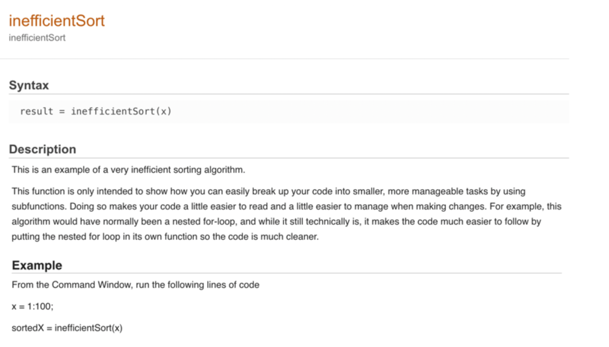
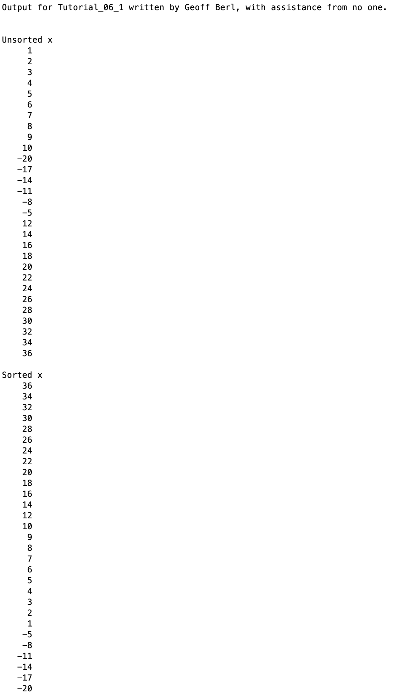

# Chapter 6 Tutorial 1
The purpose of this tutorial is to demonstrate declaring a function and using subfunctions to help clean up code and make it more readable.
```Matlab
% Clear the command window and all variables
clc     % Clear the command window contents
clear   % Clear the workspace variables
```
Edit the code below and update the variable named name with your **name** for this tutorial in the code below.
```Matlab
% Output of the title and author to the command window.
programName = "Tutorial_06_1";
name = "";
assistedBy = "";
fprintf("Output for %s written by %s, with assistance from %s.\n\n", programName, name, assistedBy)
```
## Review the function
At this point, please open the [inefficientSort.md](inefficientSort.md) file and review the function, read the description and all text within the function. Read through the comments to understand what the function is doing.
## Run the function
As shown in the example portion of [inefficientSort.md](inefficientSort.md), create an m-file for `Tutorial_06_1`. In the m-file, first print out the unsorted version, then the sorted.
## Adding doc for help
Adding the proper comments to your function will give you documentation in the help. Go ahead and right click on inefficientSort and select "Help on inefficientSort" to see the pop up dialog. It's also shown below. Documentation is important, especially if you plan to share your code with someone else, they need to know how to use the function, and what to expect from it.


# Additional Notes:
* 
# Example Output
Create a script of the same name, your output should match the following.
