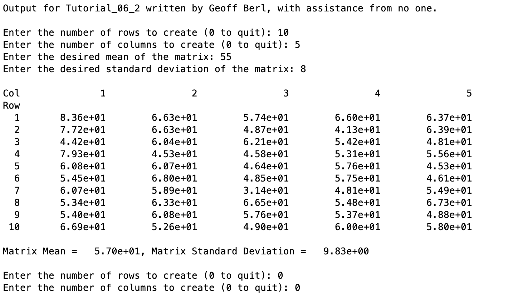
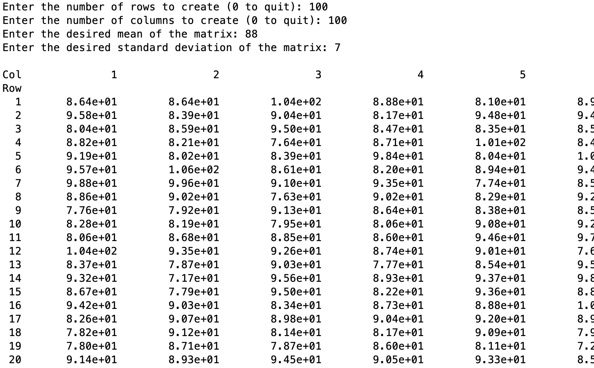
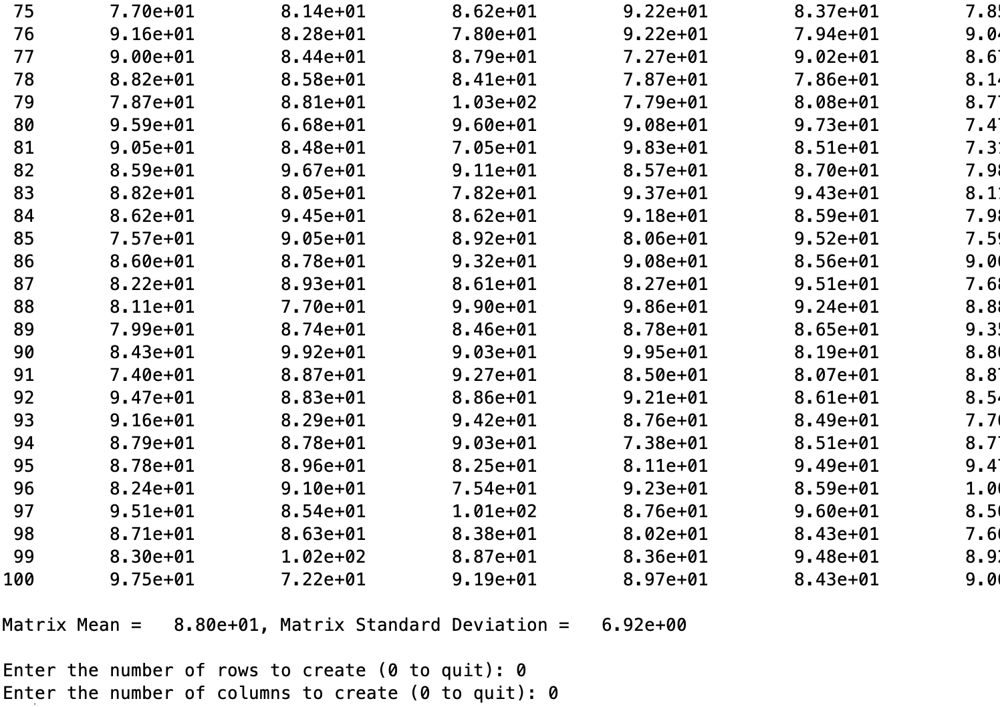

# Chapter 6 Tutorial 2
The purpose of this tutorial is to show how to use user-defined functions. It will also cover some usage of the while-loop. To use user defined functions, the function m-file must be in the same directory, or the full path to the function m-file must be provided.
```Matlab
% Clear the command window and all variables
clc     % Clear the command window contents
clear   % Clear the workspace variables
```
Edit the code below and update the variable named name with your **name** for this tutorial in the code below.
```Matlab
% Output of the title and author to the command window.
programName = "Tutorial_06_2";
name = "";
assistedBy = "";
fprintf("Output for %s written by %s, with assistance from %s.\n\n", programName, name, assistedBy)
```
## Input
Ask a user for two inputs
Write two input statements for the following variables, ask the user for a number of rows to create, and a number of columns to create. Also, note in your input that a 0 will quit the program.
```Matlab
% Ask the user for a count of row and columns
numRows =
numCols =
```
Due to the nature of while loops, and because MATLAB does not have a do-while loop, we have two choices in our program layout. We can either duplicate the input, or use the dreaded break command.

We've already asked the user for input, now here is what the loop would look like, copy your input messages and paste them at the bottom of the loop.
```Matlab
% while loop to continue the program until numRows or numCols == 0
while (numRows ~= 0 && numCols ~= 0)
    % input the desired mean and standard deviation of the matrix
    avg = input('Enter the desired mean of the matrix: ');
    std = input('Enter the desired standard deviation of the matrix: ');
    
    %create the matrix
    matrix = avg + std*randn(numRows,numCols);
    
    % print the matrix with row and column numbers using function matPrint
    matPrint(matrix)
    
    % Compute the actual mean and standard deviation using function matStat
    [matrixMean, matrixStd] = matStat(matrix);
    % Print the mean and standard deviation
    fprintf('\n\nMatrix Mean = %10.2e, Matrix Standard Deviation = %10.2e\n\n',...
             matrixMean, matrixStd)
    
    % Ask the user for a count of row and columns
    numRows =
    numCols =
end
```
## The DRY principal
There is an important principal in software development called the DRY principal. DRY stands for Do not Repeat Yourself. One of the worst things you can do in software is to copy and paste code (like we did above). The reason is, what if you want to change the message, or change the number to quit from 0 to -1? You have to remember that the input messages were copied and pasted so there are actually four lines to change, not just two.

So, how can we avoid copying the input statements and still allow the user to quit if entering zero? We have to resort to the dreaded `break` command. We're also weighing our options and trying to choose the lesser of two evils, use an infinite loop, with the break command or repeating code. This may come down to personal preference but I would almost always favor not duplicating code. Also, this algorithm looks a little cleaner, we're asking for input first, deciding whether or not to end, then performing the code, whereas above we ask at the end of the loop. Here is the other option we have for this program.

One last time, copy your input statements below (this would effectively be a separate program so in this case you're not duplicating code).
```Matlab
while (true)
    % Ask the user for a count of row and columns
    numRows = 
    numCols = 

    % quit if numRows or numCols == 0
    if (numRows == 0 || numCols == 0)
        break;
    end

    % input the desired mean and standard deviation of the matrix
    avg = input('Enter the desired mean of the matrix: ');
    std = input('Enter the desired standard deviation of the matrix: ');
    
    %create the matrix
    matrix = avg + std*randn(numRows,numCols);
    
    % print the matrix with row and column numbers using function matPrint
    matPrint(matrix)
    
    % Compute the actual mean and standard deviation using function matStat
    [matrixMean, matrixStd] = matStat(matrix);
    % Print the mean and standard deviation
    fprintf('\n\nMatrix Mean = %10.2e, Matrix Standard Deviation = %10.2e\n\n',...
             matrixMean, matrixStd)
end
```
## Additional Notes:
* 
## Example Output
Create a script of the same name, your output should match the following.

**NOTE: at this point the first loop has ended (since we entered 0 to quit for the rows and columns). The following will be for the second loop**

**...**
