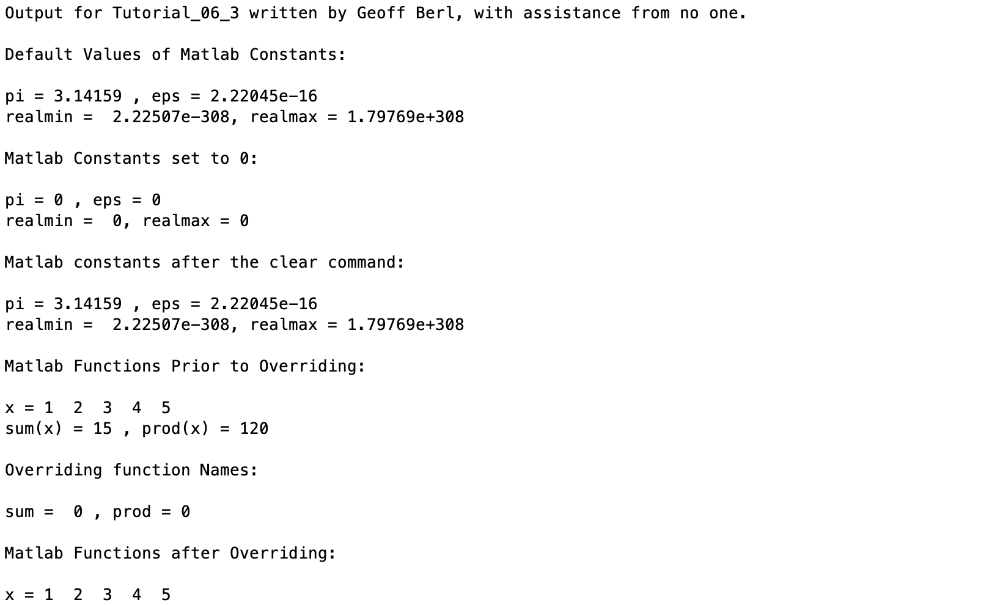
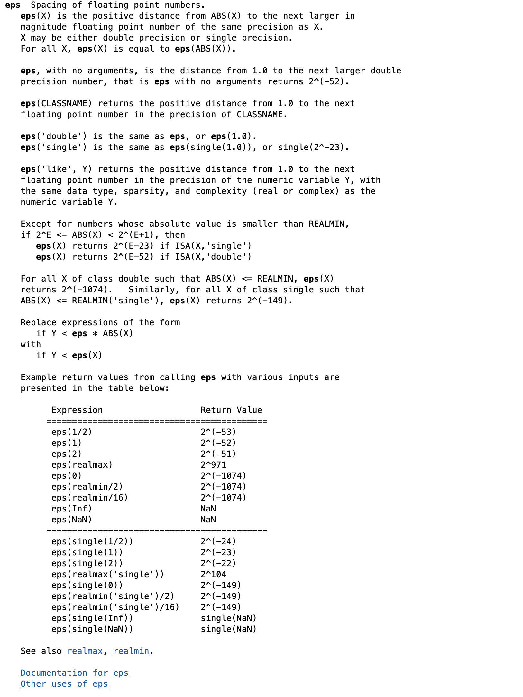
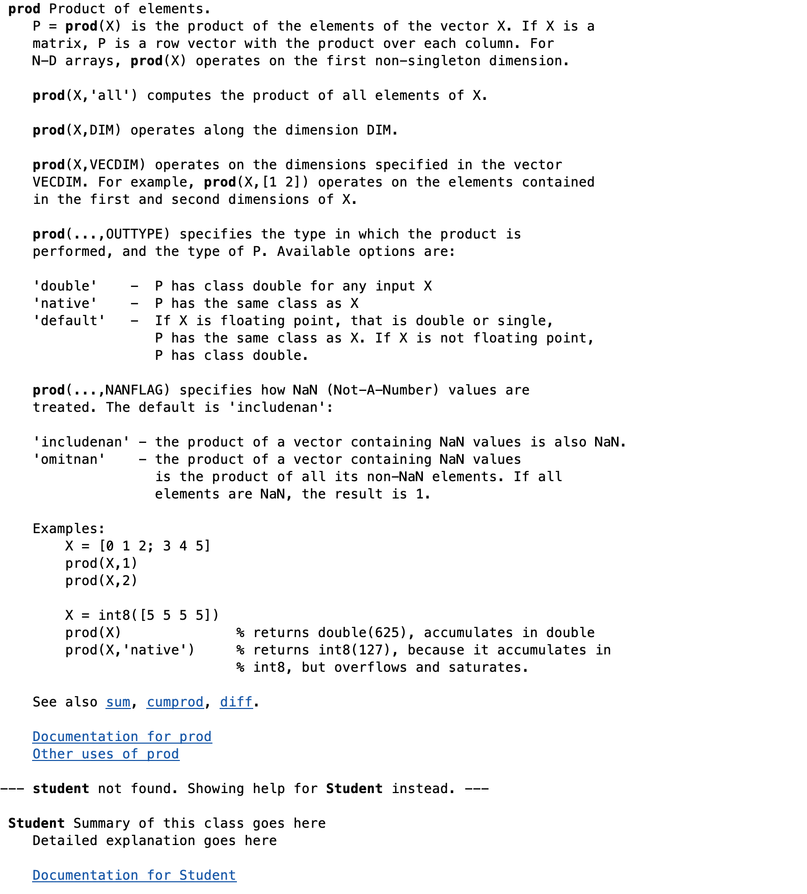

# Chapter 6 Tutorial 3
The purpose of this tutorial is to demonstrate a common error in MATLAB that can be difficult to identify; saving a MATLAB program with an invalid name
```Matlab
% Clear the command window and all variables
clc     % Clear the command window contents
clear   % Clear the workspace variables
```
Edit the code below and update the variable named name with your **name** for this tutorial in the code below.
```Matlab
% Output of the title and author to the command window.
programName = "Tutorial_06_3";
name = "";
assistedBy = "";
fprintf("Output for %s written by %s, with assistance from %s.\n\n", programName, name, assistedBy)
```
## Error - Overriding constants in MATLAB
There are hundreds of constants in MATLAB, even more when you start adding add-ons. It is difficult to know if your variable name "hides" an existing constant. Follow along in the example and see how this can negatively affect your program.

Matlab allows you to use MATLAB function names and constants as variables. If you do this your variable will take precedence over the built-in constant name in the workspace. Here we'll print the predefined values of a few constants.
```Matlab
% Print the predefined values
fprintf('Default Values of Matlab Constants:\n\n')
fprintf('pi = %g , eps = %g \nrealmin = % g, realmax = %g\n\n', ...
    pi,eps,realmin,realmax)
```
### Override the constants
Now, create your own variables with the names pi, eps, realmin, realmax and set them to some arbitrary value.
```Matlab
% Override built-in variables by assinging your own with the same names


% MATLAB allows these constant names to be used without giving a warning
fprintf('Matlab Constants set to 0:\n\n')
fprintf('pi = %g , eps = %g \nrealmin = % g, realmax = %g\n\n', ...
        pi,eps,realmin,realmax)
```
You can see, the values for these constants now contain the values from your workspace variables as your workspace takes precedence over any built-in constants.
### Clear variables to restore built-in constants
We can easily reset the constants by clearing out the variable names.
```Matlab
% To restore the default values of the MATLAB constants you need to clear
% the variable names
clear  % clears all variable names in the workspace
fprintf('Matlab constants after the clear command:\n\n')
fprintf('pi = %g , eps = %g \nrealmin = % g, realmax = %g\n\n', ...
        pi,eps,realmin,realmax) 
```
## Error - Overriding functions in MATLAB
Regarding functions, there are likely hundreds, if not thousands of built-in functions in MATLAB. As with constants, there are even more when you start adding add-ons. Follow along in the example and see how this can negatively affect your program.

As you'll see in the following, you can override or "hide" a function simply by creating a variable of the same name, the same works if you were to create a function that shares a name with a built-in variable or function name.
```Matlab
% Using the functions sum() and prod() prior to overriding
x = 1:5;
fprintf('Matlab Functions Prior to Overriding:\n\n')
fprintf('x = %i  %i  %i  %i  %i\n',x)
fprintf('sum(x) = %2i , prod(x) = %g\n\n',sum(x), prod(x))
```
### Override the functions
Now, override or "mask" the built-in sum and prod functions by creating variables of the same name.
```Matlab
% Create variables for sum and prod, assign some arbitrary value


% Using the variable names sum and prod, Matlab does not warn you that you
% are overriding the functions.
fprintf('Overriding function Names:\n\n')
fprintf('sum = %2i , prod = %g\n\n',sum, prod)

% Using the functions sum() and prod() after overriding will cause an error
% Note that when you comment out the clear sum prod line you will get 
% the error message:

% ??? Index exceeds matrix dimensions.
% Error in ==> Tutorial_09_1 at 91.  

% This error appears because Matlab interprets sum(x) and prod(x) as your 
% attempt to access elements in vectors or matrices that do not exist.
fprintf('Matlab Functions after Overriding:\n\n')
fprintf('x = %i  %i  %i  %i  %i\n',x)
% To create the error comment the next line (add a % a the beginning)
fprintf('sum(x) = %2i , prod(x) = %g\n\n',sum(x), prod(x))
```
You should notice, when running this section, or the whole script, you will receive an error as follows:

`Index exceeds the number of array elements. Index must not exceed 1.`

This may be confusing at first but, let's think about this for a second. A function nearly always uses open and close parenthesis. Subscripting a matrix is technically a function and, as you see, it shares the same format as a function. For example `sum(x)` will sum the value(s) in x. However, if sum is a variable `sum(x)` will access the nth element in the sum matrix.

Now, you likely created a scalar variable so you get this error of exceeding array elements since you're trying to access the elements in the positions that match the value of x.

In the worst-case scenario, you created a matrix of more than 5 elements, now if you try to run `sum(x)` you just simply get a vector or, if x is a scalar you just get a single value. Either of which will be very confusing as MATLAB will not give you an error, instead you will get a valid output that might appear to be the result of `sum(x)` when it is merely accessing the values of sum.

Clear the sum and prod variables and, for good measure, comment out the last line in the previous code block to rid ourselves of this trap.
```Matlab
% Clear the variables sum and prod

```
## Avoid overriding or hiding variables and functions
It is best to avoid using variable names that match those of MATLAB functions and constants. To check to see if a name is used for a MATLAB function or constant, type `help` followed by the variable name in the command window or your script file. If MATLAB uses that name a description will appear. If the name is not used the message `"<name> not found."` will be displayed.
```Matlab
help eps  % matlab will display a description of eps
help prod % matlab will display a description of the prod() function
help student  % not found, you may use this variable in your program
```
It can also be helpful to think about what type of manipulations you are running in your program. If you are going to need the sum, prod, etc, functions then definitely avoid creating variables of the same name.
## Additional Notes:
* 
## Example Output
Create a script of the same name, your output should match the following.


