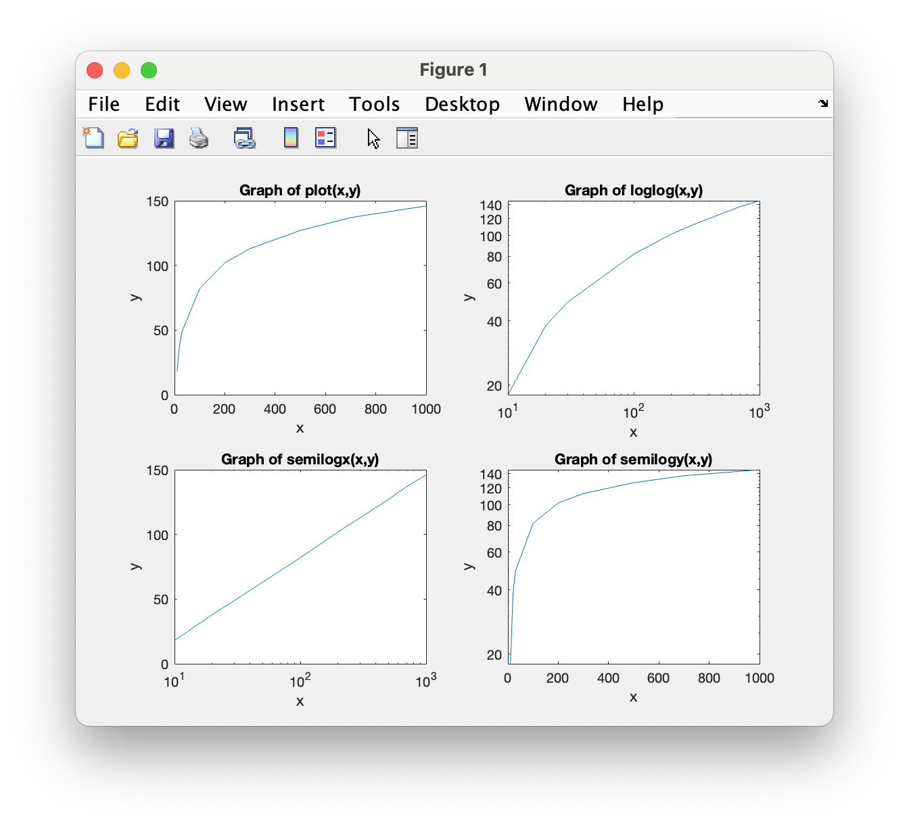
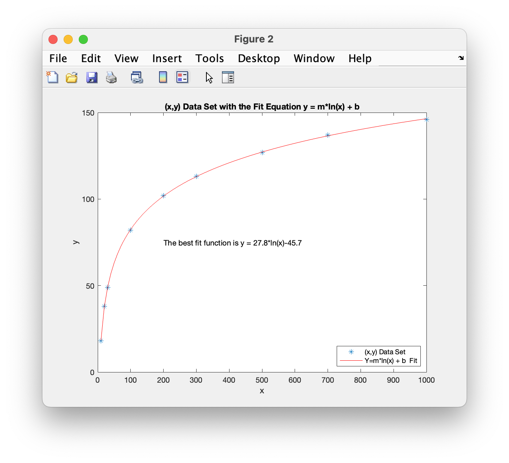

# Program\_07\_2
## Requirements
Given the following dataset, create a script that satisfies the following requirements.
```Matlab
% Dataset 
x = [10 20 30 100 200 300 500 700 1000];
y = [18 38 49  82 102 113 127 137  146];
```
* Determine the functional form of an (x,y) dataset by creating plots and figures
* Create a Figure 1 window
* Create a Figure 2 window
Figure 1:
* Have four plots, plot(x,y), loglog(x,y), semilogx(x,y), and semilogy(x,y)
* Provide a title, and axis labels for all four plots using your previously generated function `labelPlot`
Figure 2:
* Use `polyfit()` along with the correct linear model to find the `m` and `b` coefficients.
* Provide the functional form, along with numerical values of the best fit coefficients in a text object on the plot.
* Use the fit equation to create a linear plot of the data and the fit equation plotted with at least 100 points.
* Format the plot with blue asterisk markers, and a solid red line.
* Add a legend indicating the functional form of the fit line in the lower right
* Provide a title, and axis lavels for the plot using your previously generated function `labelPlot`

## Program
Use the following code to help with defining your function.
### Tips
* The plot (of the four subplots) showing a linear representation of the data will indicate the functional form of the data set, refer to **Tutorial_07_5** for more detail.
* Remember, you can use manual calculations or the `polyval()` function
* You cannot fprintf to a title but you want the variable data to be displayed in text. Recall that the `sprintf` function allows you to create a string of text much like fprintf but you can store the resulting output in a variable.

```Matlab
% Program Description:
% The purpose of this program is to ...

% Clear the command window and all variables
clc     % Clear the command window contents
clear   % Clear the workspace variables

% Output of the title and author to the command window.
programName = "Program_07_2";
name = "";
assistedBy = "";
fprintf("Output for %s written by %s, with assistance from %s.\n\n", programName, name, assistedBy)

```
## Example Output
When running your program, the output should match the following

