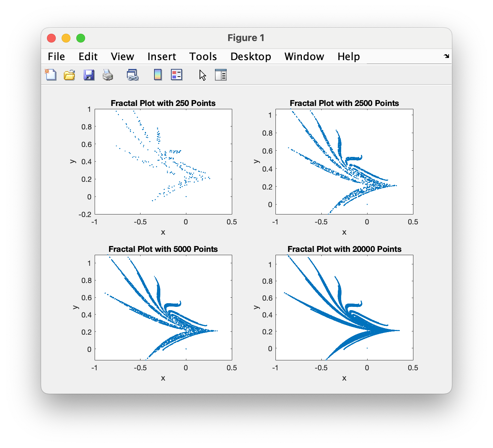

# Program\_07\_3
## Requirements
Complete **problem 9.7 on page 235** (7th Edition) of the text with the following requirements
* Create four subplots on a single Figure 1 window
* Subplot 1 shall plot the first 250 points of the x and y vectors
* Subplot 2 shall plot the first 2,500 points of the x and y vectors
* Subplot 3 shall plot the first 5,000 points of the x and y vectors
* Subplot 4 shall plot all 20,000 points of the x and y vectors
* The script shall be efficient using only one loop to generate all of the data at one time.
* Provide a title, and axis labels for all four plots using your previously generated function `labelPlot`

## Program
Use the following code to help with defining your function.
### Tips
* Recall, to plot only points, simply omit the `linetype` from the `plot` function

```Matlab
% Program Description:
% The purpose of this program is to ...

% Clear the command window and all variables
clc     % Clear the command window contents
clear   % Clear the workspace variables

% Output of the title and author to the command window.
programName = "Program_07_3";
name = "";
assistedBy = "";
fprintf("Output for %s written by %s, with assistance from %s.\n\n", programName, name, assistedBy)

```
## Example Output
When running your program, the output should match the following
