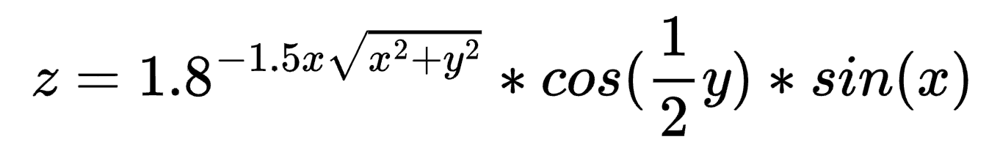

# Program\_07\_4
## Requirements
Create an x,y `meshgrid` and evaluate `z` to form a surface plot for the following equation. Satisfy the following requirements.

* Create a `meshgrid` with `x=y=-3.5:0.25:3.5`
* Create a `surf` plot with the resulting `x`, `y`, and `z` values
* Provide a title, and axis labels for the surf plot using your previously generated function `labelPlot`. Also, turn grid on using the optional parameter from your `labelPlot` function.

## Program
Use the following code to help with defining your function.
### Tips
* When creating the title, using ^ will place characters in superscript as shown in the output. Note that the entire superscript text must be wrapped in curly braces {like this} or only the first character will be superscript.

```Matlab
% Program Description:
% The purpose of this program is to ...

% Clear the command window and all variables
clc     % Clear the command window contents
clear   % Clear the workspace variables

% Output of the title and author to the command window.
programName = "Program_07_4";
name = "";
assistedBy = "";
fprintf("Output for %s written by %s, with assistance from %s.\n\n", programName, name, assistedBy)

```
## Example Output
When running your program, the output should match the following
