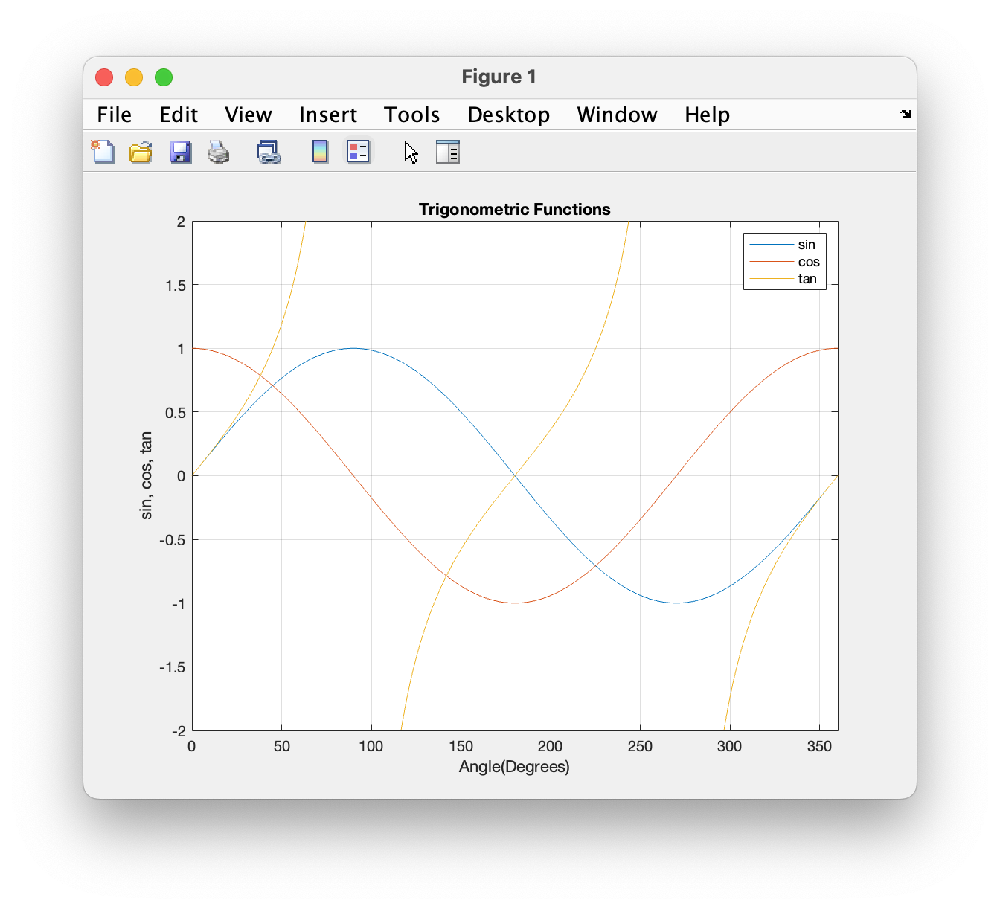

# Chapter 7 Tutorial 1
The purpose of this tutorial is to demonstrate the basics of plotting data on a graph.

**NOTICE:** Here I've added the `close all` command, you'll want to add this to all of your programs just like you do with `clear` and `clc`.
```Matlab
% Clear the command window and all variables
clc       % Clear the command window contents
clear     % Clear the workspace variables
close all % Close any currently open plot figure windows
```
Edit the code below and update the variable named name with your **name** for this tutorial in the code below.
```Matlab
% Output of the title and author to the command window.
programName = "Tutorial_07_1";
name = "";
assistedBy = "";
fprintf("Output for %s written by %s, with assistance from %s.\n\n", programName, name, assistedBy)
```
## Creating the Plot
Given the following data, let's create a plot. We've created tables before using transpose and then displaying them with the `disp()` function as in the following.
```Matlab
% A matrix can be used to display a table of values
angles=0:30:360;
table=[angles' sind(angles)' cosd(angles)' tand(angles)'];

% Display the data using disp()
disp('  Angle(Deg)      Sine        Cosine        Tangent')
disp(table)
```
However, instead, let's plot this data. With plots we can display much more data so let's recreate the `angles` variable as a vector from 0 to 360 in increments of 1 degree.
```Matlab
% Plotting the results
clear angles % clears variable angles
angles=0:360;
```
To create the plot of data, we'll add the values for each dataset. We have three datasets so we'll have three sets of (x, y) data which will all be passed in with the format `plot(x1,y1,x2,y2,...,xn,yn)`. Now, you may notice we're reusing the `angles` variable for x in all three datasets and that's fine, each set of y values is computed with the same set of x values so in this case, they will be the same x values for all three.
```Matlab
figure(1)
plot(angles,sind(angles),angles,cosd(angles),angles,tand(angles))
```
## Labeling the Plot
We could leave the plot as is, but we should always properly label plots, here we'll add a title, and labels for the x and y axes.
```Matlab
% Adds title, axis label, and gridlines
title('Trigonometric Functions')
xlabel('Angle(Degrees)')
ylabel('sin, cos, tan')
```
## More Configuration Options
Now, let's add a little more detail to our plot to make it real professional looking.

To add a grid, use
```Matlab
grid on
```
To set the x and y scales, use
```Matlab
axis([0,360,-2,2]) % sets the xmin, xmax, ymin, ymax of a graph
```
To add a legend, use (in the same order as the dataset values)
```Matlab
legend('sin', 'cos', 'tan') % adds a legend to define each data set
```
# Additional Notes:
* 
# Example Output
Create a script of the same name, your output should match the following.
