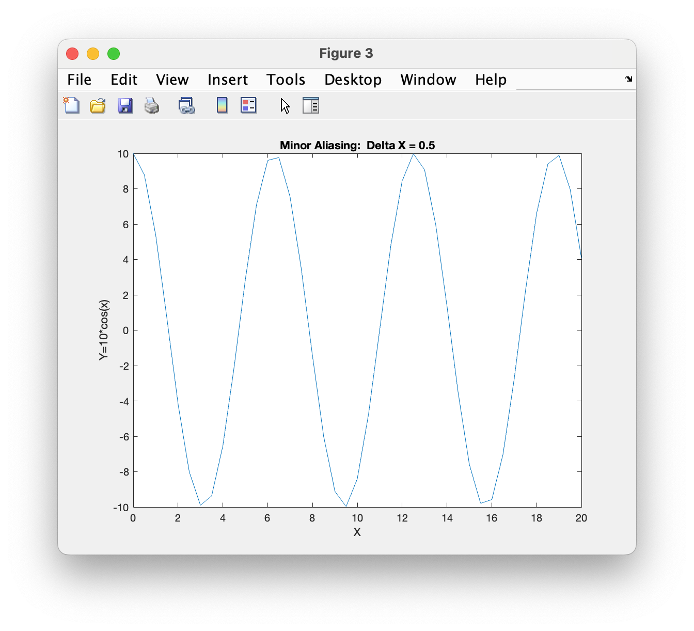

# Chapter 7 Tutorial 2
The purpose of this tutorial is to demonstrate plotting with multiple figures. There is also an example showing how to use fplot to see the benefits of anti-aliasing.
```Matlab
% Clear the command window and all variables
clc       % Clear the command window contents
clear     % Clear the workspace variables
close all % Close any currently open plot figure windows
```
Edit the code below and update the variable named name with your **name** for this tutorial in the code below.
```Matlab
% Output of the title and author to the command window.
programName = "Tutorial_07_2";
name = "";
assistedBy = "";
fprintf("Output for %s written by %s, with assistance from %s.\n\n", programName, name, assistedBy)
```
## Figure 1
Fill in the missing x data to create the first plot figure. Notice the `figure(1)` command, this is telling all future code to apply plot related configurations to the "Figure 1" window.
```Matlab
% Define a vector x from 0 to 20 with increments of 5
x=;
% define vector y
y=10*cos(x);

figure(1)  % opens figure window 1
plot(x,y)  % Plot a graph of y vs x in Figure Window 1
xlabel('X')
ylabel('Y=10*cos(x)')
title('Extreme Aliasing:  Delta X = 5')
```
## Figure 2
Fill in the missing x data to create the second plot figure. Notice the `figure(2)` command, this is telling all future code to apply plot related configurations to the "Figure 2" window.
```Matlab
% Define a vector x from 0 to 20 with increments of 1
x=;
y=10*cos(x);

figure(2)  % opens figure window 2
plot(x,y)  % Plot a graph of y vs x in Figure Window 2
xlabel('X')
ylabel('Y=10*cos(x)')
title('Moderate Aliasing:  Delta X = 1')
```
## Figure 3
Fill in the missing x data to create the first plot figure.
```Matlab
% Define a vector x from 0 to 20 with increments of 0.5
x=;
y=10*cos(x);

figure(3)  % opens figure window 3
plot(x,y)  % Plot a graph of y vs x in Figure Window 3
xlabel('X')
ylabel('Y=10*cos(x)')
title('Minor Aliasing:  Delta X = 0.5')
```
## Figure 4 Using fplot()
To avoid aliasing automatically, the `fplot` function should be used. `fplot` automatically adjusts the increment in x to avoid aliasing. Note that there is a prefex to the function `@(x)` which we have not seen before. This is referred to as a "function handle" and creates what is called an anonymous function. It's called anonymous because it's a function we are writing on the fly, there is no actual function or function file with `10*cos(x)` so we're telling MATLAB to create it for is in the background. To see more on this, refer to the [function handle documentation](https://www.mathworks.com/help/matlab/matlab_prog/creating-a-function-handle.html).
```Matlab
figure(4)  % opens figure window 4

% Note that the function must be enclosed in apostrophes.
% [0 20] are [xmin xmax]
fplot(@(x)10*cos(x),[0 20])  % fplot of 10*cos(x) in Figure Window 4
xlabel('X')
ylabel('Y=10*cos(x)')
title('No Aliasing:  Function Plotted with fplot()')
```
# Additional Notes:
* 
# Example Output
Create a script of the same name, your output should match the following.



