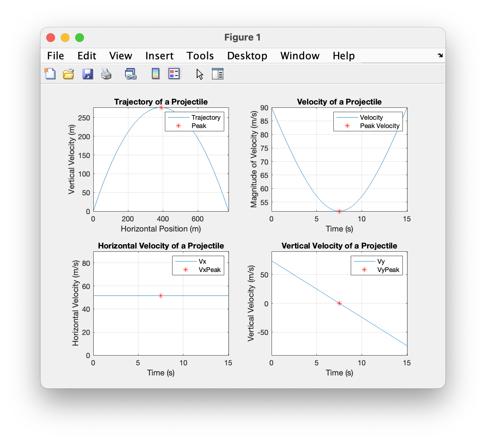

# Chapter 7 Tutorial 3
The purpose of this tutorial is to demonstrate plotting with multiple plots in a single figure window. This is referred to as sublplots.
```Matlab
% Clear the command window and all variables
clc       % Clear the command window contents
clear     % Clear the workspace variables
close all % Close any currently open plot figure windows
```
Edit the code below and update the variable named name with your **name** for this tutorial in the code below.
```Matlab
% Output of the title and author to the command window.
programName = "Tutorial_07_3";
name = "";
assistedBy = "";
fprintf("Output for %s written by %s, with assistance from %s.\n\n", programName, name, assistedBy)
```
## Input
```Matlab
% Define GRAVITY in m/s^2
GRAVITY=9.81;

% Ask for the launch speed and direction of the projectile
vi=input('Enter the launch speed in m/s: ');
theta=input('Enter the launch angle in degrees above horizontal: ');
```
## Manipulation
```Matlab
% Compute total time of flight and time to peak in seconds
tFlight=(2*vi*sind(theta))/GRAVITY;
tPeak=tFlight/2;

% Compute values at the peak
xPeak=vi*cosd(theta)*tPeak; % horizontal position in m
yPeak=vi*sind(theta)*tPeak - ((GRAVITY*tPeak^2)/2); % vertical position in m
vxPeak=vi*cosd(theta); % horizontal velocity in m/s (it is constant during the flight)
vyPeak=vi*sind(theta) - GRAVITY*tPeak; % vertical velocity in m/s
vPeak=sqrt(vxPeak^2 + vyPeak^2); % magnitde of velocity in m/s

% Create vectors for velocities and time
t=linspace(0,tFlight,30); % create 30 linearly spaced time values
vx=linspace(vxPeak, vxPeak, 30); % velocity x component in m/s                         
vy=vi*sind(theta) - GRAVITY.*t; % velocity y component in m/s
v=sqrt(vxPeak^2 + vy.^2);  % magnitude of velocity in m/s

% Create vectors for positions along the 30 points
x=vx.*t; % position x component
y=vi*sind(theta)*t - ((GRAVITY*t.^2)/2); % position y component
```
## Plot 1 - Projectile Trajactory
In plot 1, we'll plot the trajectory of the projectile but, we will also plot the peak trajectory, we do this by providing a second dataset but we'll just use one point. We will also identify that point by adding some formatting to the point, otherwise it would show up as a blue dot that would not be easily identifiable on the plot.
### The subplot command
In addition, you'll notice we use the `subplot()` function, this creates a figure window with numerous plots within that figure window. The format is much like we've seen when declaring vectors and is as follows `subplot(numRows, numCols, activeGraph)` where activeGraph is the plot you want to apply the following code to. Much like `figure(1)` tells MATLAB which figure window to apply configurations to. The order is as you would read a book, starting at the top left, move left to right and top to bottom.
```Matlab
% The subplot(rows, columns, active graph) function breaks the figure
% window into the desired number of graphs and selects the active graph to
% create.
subplot(2,2,1) % splits the figure window into 2 row and 2 columns of graphs
               % which is 4 graphs total.  The 1 represents the first graph
               % which is the graph in row 1 and column 1 of the window.

% The following plot command creates a line graph of the x and y vectors
% and also plots the point (xPeak,yPeak) with a red asterisk
plot(x,y,xPeak,yPeak,'r*')
% axis sets [xmin, xmax,ymin,ymax] for the axes
axis([0,2*xPeak,0,yPeak])
grid on  % adds gridlines to the graph
% The following add a title, axis labels, and a legend
title('Trajectory of a Projectile')
xlabel('Horizontal Position (m)')
ylabel('Vertical Velocity (m)')
legend('Trajectory','Peak') % you may move the legend box with the mouse in 
                            % the figure window
```
## Plot 2 - Magnitude of Velocity
The following will plot the magnitude of the velocity in the second subplot (upper right).
```Matlab
subplot(2,2,2) % graph number 2 is now active (1st row, 2nd column)

% The following plot command creates a line graph of the t and v vectors
% and also plots the point (tPeak,vPeak) with a red asterisk
plot(t,v,tPeak,vPeak,'r*')
axis([0,tFlight,vPeak,vi])
grid on
title('Velocity of a Projectile')
xlabel('Time (s)')
ylabel('Magnitude of Velocity (m/s)')
legend('Velocity','Peak Velocity') 
```
## Plot 3 - Velocity in the X Direction
The following will plot the velocity x component in the third subplot (lower left).
subplot(2,2,3) % graph number 3 is now active (2nd row, 1st column)
```Matlab
% The following plot command creates a line graph of the t and vx vectors
% and also plots the point (tPeak,vxPeak) with a red asterisk
plot(t,vx,tPeak,vxPeak,'r*')
axis([0,tFlight,0,vi])
grid on
title('Horizontal Velocity of a Projectile')
xlabel('Time (s)')
ylabel('Horizontal Velocity (m/s)')
legend('Vx','VxPeak') 
```
## Plot 4 - Velocity in the X Direction
The following will plot the velocity y component in the third subplot (lower right).
```Matlab
subplot(2,2,4) % graph number 4 is now active (2nd row, 2nd column)

% The following plot command creates a line graph of the t and vy vectors
% and also plots the point (tPeak,vyPeak) with a red asterisk
plot(t,vy,tPeak,vyPeak,'r*')
axis([0,tFlight,-vi,vi])
grid on
title('Vertical Velocity of a Projectile')
xlabel('Time (s)')
ylabel('Vertical Velocity (m/s)')
legend('Vy','VyPeak')
```
# Additional Notes:
* 
# Example Output
Create a script of the same name, your output should match the following. Your numbers don't have to match, but if you'd like to compare, I entered a launch speed of 90m/s and launch angle of 55 degrees to get the resulting plots.
