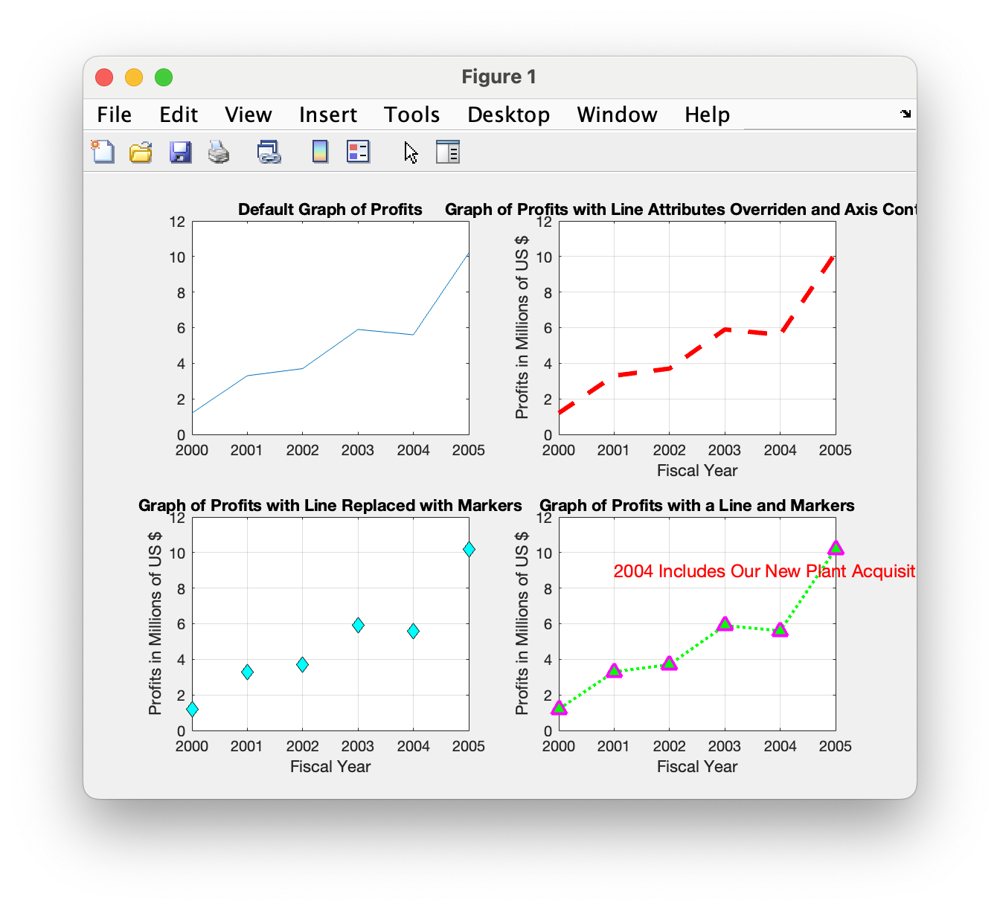

# Chapter 7 Tutorial 4
The purpose of this tutorial is to demonstrate the features available for controlling the appearance of a 2D plot including line and marker types, axis controls, and text.
```Matlab
% Clear the command window and all variables
clc       % Clear the command window contents
clear     % Clear the workspace variables
close all % Close any currently open plot figure windows
```
Edit the code below and update the variable named name with your **name** for this tutorial in the code below.
```Matlab
% Output of the title and author to the command window.
programName = "Tutorial_07_4";
name = "";
assistedBy = "";
fprintf("Output for %s written by %s, with assistance from %s.\n\n", programName, name, assistedBy)
```
## Plot 1
Here, we'll create a basic plot with no alterations to the output format.
Fill in the missing code
```Matlab
% Create two rows and two columns of subplots and activate the upper left plot


% Define the vectors to plot
year = [2000 2001 2002 2003 2004 2005];
profits = [1.2 3.3 3.7 5.9 5.6 10.2];  % in millions of US Dollars

% The following plot command will create a default 2D plot with a solid 
% blue line connecting the data points. The axes are autoscaled and
% default tick labels are added.
plot(year,profits);

% Add the title "Default Graph of Profits" to the graph
title("Default Graph of Profits")
```
## Plot 2
In this plot, we'll use the long version of formatting a plot's line style, color, etc. It requires that you provide the text identifying the parameter type (such as 'linestyle', 'color', 'linewidth', etc) followed by the value of what that property would be.

**Some color options:** red 'r',green 'g',blue 'b',cyan 'c',magenta 'm', yellow 'y', black 'k', white 'w'.

**Some linestyle options:** solid '-',dashed '--',dotted ':', dash-dot '-.'

**Linewidth options:** linewidth is specified in points, the default is 0.5 points

We also introduce the `set()` function, which allows us to specify the labels and values that will be shown in the x and y axes. The value `gca` means "Get Current Axes" which just means the current plot, MATLAB refers to "axes" as the plot contents rather than the more common use of the word which means components of a dataset like x, y, and z.

Lastly, we'll use the `axis()` function to set the scale for the x and y axes (the real axes, not MATLAB's term axes)
```Matlab
% Activate the upper right plot


% Override the default line settings 
plot(year,profits,'linestyle','--','color','r','linewidth',3)

% Use a vector to define the labels and tick marks that will appear on
% the x and y axes.
set(gca,'xtick',year) % vector year used to label the x tick marks
set(gca,'ytick',0:2:12) % 0:2:12 vector used to label the y tick marks

% axis overrides the x and y axis autoscaling
axis([2000 2005 0 12])  % axis([xmin xmax ymin ymax])
grid on  % Adds gridlines at each tick label position

% adds a title and axis labels
title('Graph of Profits with Line Attributes Overriden and Axis Controls')
xlabel('Fiscal Year')
ylabel('Profits in Millions of US $')
```
## Plot 3
Here we'll use the shorthand version of specifying format for linecolor, linestyle, and markertype. These are typically the most commonly used so these three can be formed into a shortand by simply putting them in text without specifying the format identifier. For example, a **red, dashed line**, with **circles** as markers would simply be `'r-o'`. I try to keep the same format of color, linetype, markertype for sanity but you can place them in any order as none of their values overlap so MATLAB can parse them in any order.

**marker choices:** plus '+', circle 'o',asterisk '*',cross 'x', triangle '^',square 's', diamond 'd'

We'll also introduce the following, but we must use the long format for these.

**markersize:** Specified in points

**markerfacecolor:** colors match that of linecolor

**markeredgecolor:** colors match that of linecolor
```Matlab
% Activate the lower left plot


% Create a plot with shorthand 'd' indicating diamonds for the markers
plot(year,profits,'d','markersize',8, ...
          'markerfacecolor','c','markeredgecolor','k')

title('Graph of Profits with Line Replaced with Markers')

% repeat of items from the second plot
set(gca,'xtick',year)
set(gca,'ytick',0:2:12)
axis([2000 2005 0 12])
grid on
xlabel('Fiscal Year')
ylabel('Profits in Millions of US $')
```
## Plot 4
We'll try out some more formatting here, using shorthand and longhand again.

We will also add some text, which can also be formatted to change the size and color.
```Matlab
% Activate the lower right plot


% Draws both a line and markers
plot(year,profits,'g:^','linewidth',2, 'markersize',9, ...
                  'markerfacecolor','g','markeredgecolor','m')
              
% text can be added to the graph beginning in location (2001,9)              
text(2001,9,'2004 Includes Our New Plant Acquisition', ...
            'color','r','fontsize',12) 

title('Graph of Profits with a Line and Markers') 

% repeat of items from the second graph
set(gca,'xtick',year)
set(gca,'ytick',0:2:12)
axis([2000 2005 0 12])
grid on
xlabel('Fiscal Year')
ylabel('Profits in Millions of US $')
```
# Additional Notes:
* 
# Example Output
Create a script of the same name, your output should match the following.
