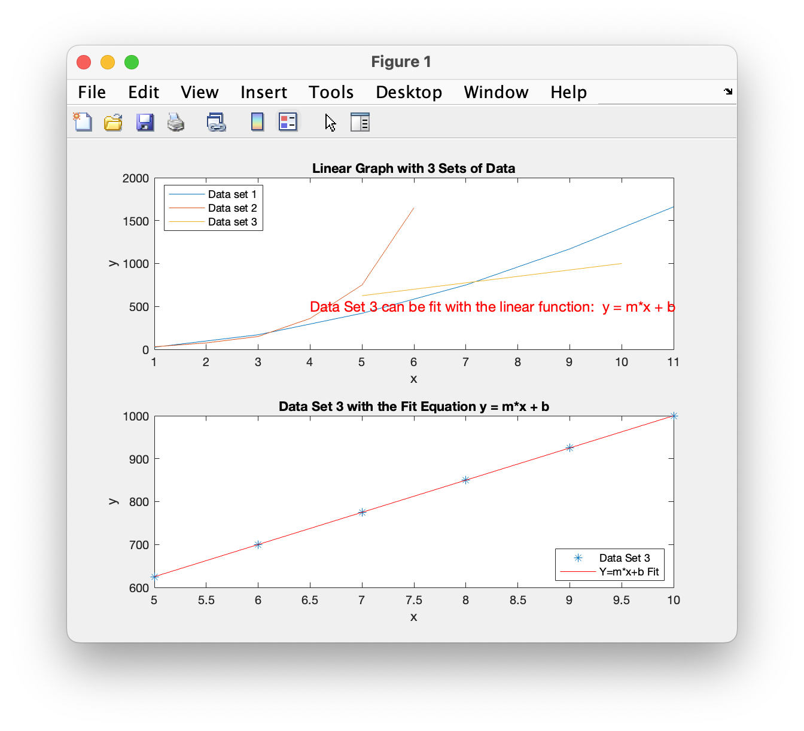
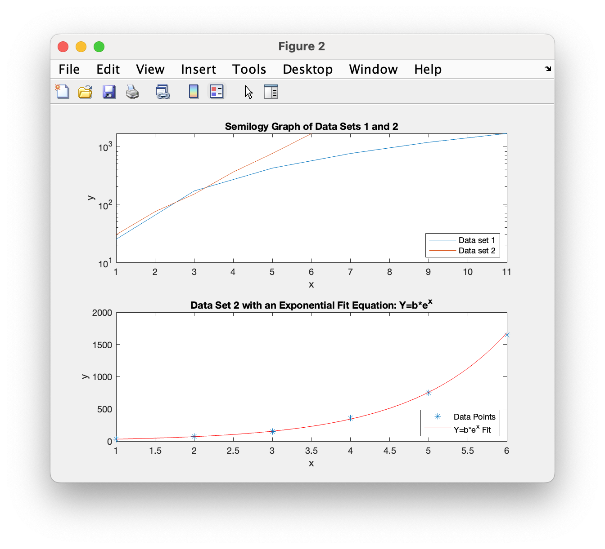
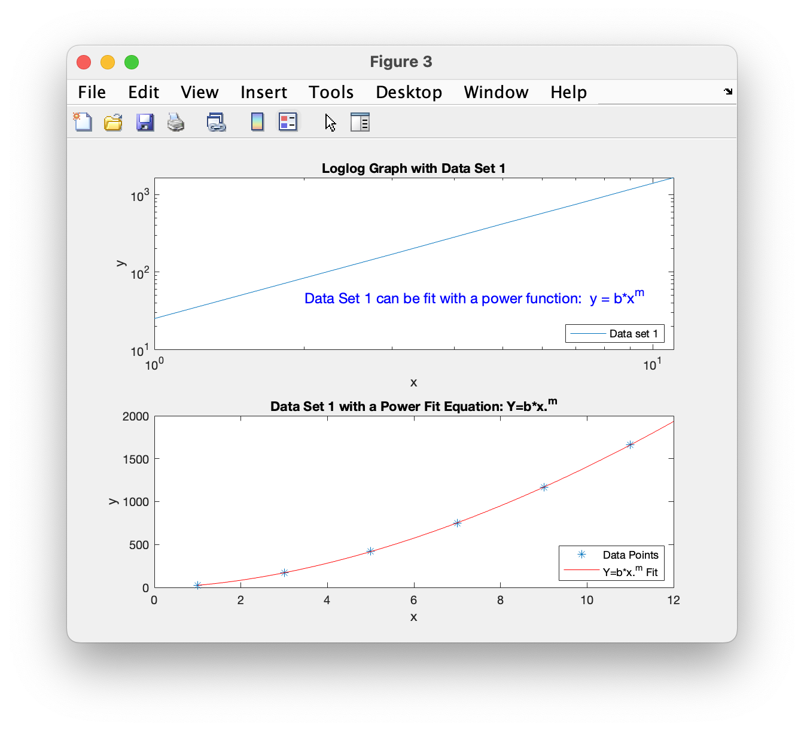

# Chapter 7 Tutorial 5
The purpose of this program is to demonstrate how to use linear, semilog, and loglog graphs to determine the functional form of a set of data. Once the functional form is identified, the `polyfit()` function is used to determine the coefficients of the fit function.
```Matlab
% Clear the command window and all variables
clc       % Clear the command window contents
clear     % Clear the workspace variables
close all % Close any currently open plot figure windows
```
Edit the code below and update the variable named name with your **name** for this tutorial in the code below.
```Matlab
% Output of the title and author to the command window.
programName = "Tutorial_07_5";
name = "";
assistedBy = "";
fprintf("Output for %s written by %s, with assistance from %s.\n\n", programName, name, assistedBy)
```
## Input
Our goal is to find the functions that best fit the three datasets.
```Matlab
% Data set 1
x1=1:2:12;
y1=[25 170 420 750 1170 1660];

% Data set 2
x2=1:6;
y2=[30 75 150 360 750 1650];

% Data set 3
x3=5:1:10;
y3=[625 700 775 850 925 1000];
```
## Figure 1
Add code to the following where necessary (see comments).
```Matlab
% Open figure 1 and create a subplot of two plots, one on top of the other.
% Activate the first plot


% plot all three data sets on one graph using the default settings.
plot(x1,y1,x2,y2,x3,y3)

% Add a title "Linear Graph with 3 Sets of Data"
title('Linear Graph with 3 Sets of Data')

% Add axis labels, text, and legend.
xlabel('x');
ylabel('y');

% Add axis labels and text
text(4,500,'Data Set 3 can be fit with the linear function:  y = m*x + b',...
           'color','r','fontsize',12) 
% Add a legend, we can specify the location using polar coordinates
legend('Data set 1', 'Data set 2','Data set 3','Location','northwest')
```
Notice that data set 3 is a straight line on the linear (default) graph. Data set 3 therefore has a functional form of `y=m*x+b` (linear). We can fit a polynomial of order 1 to this data set so we'll use the `polyfit()` function passing in `x3`, `y3`, and `1` for an order of 1 on the x3 and y3 dataset. `Polyfit` will return the two coefficients needed (m and b) for y=mx+b.
```Matlab
% Notice that data set 3 is a straight line on the linear (default) graph.
% Data set 3 therefore has a functional form of y=m*x+b (linear).
% We can fit a polynomial of order 1 to this data set
linearCoeff=polyfit(x3,y3,1); % Two coefficients are produced 
m=linearCoeff(1);
b=linearCoeff(2);
```
We can now use m and b to caculate the best fit line by plugging these values into a function for x. We could use the 
`polyVal()` function but so that you can see how it works, we'll do it manually.
```Matlab
% Calculate the best fit values using a linear model (y=mx+b)
xp3=linspace(5,10,100); % 100 linearly spaced values between 5 and 10
yp3=m*xp3+b;  % alternately we could use yp3=polyval(LinearCoeff,x3)

% Activate the second plot in the subplot set for this figure


% Plot the data with asterisks (*) and the best fit function with a red line
plot(x3,y3,'*',xp3,yp3,'r');
% Add a title, axis labels and legend.
title('Data Set 3 with the Fit Equation y = m*x + b')
xlabel('x')
ylabel('y')
legend('Data Set 3','Y=m*x+b Fit','Location','southeast')
```
## Figure 2
In Figure 2, we'll see how the data looks on a `semilogy()` plot. We already know the third dataset is a linear dataset and we computed the best fit so now we'll only look at the first and second dataset.
```Matlab
% Open figure 2 and create a subplot of two plots, one on top of the other.
% Activate the first plot


% Create a semilogy graph with x1,y1 and x2,y2.
semilogy(x1,y1,x2,y2)

% Add title, axis labels, text, and legend
title('Semilogy Graph of Data Sets 1 and 2')
xlabel('x')
ylabel('y')
text(10E3,3,'Data Set 2 can be fit with an exponential function:  y = b*e^m',...
           'color','r','fontsize',12) 
legend('Data set 1', 'Data set 2','Location','southeast')
```
Notice that data set 2 is a straight line on the semilogy graph. This indicates that it has the functional form:

`y=b*exp(m*x)` (exponential)

The linear form of an exponential function (which is found by taking the log of both sides) is: `log(y)=m*x+log(b)`. As before, if we do a 1st order `polyfit` we can find m and log(b).
```Matlab
expCoeff=polyfit(x2,log(y2),1); % Two coefficients are produced 
m=expCoeff(1);
logb=expCoeff(2);
b=exp(logb);

% Calculate the best fit values using a linear model (y=mx+b)
xp2=linspace(1,6,100); % 100 values between 1 and 6
yp2=b*exp(m*xp2);  % find the fit values
```
Here we'll display our best fit function. We will plot data set 2 and the fit function on a **linear** graph
```Matlab
% Activate the second plot in this Figure's subplot


% Plot the data with asterisks (*) and the best fit function with a red line
plot(x2,y2,'*',xp2,yp2,'r');

% add a title, axis labels, and legend
title('Data Set 2 with an Exponential Fit Equation: Y=b*e^x')
xlabel('x')
ylabel('y')
legend('Data Points','Y=b*e^x Fit','Location','southeast')
```
## Figure 3
Finally, let's look at a `loglog` example; where both axes are logarithmic. The only dataset left to identify is x1 and y1 so we'll only plot these values.
```Matlab
% Open figure 3 and create a subplot of two plots, one on top of the other.


% Plot the x1,y1 dataset on a loglog plot.
loglog(x1,y1)

% add a title, axis labels, text, and legend.
title('Loglog Graph with Data Set 1')
xlabel('x')
ylabel('y')
text(2,50,'Data Set 1 can be fit with a power function:  y = b*x^m',...
           'color','b','fontsize',12) 
legend('Data set 1','Location','southeast')
```
Notice that data set 1 is a straight line on the loglog graph. This indicates that it has the functional form:

`y=b*x.^m` (Power)

The linear form of a power function (found by taking the log of both sides) is: `log(y)=m*log(x)+ log(b)`. If we do a 1st order `polyfit` we can find m and b. Again, we'll compute the values to be displayed a **linear** graph.
```Matlab
powerCoeff=polyfit(log(x1),log(y1),1); % Two coefficients are produced 
m=powerCoeff(1);
logb=powerCoeff(2);
b=exp(logb);

% Calculate the best fit values using a linear model (y=mx+b)
xp1=linspace(1,12,100); % 100 values between 1 and 12
yp1=b*xp1.^m;  % find the fit values
% Plot data set 1 and the power funtion fit on a linear graph

% Activate the second plot in this Figure's subplot


% Plot the data with asterisks (*) and the best fit funtion with a red line


% add a title, axis labels, and legend
title('Data Set 1 with a Power Fit Equation: Y=b*x.^m')
xlabel('x')
ylabel('y')
legend('Data Points','Y=b*x.^m Fit','Location','southeast')
```
# Additional Notes:
* 
# Example Output
Create a script of the same name, your output should match the following.


