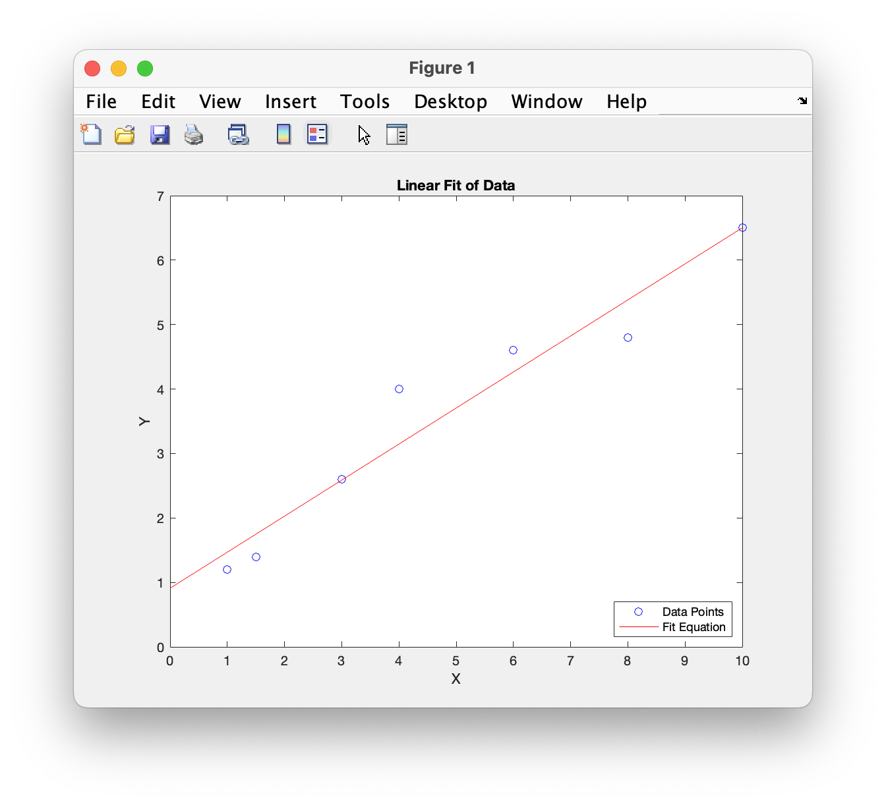
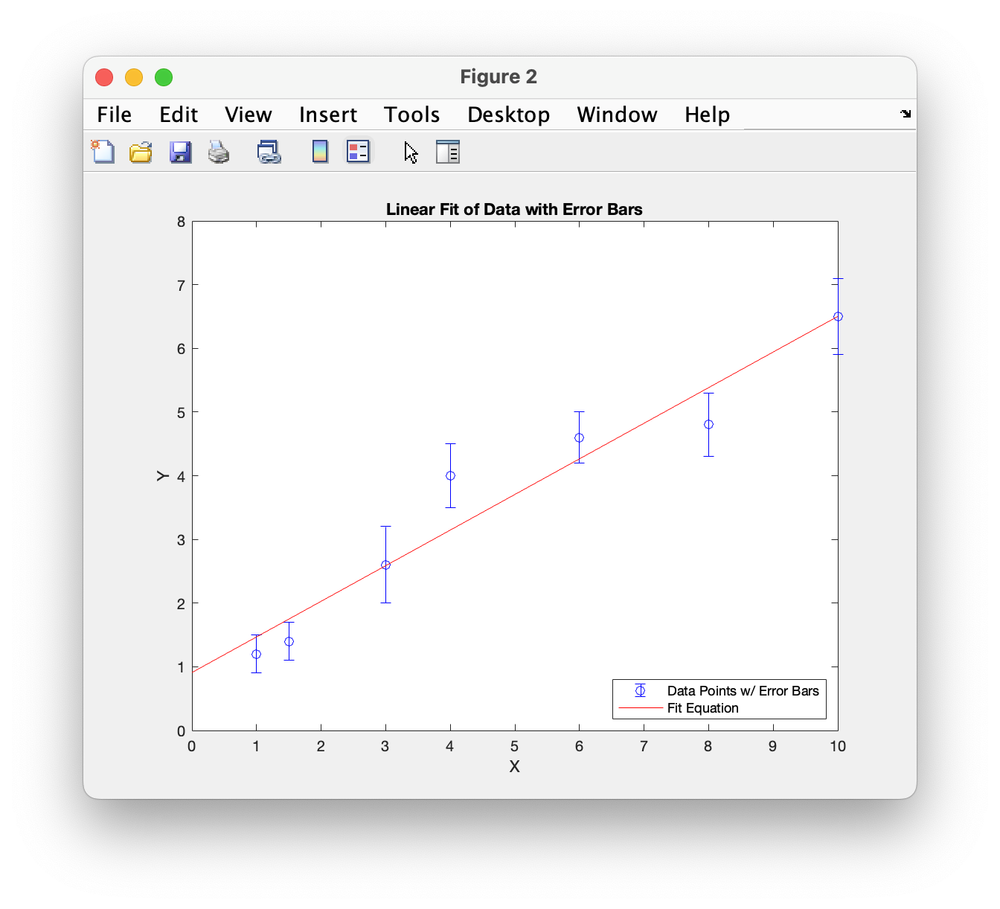

# Chapter 7 Tutorial 6
The purpose of this program is to demonstrate how to add error bars to a plot. This will also utilize the polyval function for getting best fit values.
```Matlab
% Clear the command window and all variables
clc       % Clear the command window contents
clear     % Clear the workspace variables
close all % Close any currently open plot figure windows
```
Edit the code below and update the variable named name with your **name** for this tutorial in the code below.
```Matlab
% Output of the title and author to the command window.
programName = "Tutorial_07_6";
name = "";
assistedBy = "";
fprintf("Output for %s written by %s, with assistance from %s.\n\n", programName, name, assistedBy)
```
## Figure 1
Here, we'll run through a quick example of using polyfit and polyval, unlike before where we computed the values for the best fit, we can defer to the polyval function to do that for us.
```Matlab
% Open a figure 1 window


% Given Data
xData = [1.0 1.5 3 4 6 8 10];
yData = [1.2 1.4 2.6 4.0 4.6 4.8 6.5];
```
Recall, `polyfit` determines the coefficients that will best fit the data.
```Matlab
% polyfit finds the coefficients of a polynomial that will best fit the data.
% The number 1 represents the order of the polynomial (1 = linear fit).
fitCoefficients = polyfit(xData,yData,1);
```
Now, we'll generate some x values to perform the best fit function on, but we'll simply pass the coefficients, along with the x data, into the polyval to get our y values.
```Matlab
xFit = 0: 0.1: 10;  % values to evaluate the fit function at
yFit = polyval(fitCoefficients,xFit); % computes yFit at each xFit value
And now, we plot the data, just as before.
% plot the fit equation and data on the same graph with blue circles for 
% the data points and a red line for the fit equation
plot(xData,yData,'ob',xFit,yFit,'r')
title('Linear Fit of Data')
xlabel('X')
ylabel('Y')
legend('Data Points','Fit Equation','Location','southeast')
```
## Figure 2
Now, we'll run through an example plotting error bars. Error bars are helpful in seeing just how far our data is from the best fit line. The `errorBar()` function works just like the `plot()` function however, it accepts a third parameter for the error values. In this example, we'll manually create some error values.
```Matlab
% Open a figure 1 window


% plotting data with error bars and a fit equation on the same graph
% vector of error bars for yData
yErrors = [0.3 0.3 0.6 0.5 0.4 0.5 0.6];
errorbar(xData,yData,yErrors,'bo') % blue circles with vertical error bars
```
Recall, we can use the hold function to plot multiple datasets on the same plot (**errorbar()** was the first technical plot function). This is useful if you prefer to break up your code, performing functions, plotting data, performing more functions, plotting more data, rather than performing all of the calculations up front and putting them all in one `plot()` function.

**IMPORTANT:** Just like resetting `format` or turning `diary off`, do not forget to call `hold off` to turn off the hold function. Doing so may result is undesired outcomes in future scripts.
```Matlab
hold on
% This plot line will be placed on the same plot as the previous data
plot(xFit,yFit,'r')

% We still only need to call this once, since it's for a single plot
title('Linear Fit of Data with Error Bars')
xlabel('X')
ylabel('Y')
legend('Data Points w/ Error Bars','Fit Equation','Location','southeast')
hold off
```
# Additional Notes:
* 
# Example Output
Create a script of the same name, your output should match the following.

